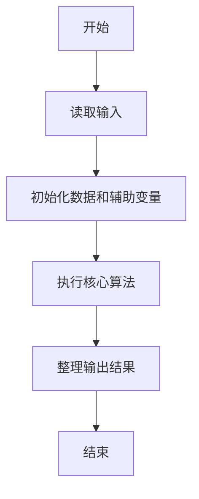
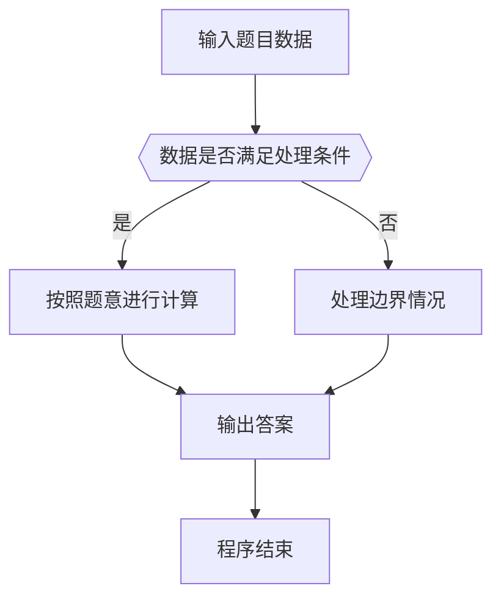

# 1003 我要通过！

- **分值：** 20分

### 题目描述

“**答案正确**”是自动判题系统给出的最令人欢喜的回复。本题属于 PAT 的“**答案正确**”大派送 —— 只要读入的字符串满足下列条件，系统就输出“**答案正确**”，否则输出“**答案错误**”。

得到“**答案正确**”的条件是：

1. 字符串中必须仅有 `P`、 `A`、 `T`这三种字符，不可以包含其它字符；
2. 任意形如 `xPATx` 的字符串都可以获得“**答案正确**”，其中 `x` 或者是空字符串，或者是仅由字母 `A` 组成的字符串；
3. 如果 `aPbTc` 是正确的，那么 `aPbATca` 也是正确的，其中 `a`、 `b`、 `c` 均或者是空字符串，或者是仅由字母 `A` 组成的字符串。

现在就请你为 PAT 写一个自动裁判程序，判定哪些字符串是可以获得“**答案正确**”的。

### 输入格式：

每个测试输入包含 1 个测试用例。第 1 行给出一个正整数 $n$ ($≤10$)，是需要检测的字符串个数。接下来每个字符串占一行，字符串长度不超过 100，且不包含空格。

### 输出格式：

每个字符串的检测结果占一行，如果该字符串可以获得“**答案正确**”，则输出 `YES`，否则输出 `NO`。

### 输入样例：
```
10
PAT
PAAT
AAPATAA
AAPAATAAAA
xPATx
PT
Whatever
APAAATAA
APT
APATTAA

```

### 输出样例：
```
YES
YES
YES
YES
NO
NO
NO
NO
NO
NO
```

**鸣谢江西财经大学软件学院朱政同学、用户 woluo_z 补充测试数据！**


### 解题思路

本题的核心是：统计字符串中各字符出现次数，并按题目要求输出 PAT 的计数关系。程序先读取题目输入，再按照上述规则完成数据处理，最后严格按照题目要求输出结果。实现时应优先根据题目约束选择合适的数据类型和数据结构，避免溢出或不必要的重复计算。

时间复杂度为 O(L)；空间复杂度取决于输入规模，主要用于保存题目数据和中间结果。

### 代码流程说明

1. 读取 1003 我要通过！ 所需的输入数据。
2. 初始化计数器、数组或其他辅助变量。
3. 统计字符串中各字符出现次数，并按题目要求输出 PAT 的计数关系。
4. 按题目规定的格式输出计算结果。

### 代码实现

```java
import java.io.*;
import java.util.*;

public class Main {
    static class FastScanner {
        private final InputStream in; private final byte[] buffer = new byte[1 << 16]; private int ptr, len;
        FastScanner(InputStream in) { this.in = in; }
        private int read() throws IOException { if (ptr >= len) { len = in.read(buffer); ptr = 0; if (len < 0) return -1; } return buffer[ptr++]; }
        String next() throws IOException { StringBuilder b = new StringBuilder(); int c; do c = read(); while (c <= 32 && c >= 0); while (c > 32) { b.append((char)c); c = read(); } return b.toString(); }
        char[] nextChars() throws IOException { return next().toCharArray(); }
        int nextInt() throws IOException { return Integer.parseInt(next()); }
        long nextLong() throws IOException { return Long.parseLong(next()); }
        double nextDouble() throws IOException { return Double.parseDouble(next()); }
        void skip() throws IOException { next(); }
    }
    static int strlen(char[] s) { int n = 0; while (n < s.length && s[n] != 0) n++; return n; }
    static int strcmp(char[] a, char[] b) { return new String(a, 0, strlen(a)).compareTo(new String(b, 0, strlen(b))); }
    static int strncmp(char[] a, char[] b) { return strcmp(a, b); }
    static void printf(String format, Object... args) { Object[] x = new Object[args.length]; for (int i=0;i<args.length;i++) x[i] = args[i] instanceof char[] ? new String((char[])args[i], 0, strlen((char[])args[i])) : args[i]; System.out.printf(format.replace("%lld", "%d"), x); }
    static void puts(Object x) { System.out.println(x instanceof char[] ? new String((char[])x, 0, strlen((char[])x)) : x); }
    static void putchar(char c) { System.out.print(c); }
    static void putchar(int c) { System.out.print((char)c); }
    static final int EOF = -1;
    static int getchar() { return -1; }
    static int isupper(char c) { return Character.isUpperCase(c) ? 1 : 0; }
    static char tolower(int c) { return Character.toLowerCase((char)c); }
    static int strchr(char[] s, char c) { for (int i=0;i<strlen(s);i++) if (s[i]==c) return i; return -1; }
/*
 * 题目：1003 数数字
 * 实现原理：统计字符串中各字符出现次数，并按题目要求输出 PAT 的计数关系。
 * 复杂度：O(L)
 * 实现步骤：
 * 1. 读取 1003 我要通过！ 所需的输入数据。
 * 2. 初始化计数器、数组或其他辅助变量。
 * 3. 统计字符串中各字符出现次数，并按题目要求输出 PAT 的计数关系。
 * 4. 按题目规定的格式输出计算结果。
 */

static FastScanner fs = new FastScanner(System.in);

    public static void main(String[] args) throws Exception {
    int n;
    n = fs.nextInt();
    while (n-- > 0) {
        char[] s = new char[105];
        s = fs.nextChars();
        int p = - 1; int t = - 1; int a = 0; int b = 0; int c = 0; int ok = 1;
        for (int i = 0; i < strlen(s); i ++) {
            if (s[i] != 'P' && s[i] != 'A' && s[i] != 'T') ok = 0;
            if (s[i] == 'P') {
                if (p != - 1) ok = 0;
                p = i;
            }
            if (s[i] == 'T') {
                if (t != - 1) ok = 0;
                t = i;
            }
        }
        if (p < 0 || t < 0 || t <= p + 1) ok = 0;
        for (int i = 0; i < strlen(s); i ++) {
            if (i < p && s[i] == 'A') a ++;
            else if (i > p && i < t && s[i] == 'A') b ++;
            else if (i > t && s[i] == 'A') c ++;
            else if (s[i] != 'P' && s[i] != 'T' && s[i] != 'A') ok = 0;
        }
        if (ok != 0 && a * b == c) puts("YES");
        else puts("NO");
    }

}
}
```

### 代码流程图



### 解题流程图



### 常见易错点

- 注意输入数据的范围，选择足够大的整数类型，并正确处理边界值。
- 循环、数组下标和字符串结束位置要严格对应题目定义，避免越界。
- 输出格式必须与题目要求完全一致，包括空格、换行、大小写和特殊符号。
- 如果存在排序、去重、进位、约分或四舍五入等操作，应在输出前统一完成。
