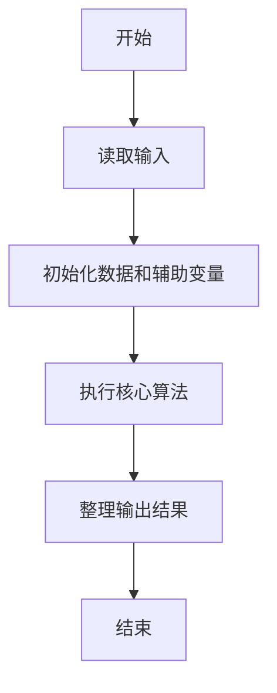
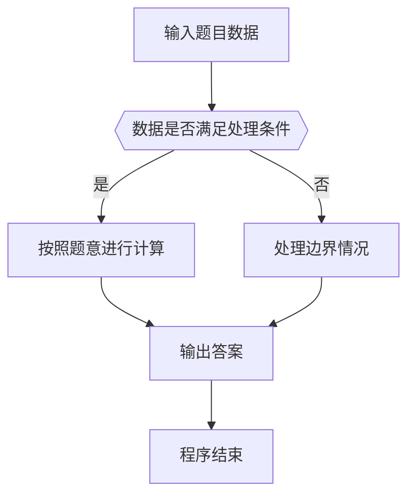

# 1005 继续(3n+1)猜想

- **分值：** 25分

### 题目描述

卡拉兹(Callatz)猜想已经在1001中给出了描述。在这个题目里，情况稍微有些复杂。

当我们验证卡拉兹猜想的时候，为了避免重复计算，可以记录下递推过程中遇到的每一个数。例如对 $n=3$ 进行验证的时候，我们需要计算 3、5、8、4、2、1，则当我们对 $n=5$、8、4、2 进行验证的时候，就可以直接判定卡拉兹猜想的真伪，而不需要重复计算，因为这 4 个数已经在验证3的时候遇到过了，我们称 5、8、4、2 是被 3“覆盖”的数。我们称一个数列中的某个数 $n$ 为“关键数”，如果 $n$ 不能被数列中的其他数字所覆盖。

现在给定一系列待验证的数字，我们只需要验证其中的几个关键数，就可以不必再重复验证余下的数字。你的任务就是找出这些关键数字，并按从大到小的顺序输出它们。

### 输入格式：

每个测试输入包含 1 个测试用例，第 1 行给出一个正整数 $K$ ($<100$)，第 2 行给出 $K$ 个互不相同的待验证的正整数 $n$ ($1<n\le 100$)的值，数字间用空格隔开。

### 输出格式：

每个测试用例的输出占一行，按从大到小的顺序输出关键数字。数字间用 1 个空格隔开，但一行中最后一个数字后没有空格。

### 输入样例：
```
6
3 5 6 7 8 11
```

### 输出样例：
```
7 6
```


### 解题思路
本题的核心是：先标记被其他数覆盖的数，再对剩余数按降序输出。程序先读取题目输入，再按照上述规则完成数据处理，最后严格按照题目要求输出结果。实现时应优先根据题目约束选择合适的数据类型和数据结构，避免溢出或不必要的重复计算。

时间复杂度为 O(n²)；空间复杂度取决于输入规模，主要用于保存题目数据和中间结果。

### 代码流程说明

1. 读取 1005 继续(3n+1)猜想 所需的输入数据。
2. 初始化计数器、数组或其他辅助变量。
3. 先标记被其他数覆盖的数，再对剩余数按降序输出。
4. 按题目规定的格式输出计算结果。

### 代码实现

```java
import java.io.*;
import java.util.*;

public class Main {
    static class FastScanner {
        private final InputStream in; private final byte[] buffer = new byte[1 << 16]; private int ptr, len;
        FastScanner(InputStream in) { this.in = in; }
        private int read() throws IOException { if (ptr >= len) { len = in.read(buffer); ptr = 0; if (len < 0) return -1; } return buffer[ptr++]; }
        String next() throws IOException { StringBuilder b = new StringBuilder(); int c; do c = read(); while (c <= 32 && c >= 0); while (c > 32) { b.append((char)c); c = read(); } return b.toString(); }
        char[] nextChars() throws IOException { return next().toCharArray(); }
        int nextInt() throws IOException { return Integer.parseInt(next()); }
        long nextLong() throws IOException { return Long.parseLong(next()); }
        double nextDouble() throws IOException { return Double.parseDouble(next()); }
        void skip() throws IOException { next(); }
    }
    static int strlen(char[] s) { int n = 0; while (n < s.length && s[n] != 0) n++; return n; }
    static int strcmp(char[] a, char[] b) { return new String(a, 0, strlen(a)).compareTo(new String(b, 0, strlen(b))); }
    static int strncmp(char[] a, char[] b) { return strcmp(a, b); }
    static void printf(String format, Object... args) { Object[] x = new Object[args.length]; for (int i=0;i<args.length;i++) x[i] = args[i] instanceof char[] ? new String((char[])args[i], 0, strlen((char[])args[i])) : args[i]; System.out.printf(format.replace("%lld", "%d"), x); }
    static void puts(Object x) { System.out.println(x instanceof char[] ? new String((char[])x, 0, strlen((char[])x)) : x); }
    static void putchar(char c) { System.out.print(c); }
    static void putchar(int c) { System.out.print((char)c); }
    static final int EOF = -1;
    static int getchar() { return -1; }
    static int isupper(char c) { return Character.isUpperCase(c) ? 1 : 0; }
    static char tolower(int c) { return Character.toLowerCase((char)c); }
    static int strchr(char[] s, char c) { for (int i=0;i<strlen(s);i++) if (s[i]==c) return i; return -1; }
/*
 * 题目：1005 德州扑克式卡拉兹分类
 * 实现原理：先标记被其他数覆盖的数，再对剩余数按降序输出。
 * 复杂度：O(n²)
 * 实现步骤：
 * 1. 读取 1005 继续(3n+1)猜想 所需的输入数据。
 * 2. 初始化计数器、数组或其他辅助变量。
 * 3. 先标记被其他数覆盖的数，再对剩余数按降序输出。
 * 4. 按题目规定的格式输出计算结果。
 */

static FastScanner fs = new FastScanner(System.in);

    public static void main(String[] args) throws Exception {
    int k; int[] a = new int[100]; int[] covered = new int[10001];
    k = fs.nextInt();
    for (int i = 0; i < k; i ++) a[i] = fs.nextInt();
    for (int i = 0; i < k; i ++) {
        int x = a[i];
        int first = 1;
        while (x != 1) {
            if (first == 0 && x <= 10000) covered[x] = 1;
            x = x % 2 != 0 ? (3 * x + 1) / 2 : x / 2;
            first = 0;
        }
    }
    Arrays.sort(a, 0, k);
    int first = 1;
    for (int i = 0; i < k; i ++) if (covered[a[i] == 0]) {
        if (first == 0) putchar(' ');
        printf("%d", a[i]);
        first = 0;
    }
    putchar('\n');

}
}
```

### 代码流程图



### 解题流程图



### 常见易错点

- 注意输入数据的范围，选择足够大的整数类型，并正确处理边界值。
- 循环、数组下标和字符串结束位置要严格对应题目定义，避免越界。
- 输出格式必须与题目要求完全一致，包括空格、换行、大小写和特殊符号。
- 如果存在排序、去重、进位、约分或四舍五入等操作，应在输出前统一完成。
