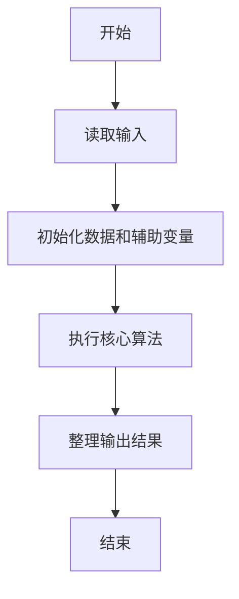
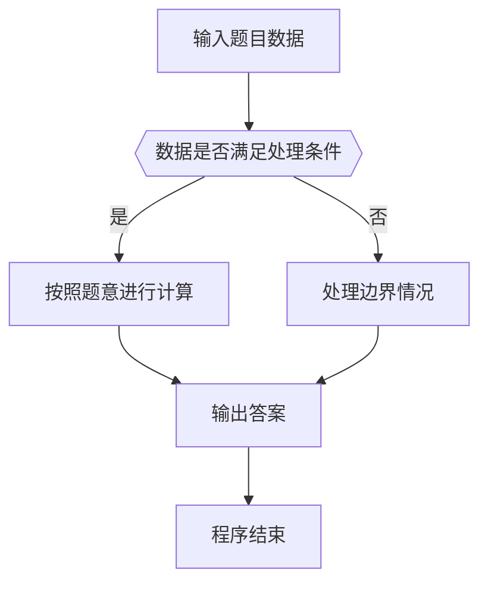

# 1008 数组元素循环右移问题

- **分值：** 20分

### 题目描述

一个数组$A$中存有$N$（$>0$）个整数，在不允许使用另外数组的前提下，将每个整数循环向右移$M$（$\ge 0$）个位置，即将$A$中的数据由（$A_0 A_1 \cdots A_{N-1}$）变换为（$A_{N-M} \cdots A_{N-1} A_0 A_1 \cdots A_{N-M-1}$）（最后$M$个数循环移至最前面的$M$个位置）。如果需要考虑程序移动数据的次数尽量少，要如何设计移动的方法？

### 输入格式：

每个输入包含一个测试用例，第1行输入$N$（$1\le N \le 100$）和$M$（$\ge 0$）；第2行输入$N$个整数，之间用空格分隔。

### 输出格式：

在一行中输出循环右移$M$位以后的整数序列，之间用空格分隔，序列结尾不能有多余空格。

### 输入样例：
```
6 2
1 2 3 4 5 6
```

### 输出样例：
```
5 6 1 2 3 4
```


### 解题思路

本题的核心是：通过三次区间翻转实现整体右移，额外空间为常数。程序先读取题目输入，再按照上述规则完成数据处理，最后严格按照题目要求输出结果。实现时应优先根据题目约束选择合适的数据类型和数据结构，避免溢出或不必要的重复计算。

时间复杂度为 O(n)；空间复杂度取决于输入规模，主要用于保存题目数据和中间结果。

### 代码流程说明

1. 读取 1008 数组元素循环右移问题 所需的输入数据。
2. 初始化计数器、数组或其他辅助变量。
3. 通过三次区间翻转实现整体右移，额外空间为常数。
4. 按题目规定的格式输出计算结果。

### 代码实现

```java
import java.io.*;
import java.util.*;

public class Main {
    static class FastScanner {
        private final InputStream in; private final byte[] buffer = new byte[1 << 16]; private int ptr, len;
        FastScanner(InputStream in) { this.in = in; }
        private int read() throws IOException { if (ptr >= len) { len = in.read(buffer); ptr = 0; if (len < 0) return -1; } return buffer[ptr++]; }
        String next() throws IOException { StringBuilder b = new StringBuilder(); int c; do c = read(); while (c <= 32 && c >= 0); while (c > 32) { b.append((char)c); c = read(); } return b.toString(); }
        char[] nextChars() throws IOException { return next().toCharArray(); }
        int nextInt() throws IOException { return Integer.parseInt(next()); }
        long nextLong() throws IOException { return Long.parseLong(next()); }
        double nextDouble() throws IOException { return Double.parseDouble(next()); }
        void skip() throws IOException { next(); }
    }
    static int strlen(char[] s) { int n = 0; while (n < s.length && s[n] != 0) n++; return n; }
    static int strcmp(char[] a, char[] b) { return new String(a, 0, strlen(a)).compareTo(new String(b, 0, strlen(b))); }
    static int strncmp(char[] a, char[] b) { return strcmp(a, b); }
    static void printf(String format, Object... args) { Object[] x = new Object[args.length]; for (int i=0;i<args.length;i++) x[i] = args[i] instanceof char[] ? new String((char[])args[i], 0, strlen((char[])args[i])) : args[i]; System.out.printf(format.replace("%lld", "%d"), x); }
    static void puts(Object x) { System.out.println(x instanceof char[] ? new String((char[])x, 0, strlen((char[])x)) : x); }
    static void putchar(char c) { System.out.print(c); }
    static void putchar(int c) { System.out.print((char)c); }
    static final int EOF = -1;
    static int getchar() { return -1; }
    static int isupper(char c) { return Character.isUpperCase(c) ? 1 : 0; }
    static char tolower(int c) { return Character.toLowerCase((char)c); }
    static int strchr(char[] s, char c) { for (int i=0;i<strlen(s);i++) if (s[i]==c) return i; return -1; }
/*
 * 题目：1008 数组循环右移
 * 实现原理：通过三次区间翻转实现整体右移，额外空间为常数。
 * 复杂度：O(n)
 * 实现步骤：
 * 1. 读取 1008 数组元素循环右移问题 所需的输入数据。
 * 2. 初始化计数器、数组或其他辅助变量。
 * 3. 通过三次区间翻转实现整体右移，额外空间为常数。
 * 4. 按题目规定的格式输出计算结果。
 */

static void rev(int[] a, int l, int r) {
    while (l < r) {
        int t = a[l];
        a[l ++] = a[r];
        a[r --] = t;
    }
}
static FastScanner fs = new FastScanner(System.in);

    public static void main(String[] args) throws Exception {
    int n; int m; int[] a = new int[105];
    n = fs.nextInt(); m = fs.nextInt();
    for (int i = 0; i < n; i ++) a[i] = fs.nextInt();
    m %= n;
    rev(a, 0, n - 1);
    rev(a, 0, m - 1);
    rev(a, m, n - 1);
    for (int i = 0; i < n; i ++) printf("%d%c", a[i], i == n - 1 ? '\n' : ' ');

}
}
```

### 代码流程图



### 解题流程图



### 常见易错点

- 注意输入数据的范围，选择足够大的整数类型，并正确处理边界值。
- 循环、数组下标和字符串结束位置要严格对应题目定义，避免越界。
- 输出格式必须与题目要求完全一致，包括空格、换行、大小写和特殊符号。
- 如果存在排序、去重、进位、约分或四舍五入等操作，应在输出前统一完成。
