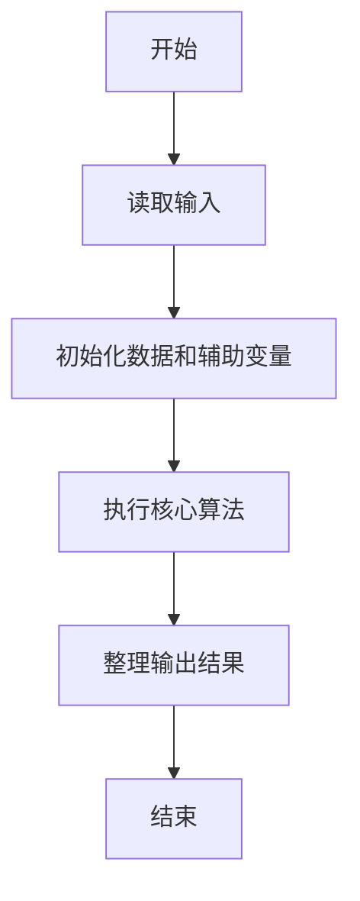
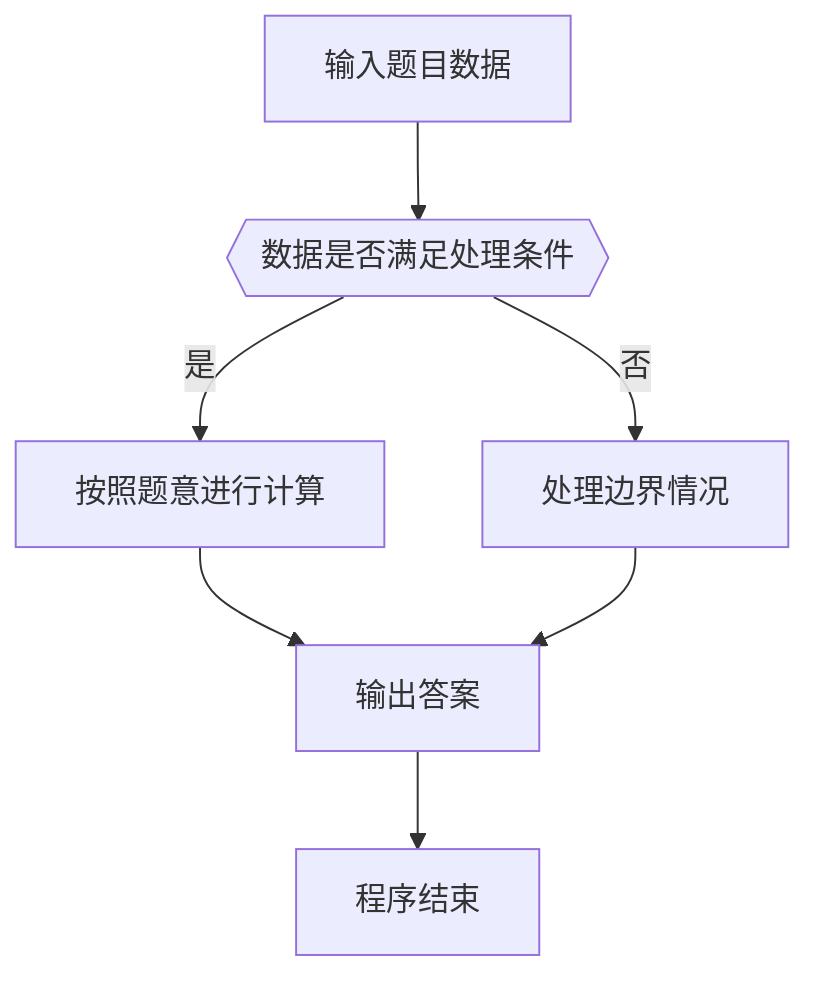

# 1012 数字分类

- **分值：** 20分

### 题目描述

给定一系列正整数，请按要求对数字进行分类，并输出以下 5 个数字：

- $A_1$ = 能被 5 整除的数字中所有偶数的和；
- $A_2$ = 将被 5 除后余 1 的数字按给出顺序进行交错求和，即计算 $n_1-n_2+n_3-n_4\cdots$；
- $A_3$ = 被 5 除后余 2 的数字的个数；
- $A_4$ = 被 5 除后余 3 的数字的平均数，精确到小数点后 1 位；
- $A_5$ = 被 5 除后余 4 的数字中最大数字。

### 输入格式：

每个输入包含 1 个测试用例。每个测试用例先给出一个不超过 1000 的正整数 $N$，随后给出 $N$ 个不超过 1000 的待分类的正整数。数字间以空格分隔。

### 输出格式：

对给定的 $N$ 个正整数，按题目要求计算 $A_1$ ~ $A_5$ 并在一行中顺序输出。数字间以空格分隔，但行末不得有多余空格。

若分类之后某一类不存在数字，则在相应位置输出 `N`。

### 输入样例 1：
```
13 1 2 3 4 5 6 7 8 9 10 20 16 18
```

### 输出样例 1：
```
30 11 2 9.7 9
```

### 输入样例 2：
```
8 1 2 4 5 6 7 9 16
```

### 输出样例 2：
```
N 11 2 N 9
```


### 解题思路

本题的核心是：遍历数字，根据除 5 取余结果分别累加、计数或记录最大值。程序先读取题目输入，再按照上述规则完成数据处理，最后严格按照题目要求输出结果。实现时应优先根据题目约束选择合适的数据类型和数据结构，避免溢出或不必要的重复计算。

时间复杂度为 O(n)；空间复杂度取决于输入规模，主要用于保存题目数据和中间结果。

### 代码流程说明

1. 读取 1012 数字分类 所需的输入数据。
2. 初始化计数器、数组或其他辅助变量。
3. 遍历数字，根据除 5 取余结果分别累加、计数或记录最大值。
4. 按题目规定的格式输出计算结果。

### 代码实现

```java
import java.io.*;
import java.util.*;

public class Main {
    static class FastScanner {
        private final InputStream in; private final byte[] buffer = new byte[1 << 16]; private int ptr, len;
        FastScanner(InputStream in) { this.in = in; }
        private int read() throws IOException { if (ptr >= len) { len = in.read(buffer); ptr = 0; if (len < 0) return -1; } return buffer[ptr++]; }
        String next() throws IOException { StringBuilder b = new StringBuilder(); int c; do c = read(); while (c <= 32 && c >= 0); while (c > 32) { b.append((char)c); c = read(); } return b.toString(); }
        char[] nextChars() throws IOException { return next().toCharArray(); }
        int nextInt() throws IOException { return Integer.parseInt(next()); }
        long nextLong() throws IOException { return Long.parseLong(next()); }
        double nextDouble() throws IOException { return Double.parseDouble(next()); }
        void skip() throws IOException { next(); }
    }
    static int strlen(char[] s) { int n = 0; while (n < s.length && s[n] != 0) n++; return n; }
    static int strcmp(char[] a, char[] b) { return new String(a, 0, strlen(a)).compareTo(new String(b, 0, strlen(b))); }
    static int strncmp(char[] a, char[] b) { return strcmp(a, b); }
    static void printf(String format, Object... args) { Object[] x = new Object[args.length]; for (int i=0;i<args.length;i++) x[i] = args[i] instanceof char[] ? new String((char[])args[i], 0, strlen((char[])args[i])) : args[i]; System.out.printf(format.replace("%lld", "%d"), x); }
    static void puts(Object x) { System.out.println(x instanceof char[] ? new String((char[])x, 0, strlen((char[])x)) : x); }
    static void putchar(char c) { System.out.print(c); }
    static void putchar(int c) { System.out.print((char)c); }
    static final int EOF = -1;
    static int getchar() { return -1; }
    static int isupper(char c) { return Character.isUpperCase(c) ? 1 : 0; }
    static char tolower(int c) { return Character.toLowerCase((char)c); }
    static int strchr(char[] s, char c) { for (int i=0;i<strlen(s);i++) if (s[i]==c) return i; return -1; }
/*
 * 题目：1012 数字分类
 * 实现原理：遍历数字，根据除 5 取余结果分别累加、计数或记录最大值。
 * 复杂度：O(n)
 * 实现步骤：
 * 1. 读取 1012 数字分类 所需的输入数据。
 * 2. 初始化计数器、数组或其他辅助变量。
 * 3. 遍历数字，根据除 5 取余结果分别累加、计数或记录最大值。
 * 4. 按题目规定的格式输出计算结果。
 */

static FastScanner fs = new FastScanner(System.in);

    public static void main(String[] args) throws Exception {
    int n; int x; int a1 = 0; int a2 = 0; int a3 = 0; int a4 = 0; int a5 = 0; int c2 = 0; int c4 = 0;
    n = fs.nextInt();
    while (n-- > 0) {
        x = fs.nextInt();
        if (x % 5 == 0 && x % 2 == 0) a1 += x;
        else if (x % 5 == 1) {
            a2 += (c2 % 2 != 0 ? - x : x);
            c2 ++;
        } else if (x % 5 == 2) a3 ++;
        else if (x % 5 == 3) {
            a4 += x;
            c4 ++;
        } else if (x % 5 == 4 && x > a5) a5 = x;
    }
    if (a1 == 0) printf("N ");
    else printf("%d ", a1);
    if (c2 == 0) printf("N ");
    else printf("%d ", a2);
    if (a3 == 0) printf("N ");
    else printf("%d ", a3);
    if (c4 == 0) printf("N ");
    else printf("%.1f ", (double) a4 / c4);
    if (a5 == 0) printf("N\n");
    else printf("%d\n", a5);

}
}
```

### 代码流程图



### 解题流程图



### 常见易错点

- 注意输入数据的范围，选择足够大的整数类型，并正确处理边界值。
- 循环、数组下标和字符串结束位置要严格对应题目定义，避免越界。
- 输出格式必须与题目要求完全一致，包括空格、换行、大小写和特殊符号。
- 如果存在排序、去重、进位、约分或四舍五入等操作，应在输出前统一完成。
