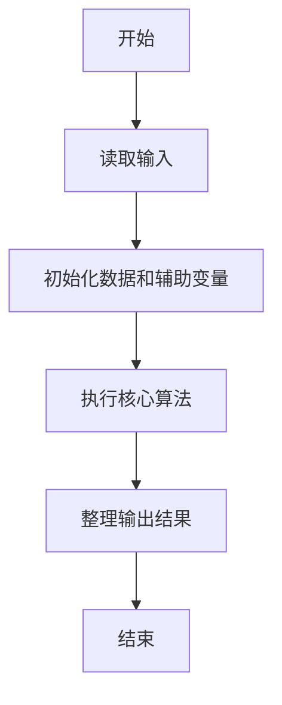
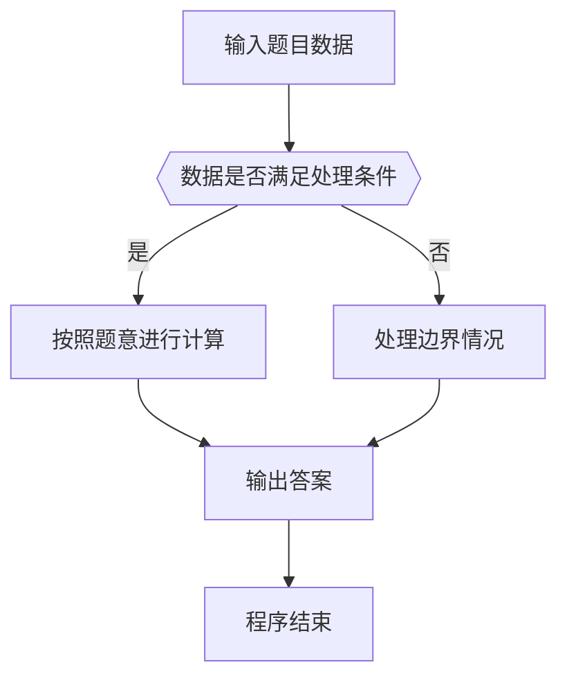

# 1014 福尔摩斯的约会

- **分值：** 20分

### 题目描述

大侦探福尔摩斯接到一张奇怪的字条：
```
我们约会吧！
3485djDkxh4hhGE
2984akDfkkkkggEdsb
s&hgsfdk
d&Hyscvnm
```
大侦探很快就明白了，字条上奇怪的乱码实际上就是约会的时间`星期四 14:04`，因为前面两字符串中第 1 对相同的大写英文字母（大小写有区分）是第 4 个字母 `D`，代表星期四；第 2 对相同的字符是 `E` ，那是第 5 个英文字母，代表一天里的第 14 个钟头（于是一天的 0 点到 23 点由数字 0 到 9、以及大写字母 `A` 到 `N` 表示）；后面两字符串第 1 对相同的英文字母 `s` 出现在第 4 个位置（从 0 开始计数）上，代表第 4 分钟。现给定两对字符串，请帮助福尔摩斯解码得到约会的时间。

### 输入格式：

输入在 4 行中分别给出 4 个非空、不包含空格、且长度不超过 60 的字符串。

### 输出格式：

在一行中输出约会的时间，格式为 `DAY HH:MM`，其中 `DAY` 是某星期的 3 字符缩写，即 `MON` 表示星期一，`TUE` 表示星期二，`WED` 表示星期三，`THU` 表示星期四，`FRI` 表示星期五，`SAT` 表示星期六，`SUN` 表示星期日。题目输入保证每个测试存在唯一解。

### 输入样例：
```
3485djDkxh4hhGE
2984akDfkkkkggEdsb
s&hgsfdk
d&Hyscvnm
```

### 输出样例：
```
THU 14:04
```


### 解题思路

本题的核心是：按顺序匹配前两串中的首个相同大写字母和数字，再匹配星期与分钟。程序先读取题目输入，再按照上述规则完成数据处理，最后严格按照题目要求输出结果。实现时应优先根据题目约束选择合适的数据类型和数据结构，避免溢出或不必要的重复计算。

时间复杂度为 O(L)；空间复杂度取决于输入规模，主要用于保存题目数据和中间结果。

### 代码流程说明

1. 读取 1014 福尔摩斯的约会 所需的输入数据。
2. 初始化计数器、数组或其他辅助变量。
3. 按顺序匹配前两串中的首个相同大写字母和数字，再匹配星期与分钟。
4. 按题目规定的格式输出计算结果。

### 代码实现

```java
import java.io.*;
import java.util.*;

public class Main {
    static class FastScanner {
        private final InputStream in; private final byte[] buffer = new byte[1 << 16]; private int ptr, len;
        FastScanner(InputStream in) { this.in = in; }
        private int read() throws IOException { if (ptr >= len) { len = in.read(buffer); ptr = 0; if (len < 0) return -1; } return buffer[ptr++]; }
        String next() throws IOException { StringBuilder b = new StringBuilder(); int c; do c = read(); while (c <= 32 && c >= 0); while (c > 32) { b.append((char)c); c = read(); } return b.toString(); }
        char[] nextChars() throws IOException { return next().toCharArray(); }
        int nextInt() throws IOException { return Integer.parseInt(next()); }
        long nextLong() throws IOException { return Long.parseLong(next()); }
        double nextDouble() throws IOException { return Double.parseDouble(next()); }
        void skip() throws IOException { next(); }
    }
    static int strlen(char[] s) { int n = 0; while (n < s.length && s[n] != 0) n++; return n; }
    static int strcmp(char[] a, char[] b) { return new String(a, 0, strlen(a)).compareTo(new String(b, 0, strlen(b))); }
    static int strncmp(char[] a, char[] b) { return strcmp(a, b); }
    static void printf(String format, Object... args) { Object[] x = new Object[args.length]; for (int i=0;i<args.length;i++) x[i] = args[i] instanceof char[] ? new String((char[])args[i], 0, strlen((char[])args[i])) : args[i]; System.out.printf(format.replace("%lld", "%d"), x); }
    static void puts(Object x) { System.out.println(x instanceof char[] ? new String((char[])x, 0, strlen((char[])x)) : x); }
    static void putchar(char c) { System.out.print(c); }
    static void putchar(int c) { System.out.print((char)c); }
    static final int EOF = -1;
    static int getchar() { return -1; }
    static int isupper(char c) { return Character.isUpperCase(c) ? 1 : 0; }
    static char tolower(int c) { return Character.toLowerCase((char)c); }
    static int strchr(char[] s, char c) { for (int i=0;i<strlen(s);i++) if (s[i]==c) return i; return -1; }
/*
 * 题目：1014 福尔摩斯约会
 * 实现原理：按顺序匹配前两串中的首个相同大写字母和数字，再匹配星期与分钟。
 * 复杂度：O(L)
 * 实现步骤：
 * 1. 读取 1014 福尔摩斯的约会 所需的输入数据。
 * 2. 初始化计数器、数组或其他辅助变量。
 * 3. 按顺序匹配前两串中的首个相同大写字母和数字，再匹配星期与分钟。
 * 4. 按题目规定的格式输出计算结果。
 */

static FastScanner fs = new FastScanner(System.in);

    public static void main(String[] args) throws Exception {
    char[] a = new char[65]; char[] b = new char[65]; char[] c = new char[65]; char[] d = new char[65];
    a = fs.nextChars(); b = fs.nextChars(); c = fs.nextChars(); d = fs.nextChars();
    int i = 0; int h = 0;
    while (a[i] != 0 && b[i] != 0 && !(a[i] == b[i] != 0 && a[i] >= 'A' && a[i] <= 'G')) i ++;
    char day = a[i ++];
    while (a[i] != 0 && b[i] != 0 && !(a[i] == b[i] != 0 && ((a[i] >= 'A' && a[i] <= 'N') || (a[i] >= '0' && a[i] <= '9')))) i ++;
    if (a[i] >= '0' && a[i] <= '9') h = a[i] - '0';
    else h = a[i] - 'A' + 10;
    int min = 0;
    for (int j = 0; c[j] != 0 && d[j]; j ++) if (c[j] == d[j] != 0 && Character.isLetter((char) c[j])) {
        min = j;
        break;
    }
    String[] wd = {
        "MON", "TUE", "WED", "THU", "FRI", "SAT", "SUN"
    };
    printf("%s %02d:%02d\n", wd[day - 'A'], h, min);

}
}
```

### 代码流程图



### 解题流程图



### 常见易错点

- 注意输入数据的范围，选择足够大的整数类型，并正确处理边界值。
- 循环、数组下标和字符串结束位置要严格对应题目定义，避免越界。
- 输出格式必须与题目要求完全一致，包括空格、换行、大小写和特殊符号。
- 如果存在排序、去重、进位、约分或四舍五入等操作，应在输出前统一完成。
