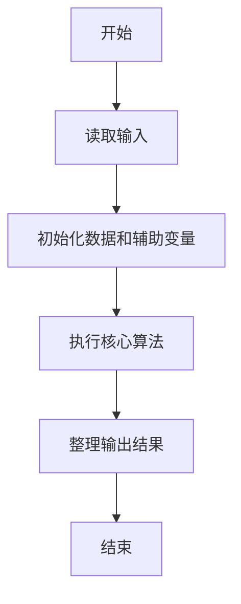
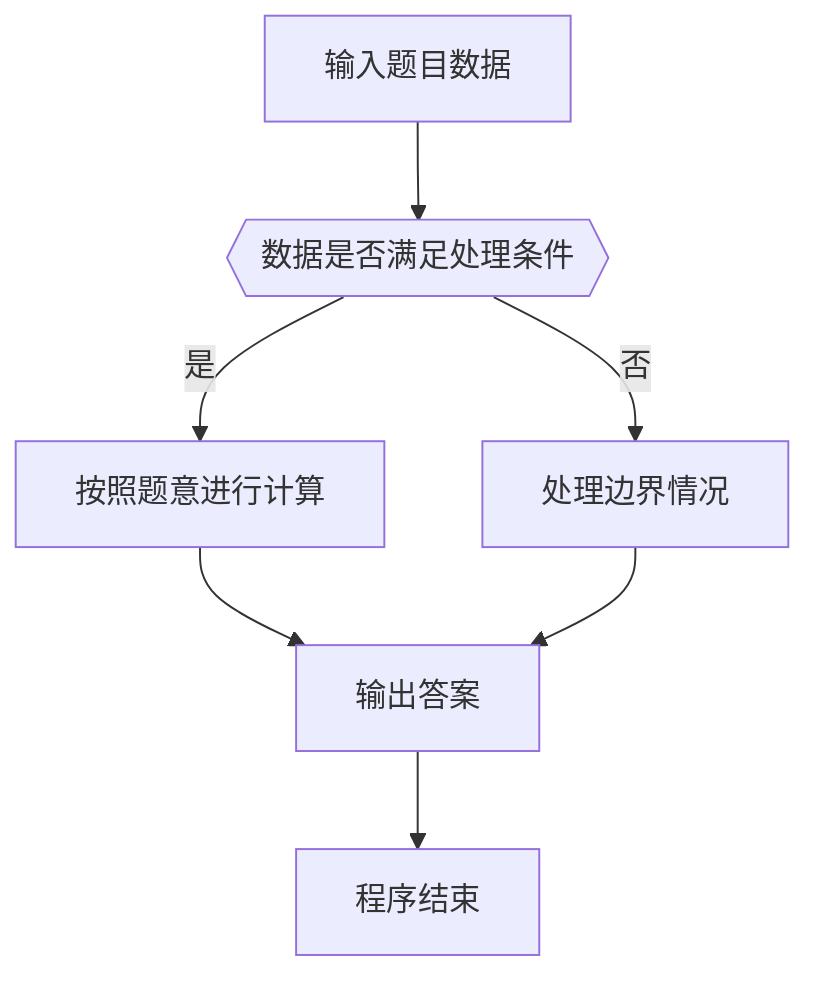

# 1018 锤子剪刀布

- **分值：** 20分

### 题目描述

大家应该都会玩“锤子剪刀布”的游戏：两人同时给出手势，胜负规则如图所示：


现给出两人的交锋记录，请统计双方的胜、平、负次数，并且给出双方分别出什么手势的胜算最大。

### 输入格式：

输入第 1 行给出正整数 $N$（$\le 10^{5}$），即双方交锋的次数。随后 $N$ 行，每行给出一次交锋的信息，即甲、乙双方同时给出的的手势。`C` 代表“锤子”、`J` 代表“剪刀”、`B` 代表“布”，第 1 个字母代表甲方，第 2 个代表乙方，中间有 1 个空格。

### 输出格式：

输出第 1、2 行分别给出甲、乙的胜、平、负次数，数字间以 1 个空格分隔。第 3 行给出两个字母，分别代表甲、乙获胜次数最多的手势，中间有 1 个空格。如果解不唯一，则输出按字母序最小的解。

### 输入样例：
```
10
C J
J B
C B
B B
B C
C C
C B
J B
B C
J J
```

### 输出样例：
```
5 3 2
2 3 5
B B
```


### 解题思路

本题的核心是：统计每种手势的胜负次数，并记录双方最常获胜手势。程序先读取题目输入，再按照上述规则完成数据处理，最后严格按照题目要求输出结果。实现时应优先根据题目约束选择合适的数据类型和数据结构，避免溢出或不必要的重复计算。

时间复杂度为 O(n)；空间复杂度取决于输入规模，主要用于保存题目数据和中间结果。

### 代码流程说明

1. 读取 1018 锤子剪刀布 所需的输入数据。
2. 初始化计数器、数组或其他辅助变量。
3. 统计每种手势的胜负次数，并记录双方最常获胜手势。
4. 按题目规定的格式输出计算结果。

### 代码实现

```java
import java.io.*;
import java.util.*;

public class Main {
    static class FastScanner {
        private final InputStream in; private final byte[] buffer = new byte[1 << 16]; private int ptr, len;
        FastScanner(InputStream in) { this.in = in; }
        private int read() throws IOException { if (ptr >= len) { len = in.read(buffer); ptr = 0; if (len < 0) return -1; } return buffer[ptr++]; }
        String next() throws IOException { StringBuilder b = new StringBuilder(); int c; do c = read(); while (c <= 32 && c >= 0); while (c > 32) { b.append((char)c); c = read(); } return b.toString(); }
        char[] nextChars() throws IOException { return next().toCharArray(); }
        int nextInt() throws IOException { return Integer.parseInt(next()); }
        long nextLong() throws IOException { return Long.parseLong(next()); }
        double nextDouble() throws IOException { return Double.parseDouble(next()); }
        void skip() throws IOException { next(); }
    }
    static int strlen(char[] s) { int n = 0; while (n < s.length && s[n] != 0) n++; return n; }
    static int strcmp(char[] a, char[] b) { return new String(a, 0, strlen(a)).compareTo(new String(b, 0, strlen(b))); }
    static int strncmp(char[] a, char[] b) { return strcmp(a, b); }
    static void printf(String format, Object... args) { Object[] x = new Object[args.length]; for (int i=0;i<args.length;i++) x[i] = args[i] instanceof char[] ? new String((char[])args[i], 0, strlen((char[])args[i])) : args[i]; System.out.printf(format.replace("%lld", "%d"), x); }
    static void puts(Object x) { System.out.println(x instanceof char[] ? new String((char[])x, 0, strlen((char[])x)) : x); }
    static void putchar(char c) { System.out.print(c); }
    static void putchar(int c) { System.out.print((char)c); }
    static final int EOF = -1;
    static int getchar() { return -1; }
    static int isupper(char c) { return Character.isUpperCase(c) ? 1 : 0; }
    static char tolower(int c) { return Character.toLowerCase((char)c); }
    static int strchr(char[] s, char c) { for (int i=0;i<strlen(s);i++) if (s[i]==c) return i; return -1; }
/*
 * 题目：1018 锤子剪刀布
 * 实现原理：统计每种手势的胜负次数，并记录双方最常获胜手势。
 * 复杂度：O(n)
 * 实现步骤：
 * 1. 读取 1018 锤子剪刀布 所需的输入数据。
 * 2. 初始化计数器、数组或其他辅助变量。
 * 3. 统计每种手势的胜负次数，并记录双方最常获胜手势。
 * 4. 按题目规定的格式输出计算结果。
 */

static int win(char a, char b) {
    return (a == 'C' && b == 'J') || (a == 'J' && b == 'B') || (a == 'B' && b == 'C') ? 1 : 0;
}
static FastScanner fs = new FastScanner(System.in);

    public static void main(String[] args) throws Exception {
    int n; int wa = 0; int wb = 0; int tie = 0; int[] ca = new int[3]; int[] cb = new int[3];
    char a; char b;
    n = fs.nextInt();
    while (n-- > 0) {
        a = fs.next().charAt(0); b = fs.next().charAt(0);
        if (a == b) {
            tie ++;
        } else if (win(a, b) != 0) {
            wa ++;
            ca[a == 'B' ? 0 : a == 'C' ? 1 : 2] ++;
        } else {
            wb ++;
            cb[b == 'B' ? 0 : b == 'C' ? 1 : 2] ++;
        }
    }
    char[] z = "BCJ".toCharArray();
    int ia = 0; int ib = 0;
    for (int i = 1; i < 3; i ++) {
        if (ca[i] > ca[ia]) ia = i;
        if (cb[i] > cb[ib]) ib = i;
    }
    printf("%d %d %d\n%d %d %d\n%c %c\n", wa, tie, wb, wb, tie, wa, z[ia], z[ib]);

}
}
```

### 代码流程图



### 解题流程图



### 常见易错点

- 注意输入数据的范围，选择足够大的整数类型，并正确处理边界值。
- 循环、数组下标和字符串结束位置要严格对应题目定义，避免越界。
- 输出格式必须与题目要求完全一致，包括空格、换行、大小写和特殊符号。
- 如果存在排序、去重、进位、约分或四舍五入等操作，应在输出前统一完成。
