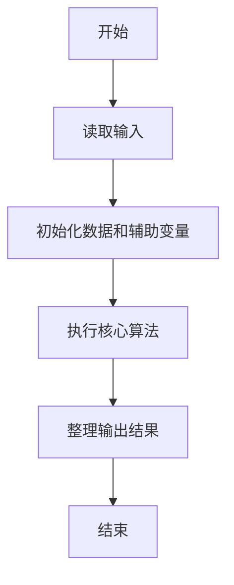
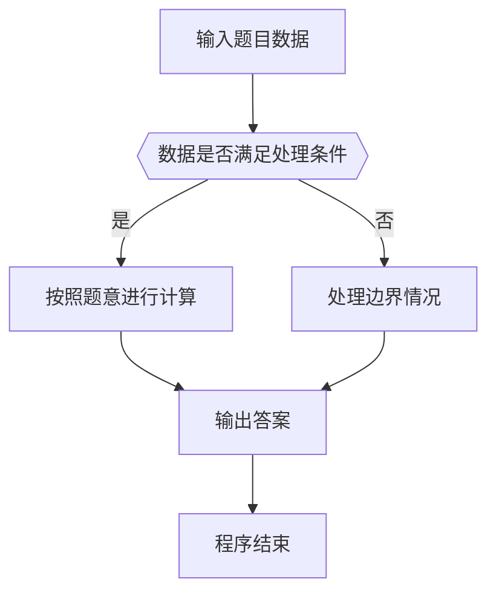

# 1019 数字黑洞

- **分值：** 20分

### 题目描述

给定任一个各位数字不完全相同的 4 位正整数，如果我们先把 4 个数字按非递增排序，再按非递减排序，然后用第 1 个数字减第 2 个数字，将得到一个新的数字。一直重复这样做，我们很快会停在有“数字黑洞”之称的 `6174`，这个神奇的数字也叫 Kaprekar 常数。

例如，我们从`6767`开始，将得到
```
7766 - 6677 = 1089
9810 - 0189 = 9621
9621 - 1269 = 8352
8532 - 2358 = 6174
7641 - 1467 = 6174
... ...
```

现给定任意 4 位正整数，请编写程序演示到达黑洞的过程。

### 输入格式：

输入给出一个 $(0, 10^4)$ 区间内的正整数 $N$。

### 输出格式：

如果 $N$ 的 4 位数字全相等，则在一行内输出 `N - N = 0000`；否则将计算的每一步在一行内输出，直到 `6174` 作为差出现，输出格式见样例。注意每个数字按 `4` 位数格式输出。

### 输入样例 1：
```
6767
```

### 输出样例 1：
```
7766 - 6677 = 1089
9810 - 0189 = 9621
9621 - 1269 = 8352
8532 - 2358 = 6174
```

### 输入样例 2：
```
2222
```

### 输出样例 2：
```
2222 - 2222 = 0000
```


### 解题思路

本题的核心是：反复将数字的降序排列数减去升序排列数，直到 6174 或 0。程序先读取题目输入，再按照上述规则完成数据处理，最后严格按照题目要求输出结果。实现时应优先根据题目约束选择合适的数据类型和数据结构，避免溢出或不必要的重复计算。

时间复杂度为 O(k)；空间复杂度取决于输入规模，主要用于保存题目数据和中间结果。

### 代码流程说明

1. 读取 1019 数字黑洞 所需的输入数据。
2. 初始化计数器、数组或其他辅助变量。
3. 反复将数字的降序排列数减去升序排列数，直到 6174 或 0。
4. 按题目规定的格式输出计算结果。

### 代码实现

```java
import java.io.*;
import java.util.*;

public class Main {
    static class FastScanner {
        private final InputStream in; private final byte[] buffer = new byte[1 << 16]; private int ptr, len;
        FastScanner(InputStream in) { this.in = in; }
        private int read() throws IOException { if (ptr >= len) { len = in.read(buffer); ptr = 0; if (len < 0) return -1; } return buffer[ptr++]; }
        String next() throws IOException { StringBuilder b = new StringBuilder(); int c; do c = read(); while (c <= 32 && c >= 0); while (c > 32) { b.append((char)c); c = read(); } return b.toString(); }
        char[] nextChars() throws IOException { return next().toCharArray(); }
        int nextInt() throws IOException { return Integer.parseInt(next()); }
        long nextLong() throws IOException { return Long.parseLong(next()); }
        double nextDouble() throws IOException { return Double.parseDouble(next()); }
        void skip() throws IOException { next(); }
    }
    static int strlen(char[] s) { int n = 0; while (n < s.length && s[n] != 0) n++; return n; }
    static int strcmp(char[] a, char[] b) { return new String(a, 0, strlen(a)).compareTo(new String(b, 0, strlen(b))); }
    static int strncmp(char[] a, char[] b) { return strcmp(a, b); }
    static void printf(String format, Object... args) { Object[] x = new Object[args.length]; for (int i=0;i<args.length;i++) x[i] = args[i] instanceof char[] ? new String((char[])args[i], 0, strlen((char[])args[i])) : args[i]; System.out.printf(format.replace("%lld", "%d"), x); }
    static void puts(Object x) { System.out.println(x instanceof char[] ? new String((char[])x, 0, strlen((char[])x)) : x); }
    static void putchar(char c) { System.out.print(c); }
    static void putchar(int c) { System.out.print((char)c); }
    static final int EOF = -1;
    static int getchar() { return -1; }
    static int isupper(char c) { return Character.isUpperCase(c) ? 1 : 0; }
    static char tolower(int c) { return Character.toLowerCase((char)c); }
    static int strchr(char[] s, char c) { for (int i=0;i<strlen(s);i++) if (s[i]==c) return i; return -1; }
/*
 * 题目：1019 数字黑洞
 * 实现原理：反复将数字的降序排列数减去升序排列数，直到 6174 或 0。
 * 复杂度：O(k)
 * 实现步骤：
 * 1. 读取 1019 数字黑洞 所需的输入数据。
 * 2. 初始化计数器、数组或其他辅助变量。
 * 3. 反复将数字的降序排列数减去升序排列数，直到 6174 或 0。
 * 4. 按题目规定的格式输出计算结果。
 */

static FastScanner fs = new FastScanner(System.in);

    public static void main(String[] args) throws Exception {
    int n;
    n = fs.nextInt();
    while (true) {
        int[] d = new int[]{
            n / 1000, n / 100 % 10, n / 10 % 10, n % 10
        };
        for (int i = 0; i < 4; i ++) for (int j = i + 1; j < 4; j ++) if (d[i] < d[j]) {
            int t = d[i];
            d[i] = d[j];
            d[j] = t;
        }
        int hi = d[0] * 1000 + d[1] * 100 + d[2] * 10 + d[3]; int lo = d[3] * 1000 + d[2] * 100 + d[1] * 10 + d[0];
        printf("%04d - %04d = %04d\n", hi, lo, hi - lo);
        n = hi - lo;
        if (n == 0 || n == 6174) break;
    }

}
}
```

### 代码流程图



### 解题流程图



### 常见易错点

- 注意输入数据的范围，选择足够大的整数类型，并正确处理边界值。
- 循环、数组下标和字符串结束位置要严格对应题目定义，避免越界。
- 输出格式必须与题目要求完全一致，包括空格、换行、大小写和特殊符号。
- 如果存在排序、去重、进位、约分或四舍五入等操作，应在输出前统一完成。
