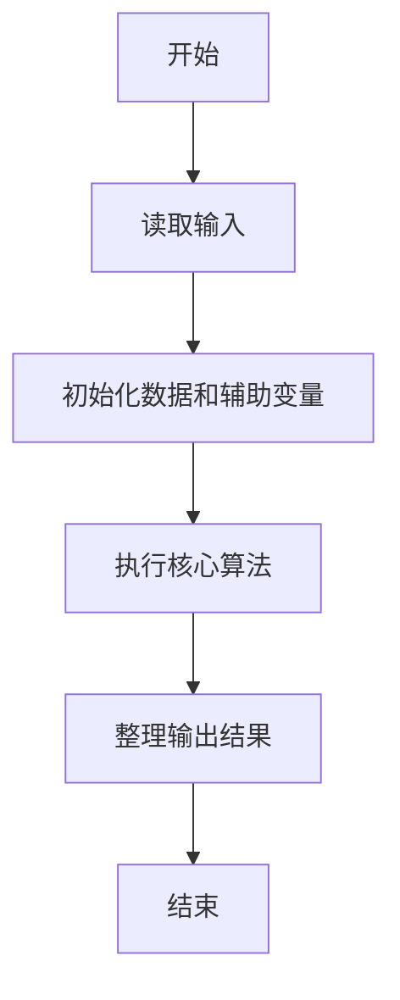
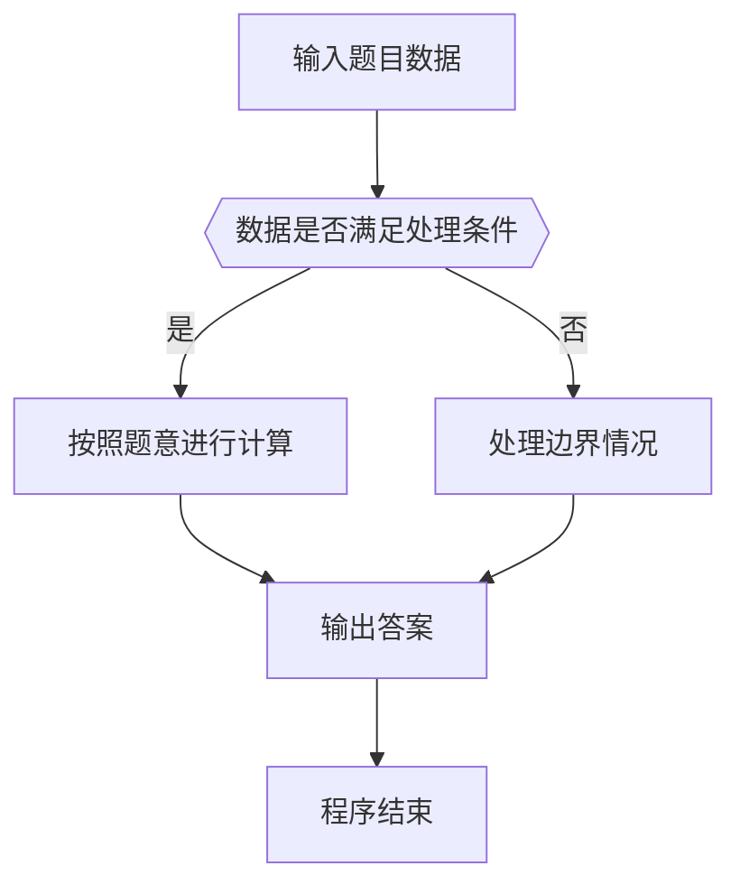

# 1021 个位数统计

- **分值：** 15分

### 题目描述

给定一个 $k$ 位整数 $N = d_{k-1}10^{k-1} + \cdots + d_1 10^{1} + d_0$ ($0\le d_i \le 9$, $i=0,\cdots ,k-1$, $d_{k-1}>0$)，请编写程序统计每种不同的个位数字出现的次数。例如：给定 $N = 100311$，则有 2 个 0，3 个 1，和 1 个 3。

### 输入格式：

每个输入包含 1 个测试用例，即一个不超过 1000 位的正整数 $N$。

### 输出格式：

对 $N$ 中每一种不同的个位数字，以 `D:M` 的格式在一行中输出该位数字 `D` 及其在 $N$ 中出现的次数 `M`。要求按 `D` 的升序输出。

### 输入样例：
```
100311
```

### 输出样例：
```
0:2
1:3
3:1
```


### 解题思路

本题的核心是：扫描数字字符串，用数组统计 0 到 9 的出现次数。程序先读取题目输入，再按照上述规则完成数据处理，最后严格按照题目要求输出结果。实现时应优先根据题目约束选择合适的数据类型和数据结构，避免溢出或不必要的重复计算。

时间复杂度为 O(L)；空间复杂度取决于输入规模，主要用于保存题目数据和中间结果。

### 代码流程说明

1. 读取 1021 个位数统计 所需的输入数据。
2. 初始化计数器、数组或其他辅助变量。
3. 扫描数字字符串，用数组统计 0 到 9 的出现次数。
4. 按题目规定的格式输出计算结果。

### 代码实现

```java
import java.io.*;
import java.util.*;

public class Main {
    static class FastScanner {
        private final InputStream in; private final byte[] buffer = new byte[1 << 16]; private int ptr, len;
        FastScanner(InputStream in) { this.in = in; }
        private int read() throws IOException { if (ptr >= len) { len = in.read(buffer); ptr = 0; if (len < 0) return -1; } return buffer[ptr++]; }
        String next() throws IOException { StringBuilder b = new StringBuilder(); int c; do c = read(); while (c <= 32 && c >= 0); while (c > 32) { b.append((char)c); c = read(); } return b.toString(); }
        char[] nextChars() throws IOException { return next().toCharArray(); }
        int nextInt() throws IOException { return Integer.parseInt(next()); }
        long nextLong() throws IOException { return Long.parseLong(next()); }
        double nextDouble() throws IOException { return Double.parseDouble(next()); }
        void skip() throws IOException { next(); }
    }
    static int strlen(char[] s) { int n = 0; while (n < s.length && s[n] != 0) n++; return n; }
    static int strcmp(char[] a, char[] b) { return new String(a, 0, strlen(a)).compareTo(new String(b, 0, strlen(b))); }
    static int strncmp(char[] a, char[] b) { return strcmp(a, b); }
    static void printf(String format, Object... args) { Object[] x = new Object[args.length]; for (int i=0;i<args.length;i++) x[i] = args[i] instanceof char[] ? new String((char[])args[i], 0, strlen((char[])args[i])) : args[i]; System.out.printf(format.replace("%lld", "%d"), x); }
    static void puts(Object x) { System.out.println(x instanceof char[] ? new String((char[])x, 0, strlen((char[])x)) : x); }
    static void putchar(char c) { System.out.print(c); }
    static void putchar(int c) { System.out.print((char)c); }
    static final int EOF = -1;
    static int getchar() { return -1; }
    static int isupper(char c) { return Character.isUpperCase(c) ? 1 : 0; }
    static char tolower(int c) { return Character.toLowerCase((char)c); }
    static int strchr(char[] s, char c) { for (int i=0;i<strlen(s);i++) if (s[i]==c) return i; return -1; }
/*
 * 题目：1021 个位数字统计
 * 实现原理：扫描数字字符串，用数组统计 0 到 9 的出现次数。
 * 复杂度：O(L)
 * 实现步骤：
 * 1. 读取 1021 个位数统计 所需的输入数据。
 * 2. 初始化计数器、数组或其他辅助变量。
 * 3. 扫描数字字符串，用数组统计 0 到 9 的出现次数。
 * 4. 按题目规定的格式输出计算结果。
 */

static FastScanner fs = new FastScanner(System.in);

    public static void main(String[] args) throws Exception {
    char[] s = new char[1005];
    int[] c = new int[10];
    s = fs.nextChars();
    for (int i = 0; i < strlen(s); i ++) c[s[i] - '0'] ++;
    for (int i = 0; i < 10; i ++) if (c[i] != 0) printf("%d:%d\n", i, c[i]);

}
}
```

### 代码流程图



### 解题流程图



### 常见易错点

- 注意输入数据的范围，选择足够大的整数类型，并正确处理边界值。
- 循环、数组下标和字符串结束位置要严格对应题目定义，避免越界。
- 输出格式必须与题目要求完全一致，包括空格、换行、大小写和特殊符号。
- 如果存在排序、去重、进位、约分或四舍五入等操作，应在输出前统一完成。
