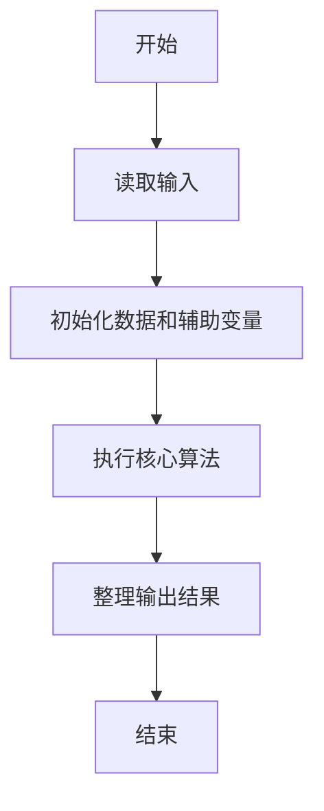
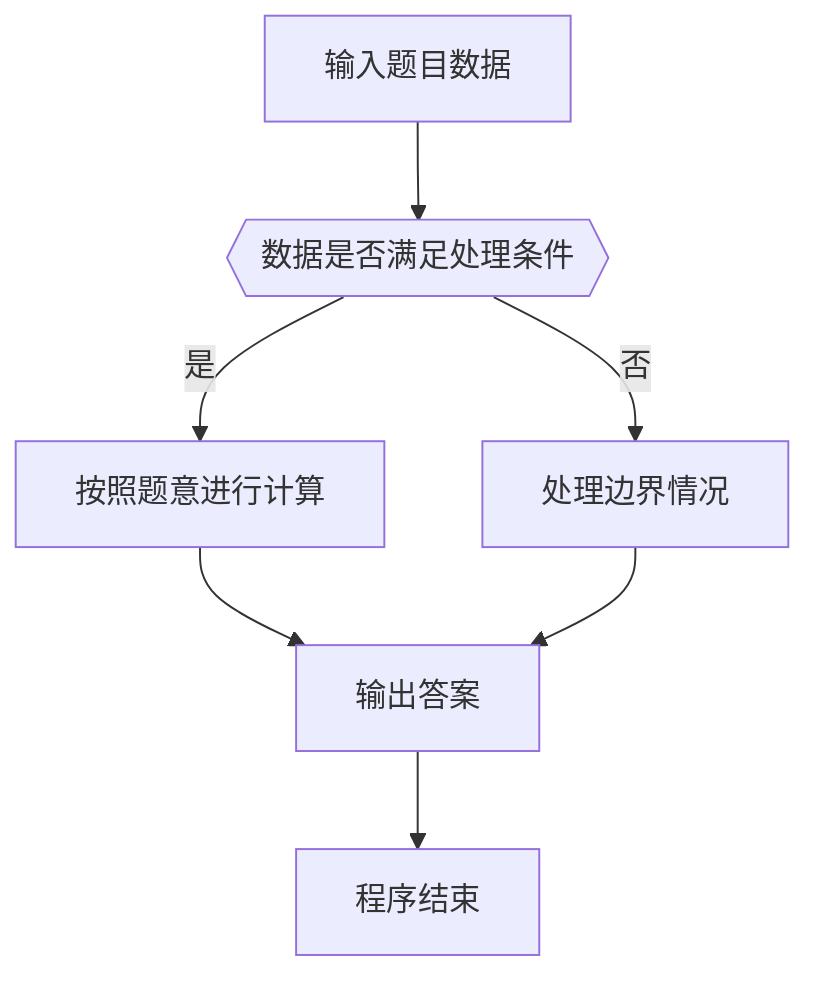

# 1026 程序运行时间

- **分值：** 15分

### 题目描述

要获得一个 C 语言程序的运行时间，常用的方法是调用头文件 time.h，其中提供了 clock() 函数，可以捕捉从程序开始运行到 clock() 被调用时所耗费的时间。这个时间单位是 clock tick，即“时钟打点”。同时还有一个常数 CLK_TCK，给出了机器时钟每秒所走的时钟打点数。于是为了获得一个函数 $f$ 的运行时间，我们只要在调用 $f$ 之前先调用 clock()，获得一个时钟打点数 C1；在 $f$ 执行完成后再调用 clock()，获得另一个时钟打点数 C2；两次获得的时钟打点数之差 (C2-C1) 就是 $f$ 运行所消耗的时钟打点数，再除以常数 CLK_TCK，就得到了以秒为单位的运行时间。

这里不妨简单假设常数 CLK_TCK 为 100。现给定被测函数前后两次获得的时钟打点数，请你给出被测函数运行的时间。

### 输入格式：

输入在一行中顺序给出 2 个整数 C1 和 C2。注意两次获得的时钟打点数肯定不相同，即 C1 $<$ C2，并且取值在 $[0, 10^7]$。

### 输出格式：

在一行中输出被测函数运行的时间。运行时间必须按照 `hh:mm:ss`（即2位的 `时:分:秒`）格式输出；不足 1 秒的时间四舍五入到秒。

### 输入样例：
```
123 4577973
```

### 输出样例：
```
12:42:59
```


### 解题思路

本题的核心是：将时钟 tick 差值按每秒 tick 数转换为时分秒并四舍五入。程序先读取题目输入，再按照上述规则完成数据处理，最后严格按照题目要求输出结果。实现时应优先根据题目约束选择合适的数据类型和数据结构，避免溢出或不必要的重复计算。

时间复杂度为 O(1)；空间复杂度取决于输入规模，主要用于保存题目数据和中间结果。

### 代码流程说明

1. 读取 1026 程序运行时间 所需的输入数据。
2. 初始化计数器、数组或其他辅助变量。
3. 将时钟 tick 差值按每秒 tick 数转换为时分秒并四舍五入。
4. 按题目规定的格式输出计算结果。

### 代码实现

```java
import java.io.*;
import java.util.*;

public class Main {
    static class FastScanner {
        private final InputStream in; private final byte[] buffer = new byte[1 << 16]; private int ptr, len;
        FastScanner(InputStream in) { this.in = in; }
        private int read() throws IOException { if (ptr >= len) { len = in.read(buffer); ptr = 0; if (len < 0) return -1; } return buffer[ptr++]; }
        String next() throws IOException { StringBuilder b = new StringBuilder(); int c; do c = read(); while (c <= 32 && c >= 0); while (c > 32) { b.append((char)c); c = read(); } return b.toString(); }
        char[] nextChars() throws IOException { return next().toCharArray(); }
        int nextInt() throws IOException { return Integer.parseInt(next()); }
        long nextLong() throws IOException { return Long.parseLong(next()); }
        double nextDouble() throws IOException { return Double.parseDouble(next()); }
        void skip() throws IOException { next(); }
    }
    static int strlen(char[] s) { int n = 0; while (n < s.length && s[n] != 0) n++; return n; }
    static int strcmp(char[] a, char[] b) { return new String(a, 0, strlen(a)).compareTo(new String(b, 0, strlen(b))); }
    static int strncmp(char[] a, char[] b) { return strcmp(a, b); }
    static void printf(String format, Object... args) { Object[] x = new Object[args.length]; for (int i=0;i<args.length;i++) x[i] = args[i] instanceof char[] ? new String((char[])args[i], 0, strlen((char[])args[i])) : args[i]; System.out.printf(format.replace("%lld", "%d"), x); }
    static void puts(Object x) { System.out.println(x instanceof char[] ? new String((char[])x, 0, strlen((char[])x)) : x); }
    static void putchar(char c) { System.out.print(c); }
    static void putchar(int c) { System.out.print((char)c); }
    static final int EOF = -1;
    static int getchar() { return -1; }
    static int isupper(char c) { return Character.isUpperCase(c) ? 1 : 0; }
    static char tolower(int c) { return Character.toLowerCase((char)c); }
    static int strchr(char[] s, char c) { for (int i=0;i<strlen(s);i++) if (s[i]==c) return i; return -1; }
/*
 * 题目：1026 时间换算
 * 实现原理：将时钟 tick 差值按每秒 tick 数转换为时分秒并四舍五入。
 * 复杂度：O(1)
 * 实现步骤：
 * 1. 读取 1026 程序运行时间 所需的输入数据。
 * 2. 初始化计数器、数组或其他辅助变量。
 * 3. 将时钟 tick 差值按每秒 tick 数转换为时分秒并四舍五入。
 * 4. 按题目规定的格式输出计算结果。
 */

static FastScanner fs = new FastScanner(System.in);

    public static void main(String[] args) throws Exception {
    long a; long b;
    a = fs.nextLong(); b = fs.nextLong();
    long t = (b - a + 50) / 100;
    printf("%02lld:%02lld:%02lld\n", t / 3600, t / 60 % 60, t % 60);

}
}
```

### 代码流程图



### 解题流程图



### 常见易错点

- 注意输入数据的范围，选择足够大的整数类型，并正确处理边界值。
- 循环、数组下标和字符串结束位置要严格对应题目定义，避免越界。
- 输出格式必须与题目要求完全一致，包括空格、换行、大小写和特殊符号。
- 如果存在排序、去重、进位、约分或四舍五入等操作，应在输出前统一完成。
