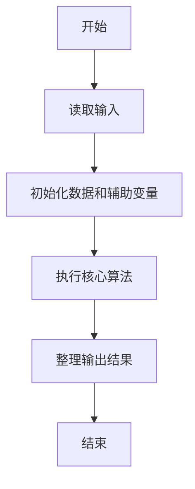
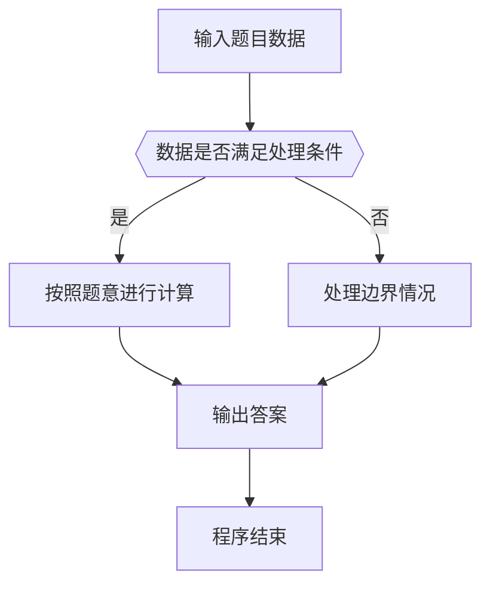

# 1031 查验身份证

- **分值：** 15分

### 题目描述

一个合法的身份证号码由17位地区、日期编号和顺序编号加1位校验码组成。校验码的计算规则如下：

首先对前17位数字加权求和，权重分配为：{7，9，10，5，8，4，2，1，6，3，7，9，10，5，8，4，2}；然后将计算的和对11取模得到值`Z`；最后按照以下关系对应`Z`值与校验码`M`的值：
```
Z：0 1 2 3 4 5 6 7 8 9 10
M：1 0 X 9 8 7 6 5 4 3 2
```
现在给定一些身份证号码，请你验证校验码的有效性，并输出有问题的号码。

### 输入格式：

输入第一行给出正整数$N$（$\le 100$）是输入的身份证号码的个数。随后$N$行，每行给出1个18位身份证号码。

### 输出格式：

按照输入的顺序每行输出1个有问题的身份证号码。这里并不检验前17位是否合理，只检查前17位是否全为数字且最后1位校验码计算准确。如果所有号码都正常，则输出`All passed`。

### 输入样例1：
```
4
320124198808240056
12010X198901011234
110108196711301866
37070419881216001X
```

### 输出样例1：
```
12010X198901011234
110108196711301866
37070419881216001X
```

### 输入样例2：
```
2
320124198808240056
110108196711301862
```

### 输出样例2：
```
All passed
```

**鸣谢阜阳师范学院范建中老师补充数据**

**鸣谢浙江工业大学之江学院石洗凡老师纠正数据**


### 解题思路

本题的核心是：按权重计算前 17 位校验和，并与校验码表逐个比对。程序先读取题目输入，再按照上述规则完成数据处理，最后严格按照题目要求输出结果。实现时应优先根据题目约束选择合适的数据类型和数据结构，避免溢出或不必要的重复计算。

时间复杂度为 O(n)；空间复杂度取决于输入规模，主要用于保存题目数据和中间结果。

### 代码流程说明

1. 读取 1031 查验身份证 所需的输入数据。
2. 初始化计数器、数组或其他辅助变量。
3. 按权重计算前 17 位校验和，并与校验码表逐个比对。
4. 按题目规定的格式输出计算结果。

### 代码实现

```java
import java.io.*;
import java.util.*;

public class Main {
    static class FastScanner {
        private final InputStream in; private final byte[] buffer = new byte[1 << 16]; private int ptr, len;
        FastScanner(InputStream in) { this.in = in; }
        private int read() throws IOException { if (ptr >= len) { len = in.read(buffer); ptr = 0; if (len < 0) return -1; } return buffer[ptr++]; }
        String next() throws IOException { StringBuilder b = new StringBuilder(); int c; do c = read(); while (c <= 32 && c >= 0); while (c > 32) { b.append((char)c); c = read(); } return b.toString(); }
        char[] nextChars() throws IOException { return next().toCharArray(); }
        int nextInt() throws IOException { return Integer.parseInt(next()); }
        long nextLong() throws IOException { return Long.parseLong(next()); }
        double nextDouble() throws IOException { return Double.parseDouble(next()); }
        void skip() throws IOException { next(); }
    }
    static int strlen(char[] s) { int n = 0; while (n < s.length && s[n] != 0) n++; return n; }
    static int strcmp(char[] a, char[] b) { return new String(a, 0, strlen(a)).compareTo(new String(b, 0, strlen(b))); }
    static int strncmp(char[] a, char[] b) { return strcmp(a, b); }
    static void printf(String format, Object... args) { Object[] x = new Object[args.length]; for (int i=0;i<args.length;i++) x[i] = args[i] instanceof char[] ? new String((char[])args[i], 0, strlen((char[])args[i])) : args[i]; System.out.printf(format.replace("%lld", "%d"), x); }
    static void puts(Object x) { System.out.println(x instanceof char[] ? new String((char[])x, 0, strlen((char[])x)) : x); }
    static void putchar(char c) { System.out.print(c); }
    static void putchar(int c) { System.out.print((char)c); }
    static final int EOF = -1;
    static int getchar() { return -1; }
    static int isupper(char c) { return Character.isUpperCase(c) ? 1 : 0; }
    static char tolower(int c) { return Character.toLowerCase((char)c); }
    static int strchr(char[] s, char c) { for (int i=0;i<strlen(s);i++) if (s[i]==c) return i; return -1; }
/*
 * 题目：1031 查验身份证
 * 实现原理：按权重计算前 17 位校验和，并与校验码表逐个比对。
 * 复杂度：O(n)
 * 实现步骤：
 * 1. 读取 1031 查验身份证 所需的输入数据。
 * 2. 初始化计数器、数组或其他辅助变量。
 * 3. 按权重计算前 17 位校验和，并与校验码表逐个比对。
 * 4. 按题目规定的格式输出计算结果。
 */

static FastScanner fs = new FastScanner(System.in);

    public static void main(String[] args) throws Exception {
    int[] w = new int[]{
        7, 9, 10, 5, 8, 4, 2, 1, 6, 3, 7, 9, 10, 5, 8, 4, 2
    };
    char[] map = "10X98765432".toCharArray(); char[] s = new char[25];
    int n; int bad = 0;
    n = fs.nextInt();
    while (n-- > 0) {
        s = fs.nextChars();
        int sum = 0; int ok = 1;
        for (int i = 0; i < 17; i ++) {
            if (s[i] < '0' || s[i] > '9') ok = 0;
            sum += (s[i] - '0') * w[i];
        }
        if (ok == 0 || map[sum % 11] != s[17]) {
            puts(s);
            bad ++;
        }
    }
    if (bad == 0) puts("All passed");

}
}
```

### 代码流程图



### 解题流程图



### 常见易错点

- 注意输入数据的范围，选择足够大的整数类型，并正确处理边界值。
- 循环、数组下标和字符串结束位置要严格对应题目定义，避免越界。
- 输出格式必须与题目要求完全一致，包括空格、换行、大小写和特殊符号。
- 如果存在排序、去重、进位、约分或四舍五入等操作，应在输出前统一完成。
