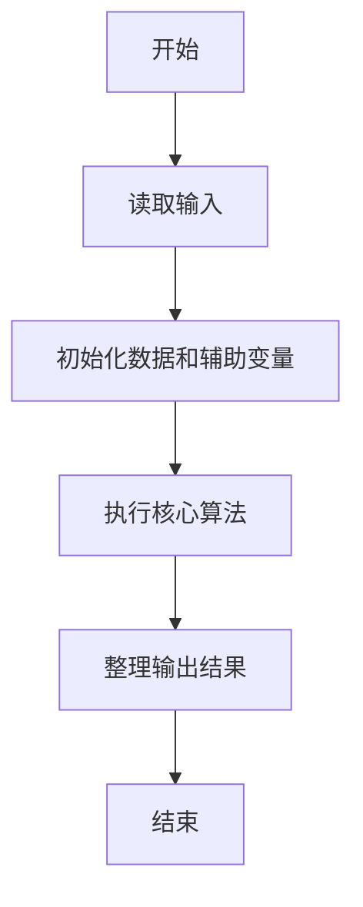
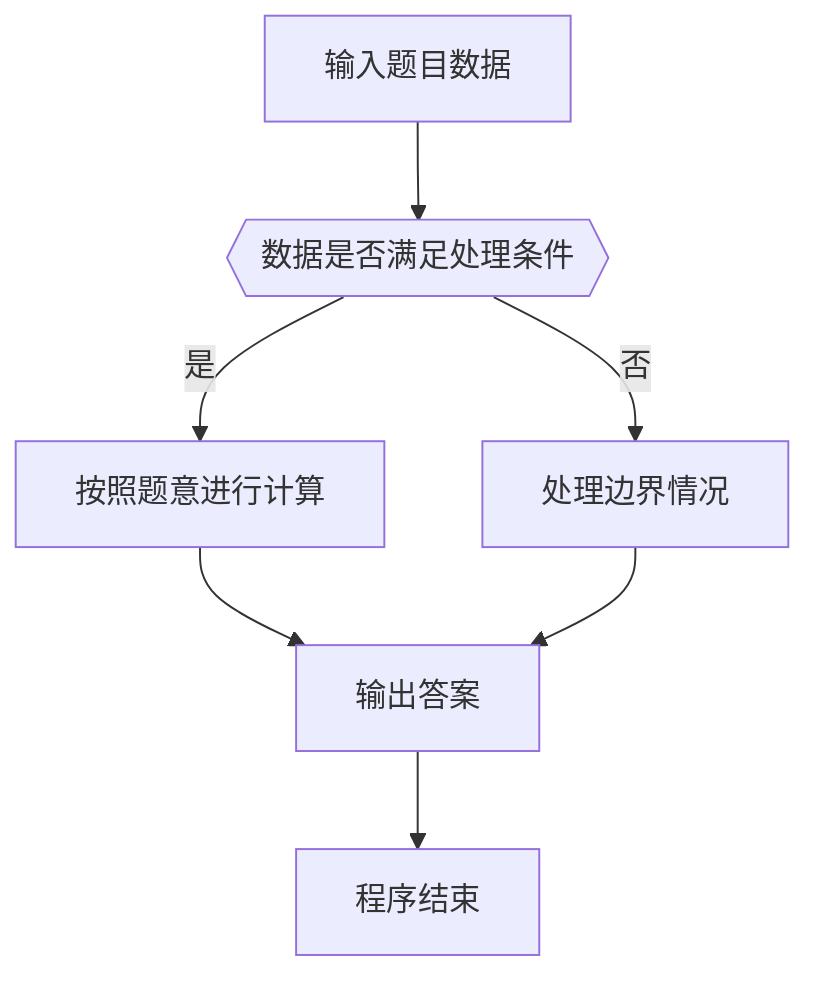

# 1035 插入与归并

- **分值：** 25分

### 题目描述

根据维基百科的定义：

**插入排序**是迭代算法，逐一获得输入数据，逐步产生有序的输出序列。每步迭代中，算法从输入序列中取出一元素，将之插入有序序列中正确的位置。如此迭代直到全部元素有序。

**归并排序**进行如下迭代操作：首先将原始序列看成 N 个只包含 1 个元素的有序子序列，然后每次迭代归并两个相邻的有序子序列，直到最后只剩下 1 个有序的序列。

现给定原始序列和由某排序算法产生的中间序列，请你判断该算法究竟是哪种排序算法？

### 输入格式：

输入在第一行给出正整数 N ($\le$100)；随后一行给出原始序列的 N 个整数；最后一行给出由某排序算法产生的中间序列。这里假设排序的目标序列是升序。数字间以空格分隔。

### 输出格式：

首先在第 1 行中输出`Insertion Sort`表示插入排序、或`Merge Sort`表示归并排序；然后在第 2 行中输出用该排序算法再迭代一轮的结果序列。题目保证每组测试的结果是唯一的。数字间以空格分隔，且行首尾不得有多余空格。

### 输入样例 1：
```
10
3 1 2 8 7 5 9 4 6 0
1 2 3 7 8 5 9 4 6 0
```

### 输出样例 1：
```
Insertion Sort
1 2 3 5 7 8 9 4 6 0
```

### 输入样例 2：
```
10
3 1 2 8 7 5 9 4 0 6
1 3 2 8 5 7 4 9 0 6
```

### 输出样例 2：
```
Merge Sort
1 2 3 8 4 5 7 9 0 6
```


### 解题思路

本题的核心是：分别模拟一次插入排序和归并排序，比较中间序列以判断算法。程序先读取题目输入，再按照上述规则完成数据处理，最后严格按照题目要求输出结果。实现时应优先根据题目约束选择合适的数据类型和数据结构，避免溢出或不必要的重复计算。

时间复杂度为 O(n log n)；空间复杂度取决于输入规模，主要用于保存题目数据和中间结果。

### 代码流程说明

1. 读取 1035 插入与归并 所需的输入数据。
2. 初始化计数器、数组或其他辅助变量。
3. 分别模拟一次插入排序和归并排序，比较中间序列以判断算法。
4. 按题目规定的格式输出计算结果。

### 代码实现

```java
import java.io.*;
import java.util.*;

public class Main {
    static class FastScanner {
        private final InputStream in; private final byte[] buffer = new byte[1 << 16]; private int ptr, len;
        FastScanner(InputStream in) { this.in = in; }
        private int read() throws IOException { if (ptr >= len) { len = in.read(buffer); ptr = 0; if (len < 0) return -1; } return buffer[ptr++]; }
        String next() throws IOException { StringBuilder b = new StringBuilder(); int c; do c = read(); while (c <= 32 && c >= 0); while (c > 32) { b.append((char)c); c = read(); } return b.toString(); }
        char[] nextChars() throws IOException { return next().toCharArray(); }
        int nextInt() throws IOException { return Integer.parseInt(next()); }
        long nextLong() throws IOException { return Long.parseLong(next()); }
        double nextDouble() throws IOException { return Double.parseDouble(next()); }
        void skip() throws IOException { next(); }
    }
    static int strlen(char[] s) { int n = 0; while (n < s.length && s[n] != 0) n++; return n; }
    static int strcmp(char[] a, char[] b) { return new String(a, 0, strlen(a)).compareTo(new String(b, 0, strlen(b))); }
    static int strncmp(char[] a, char[] b) { return strcmp(a, b); }
    static void printf(String format, Object... args) { Object[] x = new Object[args.length]; for (int i=0;i<args.length;i++) x[i] = args[i] instanceof char[] ? new String((char[])args[i], 0, strlen((char[])args[i])) : args[i]; System.out.printf(format.replace("%lld", "%d"), x); }
    static void puts(Object x) { System.out.println(x instanceof char[] ? new String((char[])x, 0, strlen((char[])x)) : x); }
    static void putchar(char c) { System.out.print(c); }
    static void putchar(int c) { System.out.print((char)c); }
    static final int EOF = -1;
    static int getchar() { return -1; }
    static int isupper(char c) { return Character.isUpperCase(c) ? 1 : 0; }
    static char tolower(int c) { return Character.toLowerCase((char)c); }
    static int strchr(char[] s, char c) { for (int i=0;i<strlen(s);i++) if (s[i]==c) return i; return -1; }
/*
 * 题目：1035 插入与归并
 * 实现原理：分别模拟一次插入排序和归并排序，比较中间序列以判断算法。
 * 复杂度：O(n log n)
 * 实现步骤：
 * 1. 读取 1035 插入与归并 所需的输入数据。
 * 2. 初始化计数器、数组或其他辅助变量。
 * 3. 分别模拟一次插入排序和归并排序，比较中间序列以判断算法。
 * 4. 按题目规定的格式输出计算结果。
 */

static int same(int[] a, int[] b, int n) {
    for (int i = 0; i < n; i ++) if (a[i] != b[i]) return 0;
    return 1;
}
static void output(int[] a, int n) {
    for (int i = 0; i < n; i ++) printf("%d%c", a[i], i + 1 == n ? '\n' : ' ');
}
static void mergepass(int[] a, int n, int w) {
    int[] t = new int[105];
    for (int l = 0; l < n; l += 2 * w) {
        int m = l + w < n ? l + w : n; int r = l + 2 * w < n ? l + 2 * w : n; int i = l; int j = m; int k = 0;
        while (i < m || j < r) {
            if (j >= r || (i < m && a[i] <= a[j])) t[k ++] = a[i ++];
            else t[k ++] = a[j ++];
        }
        for (i = 0; i < k; i ++) a[l + i] = t[i];
    }
}
static FastScanner fs = new FastScanner(System.in);

    public static void main(String[] args) throws Exception {
    int n; int[] a = new int[105]; int[] cur = new int[105]; int[] target = new int[105];
    n = fs.nextInt();
    for (int i = 0; i < n; i ++) a[i] = fs.nextInt();
    for (int i = 0; i < n; i ++) target[i] = fs.nextInt();
    for (int i = 0; i < n; i ++) cur[i] = a[i];
    for (int i = 1; i < n; i ++) {
        int x = cur[i]; int j = i - 1;
        while (j >= 0 && cur[j] > x) {
            cur[j + 1] = cur[j];
            j --;
        }
        cur[j + 1] = x;
        if (same(cur, target, n) != 0) {
            puts("Insertion Sort");
            if (i + 1 < n) {
                x = cur[i + 1];
                j = i;
                while (j >= 0 && cur[j] > x) {
                    cur[j + 1] = cur[j];
                    j --;
                }
                cur[j + 1] = x;
            }
            output(cur, n);
            return 0;
        }
    }
    for (int i = 0; i < n; i ++) cur[i] = a[i];
    for (int w = 1; ; w *= 2) {
        mergepass(cur, n, w);
        if (same(cur, target, n) != 0) {
            puts("Merge Sort");
            mergepass(cur, n, w * 2);
            output(cur, n);

        }
    }
}
}
```

### 代码流程图



### 解题流程图



### 常见易错点

- 注意输入数据的范围，选择足够大的整数类型，并正确处理边界值。
- 循环、数组下标和字符串结束位置要严格对应题目定义，避免越界。
- 输出格式必须与题目要求完全一致，包括空格、换行、大小写和特殊符号。
- 如果存在排序、去重、进位、约分或四舍五入等操作，应在输出前统一完成。
