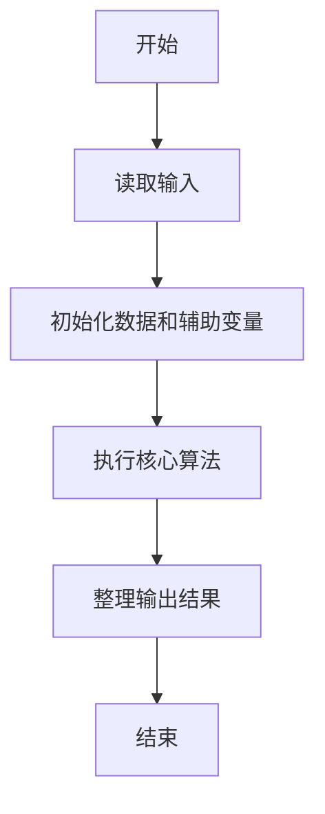
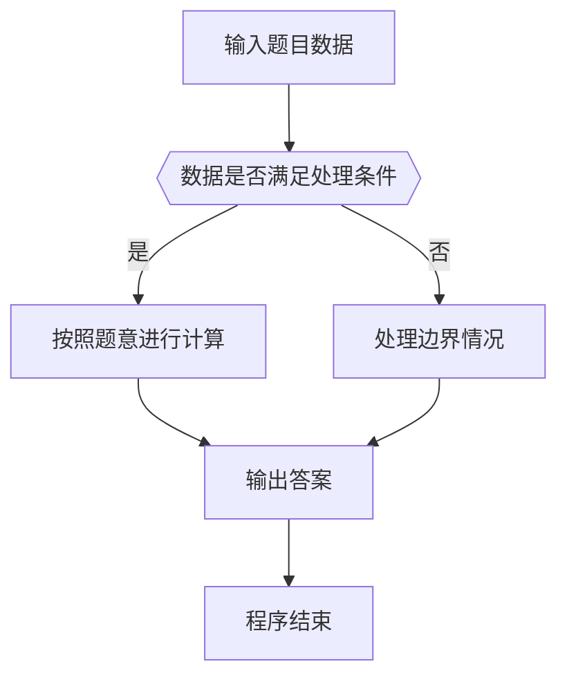

# 1044 火星数字

- **分值：** 20分

### 题目描述

火星人是以 13 进制计数的：

- 地球人的 0 被火星人称为 tret。
- 地球人数字 1 到 12 的火星文分别为：jan, feb, mar, apr, may, jun, jly, aug, sep, oct, nov, dec。
- 火星人将进位以后的 12 个高位数字分别称为：tam, hel, maa, huh, tou, kes, hei, elo, syy, lok, mer, jou。

例如地球人的数字 `29` 翻译成火星文就是 `hel mar`；而火星文 `elo nov` 对应地球数字 `115`。为了方便交流，请你编写程序实现地球和火星数字之间的互译。

### 输入格式：

输入第一行给出一个正整数 $N$（$<100$），随后 $N$ 行，每行给出一个 [0, 169) 区间内的数字 —— 或者是地球文，或者是火星文。

### 输出格式：

对应输入的每一行，在一行中输出翻译后的另一种语言的数字。

### 输入样例：
```
4
29
5
elo nov
tam
```

### 输出样例：
```
hel mar
may
115
13
```


### 解题思路

本题的核心是：使用低位和高位火星数字表，在地球数与火星数之间按进制规则转换。程序先读取题目输入，再按照上述规则完成数据处理，最后严格按照题目要求输出结果。实现时应优先根据题目约束选择合适的数据类型和数据结构，避免溢出或不必要的重复计算。

时间复杂度为 O(L)；空间复杂度取决于输入规模，主要用于保存题目数据和中间结果。

### 代码流程说明

1. 读取 1044 火星数字 所需的输入数据。
2. 初始化计数器、数组或其他辅助变量。
3. 使用低位和高位火星数字表，在地球数与火星数之间按进制规则转换。
4. 按题目规定的格式输出计算结果。

### 代码实现

```java
import java.io.*;
import java.util.*;

public class Main {
    static class FastScanner {
        private final InputStream in; private final byte[] buffer = new byte[1 << 16]; private int ptr, len;
        FastScanner(InputStream in) { this.in = in; }
        private int read() throws IOException { if (ptr >= len) { len = in.read(buffer); ptr = 0; if (len < 0) return -1; } return buffer[ptr++]; }
        String next() throws IOException { StringBuilder b = new StringBuilder(); int c; do c = read(); while (c <= 32 && c >= 0); while (c > 32) { b.append((char)c); c = read(); } return b.toString(); }
        char[] nextChars() throws IOException { return next().toCharArray(); }
        int nextInt() throws IOException { return Integer.parseInt(next()); }
        long nextLong() throws IOException { return Long.parseLong(next()); }
        double nextDouble() throws IOException { return Double.parseDouble(next()); }
        void skip() throws IOException { next(); }
    }
    static int strlen(char[] s) { int n = 0; while (n < s.length && s[n] != 0) n++; return n; }
    static int strcmp(char[] a, char[] b) { return new String(a, 0, strlen(a)).compareTo(new String(b, 0, strlen(b))); }
    static int strncmp(char[] a, char[] b) { return strcmp(a, b); }
    static void printf(String format, Object... args) { Object[] x = new Object[args.length]; for (int i=0;i<args.length;i++) x[i] = args[i] instanceof char[] ? new String((char[])args[i], 0, strlen((char[])args[i])) : args[i]; System.out.printf(format.replace("%lld", "%d"), x); }
    static void puts(Object x) { System.out.println(x instanceof char[] ? new String((char[])x, 0, strlen((char[])x)) : x); }
    static void putchar(char c) { System.out.print(c); }
    static void putchar(int c) { System.out.print((char)c); }
    static final int EOF = -1;
    static int getchar() { return -1; }
    static int isupper(char c) { return Character.isUpperCase(c) ? 1 : 0; }
    static char tolower(int c) { return Character.toLowerCase((char)c); }
    static int strchr(char[] s, char c) { for (int i=0;i<strlen(s);i++) if (s[i]==c) return i; return -1; }
/*
 * 题目：1044 火星数字
 * 实现原理：使用低位和高位火星数字表，在地球数与火星数之间按进制规则转换。
 * 复杂度：O(L)
 * 实现步骤：
 * 1. 读取 1044 火星数字 所需的输入数据。
 * 2. 初始化计数器、数组或其他辅助变量。
 * 3. 使用低位和高位火星数字表，在地球数与火星数之间按进制规则转换。
 * 4. 按题目规定的格式输出计算结果。
 */

String[] lo = {
    "tret", "jan", "feb", "mar", "apr", "may", "jun", "jly", "aug", "sep", "oct", "nov", "dec"
};
String[] hi = {
    "", "tam", "hel", "maa", "huh", "tou", "kes", "hei", "elo", "syy", "lok", "mer", "jou"
};
static FastScanner fs = new FastScanner(System.in);

    public static void main(String[] args) throws Exception {
    int n;
    n = fs.nextInt();
    getchar();
    char[] s = new char[40];
    while (n-- > 0) {
        /* line input handled by token scanner */
        s[strcspn(s, "\r\n")] = 0;
        if (s[0] >= '0' && s[0] <= '9') {
            int x;
            sscanf(s, "%d", & x);
            if (x < 13) puts(lo[x]);
            else if (x % 13 == 0) puts(hi[x / 13]);
            else printf("%s %s\n", hi[x / 13], lo[x % 13]);
        } else {
            char[] first = new char[20]; char[] second = "".toCharArray();
            int z = 0;
            sscanf(s, "%19s %19s", first, second);
            for (int i = 1; i < 13; i ++) if (strcmp == 0(first, hi[i])) z = i * 13;
            for (int i = 0; i < 13; i ++) if (strcmp == 0(first, lo[i])) z = i;
            for (int i = 0; i < 13; i ++) if (second[0] != 0 && strcmp == 0(second, lo[i])) z += i;
            printf("%d\n", z);
        }
    }

}
}
```

### 代码流程图



### 解题流程图



### 常见易错点

- 注意输入数据的范围，选择足够大的整数类型，并正确处理边界值。
- 循环、数组下标和字符串结束位置要严格对应题目定义，避免越界。
- 输出格式必须与题目要求完全一致，包括空格、换行、大小写和特殊符号。
- 如果存在排序、去重、进位、约分或四舍五入等操作，应在输出前统一完成。
