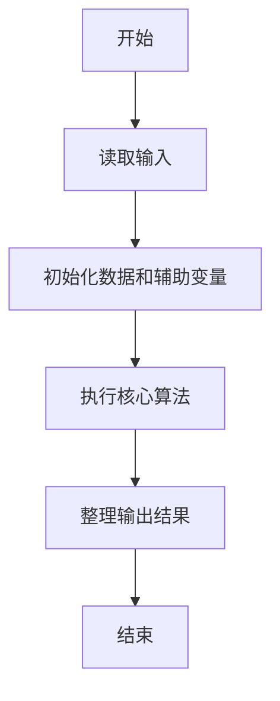
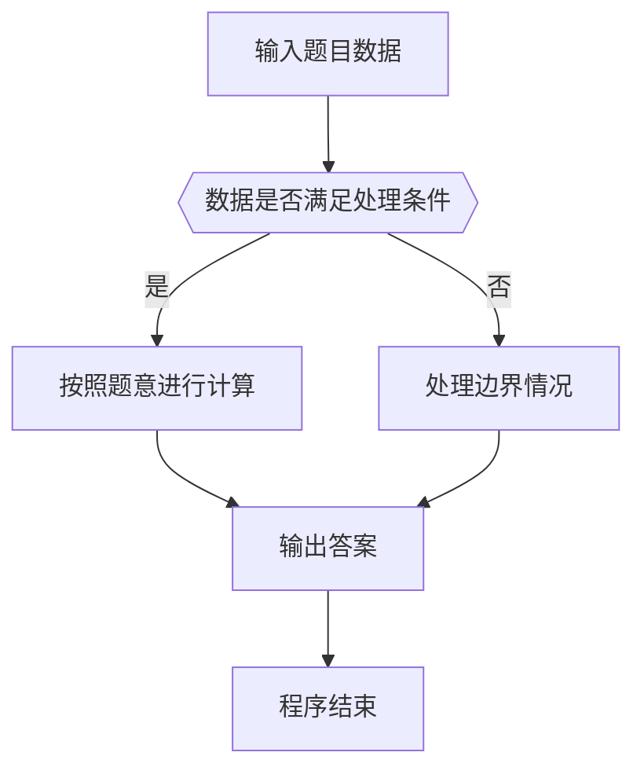

# 1050 螺旋矩阵

- **分值：** 25分

### 题目描述

本题要求将给定的 $N$ 个正整数按非递增的顺序，填入“螺旋矩阵”。所谓“螺旋矩阵”，是指从左上角第 1 个格子开始，按顺时针螺旋方向填充。要求矩阵的规模为 $m$ 行 $n$ 列，满足条件：$m\times n$ 等于 $N$；$m\ge n$；且 $m-n$ 取所有可能值中的最小值。

### 输入格式：

输入在第 1 行中给出一个正整数 $N$，第 2 行给出 $N$ 个待填充的正整数。所有数字不超过 $10^{4}$，相邻数字以空格分隔。

### 输出格式：

输出螺旋矩阵。每行 $n$ 个数字，共 $m$ 行。相邻数字以 1 个空格分隔，行末不得有多余空格。

### 输入样例：
```
12
37 76 20 98 76 42 53 95 60 81 58 93
```

### 输出样例：
```
98 95 93
42 37 81
53 20 76
58 60 76
```


### 解题思路

本题的核心是：将数据降序排序后按上、右、下、左四个方向填入矩阵。程序先读取题目输入，再按照上述规则完成数据处理，最后严格按照题目要求输出结果。实现时应优先根据题目约束选择合适的数据类型和数据结构，避免溢出或不必要的重复计算。

时间复杂度为 O(n log n)；空间复杂度取决于输入规模，主要用于保存题目数据和中间结果。

### 代码流程说明

1. 读取 1050 螺旋矩阵 所需的输入数据。
2. 初始化计数器、数组或其他辅助变量。
3. 将数据降序排序后按上、右、下、左四个方向填入矩阵。
4. 按题目规定的格式输出计算结果。

### 代码实现

```java
import java.io.*;
import java.util.*;

public class Main {
    static class FastScanner {
        private final InputStream in; private final byte[] buffer = new byte[1 << 16]; private int ptr, len;
        FastScanner(InputStream in) { this.in = in; }
        private int read() throws IOException { if (ptr >= len) { len = in.read(buffer); ptr = 0; if (len < 0) return -1; } return buffer[ptr++]; }
        String next() throws IOException { StringBuilder b = new StringBuilder(); int c; do c = read(); while (c <= 32 && c >= 0); while (c > 32) { b.append((char)c); c = read(); } return b.toString(); }
        char[] nextChars() throws IOException { return next().toCharArray(); }
        int nextInt() throws IOException { return Integer.parseInt(next()); }
        long nextLong() throws IOException { return Long.parseLong(next()); }
        double nextDouble() throws IOException { return Double.parseDouble(next()); }
        void skip() throws IOException { next(); }
    }
    static int strlen(char[] s) { int n = 0; while (n < s.length && s[n] != 0) n++; return n; }
    static int strcmp(char[] a, char[] b) { return new String(a, 0, strlen(a)).compareTo(new String(b, 0, strlen(b))); }
    static int strncmp(char[] a, char[] b) { return strcmp(a, b); }
    static void printf(String format, Object... args) { Object[] x = new Object[args.length]; for (int i=0;i<args.length;i++) x[i] = args[i] instanceof char[] ? new String((char[])args[i], 0, strlen((char[])args[i])) : args[i]; System.out.printf(format.replace("%lld", "%d"), x); }
    static void puts(Object x) { System.out.println(x instanceof char[] ? new String((char[])x, 0, strlen((char[])x)) : x); }
    static void putchar(char c) { System.out.print(c); }
    static void putchar(int c) { System.out.print((char)c); }
    static final int EOF = -1;
    static int getchar() { return -1; }
    static int isupper(char c) { return Character.isUpperCase(c) ? 1 : 0; }
    static char tolower(int c) { return Character.toLowerCase((char)c); }
    static int strchr(char[] s, char c) { for (int i=0;i<strlen(s);i++) if (s[i]==c) return i; return -1; }
/*
 * 题目：1050 螺旋矩阵
 * 实现原理：将数据降序排序后按上、右、下、左四个方向填入矩阵。
 * 复杂度：O(n log n)
 * 实现步骤：
 * 1. 读取 1050 螺旋矩阵 所需的输入数据。
 * 2. 初始化计数器、数组或其他辅助变量。
 * 3. 将数据降序排序后按上、右、下、左四个方向填入矩阵。
 * 4. 按题目规定的格式输出计算结果。
 */

static FastScanner fs = new FastScanner(System.in);

    public static void main(String[] args) throws Exception {
    int n; int m = 1;
    n = fs.nextInt();
    int[] a = new int[10000];
    for (int i = 0; i < n; i ++) a[i] = fs.nextInt();
    for (int d = 1; d * d <= n; d ++) if (n % d == 0 && d >= m) m = d;
    int rows = n / m, cols = m, mat[100][100] , t = 0, top = 0, bottom = rows - 1, left = 0, right = cols - 1;
    Arrays.sort(a, 0, n);
    while (top <= bottom && left <= right) {
        for (int j = left; j <= right; j ++) mat[top][j] = a[t ++];
        top ++;
        for (int i = top; i <= bottom; i ++) mat[i][right] = a[t ++];
        right --;
        if (top <= bottom) for (int j = right; j >= left; j --) mat[bottom][j] = a[t ++];
        bottom --;
        if (left <= right) for (int i = bottom; i >= top; i --) mat[i][left] = a[t ++];
        left ++;
    }
    for (int i = 0; i < rows; i ++) for (int j = 0; j < cols; j ++) printf("%d%c", mat[i][j], j + 1 == cols ? '\n' : ' ');

}
}
```

### 代码流程图



### 解题流程图



### 常见易错点

- 注意输入数据的范围，选择足够大的整数类型，并正确处理边界值。
- 循环、数组下标和字符串结束位置要严格对应题目定义，避免越界。
- 输出格式必须与题目要求完全一致，包括空格、换行、大小写和特殊符号。
- 如果存在排序、去重、进位、约分或四舍五入等操作，应在输出前统一完成。
