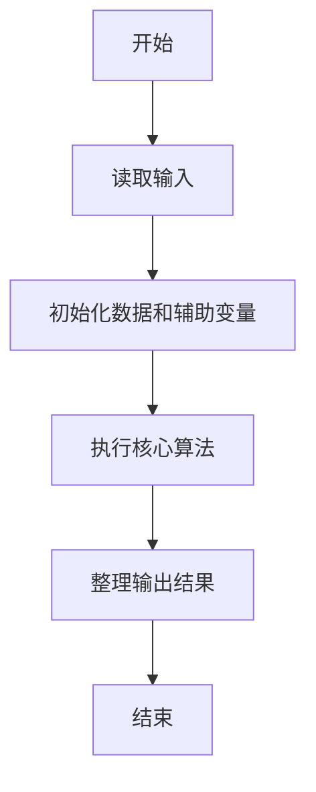
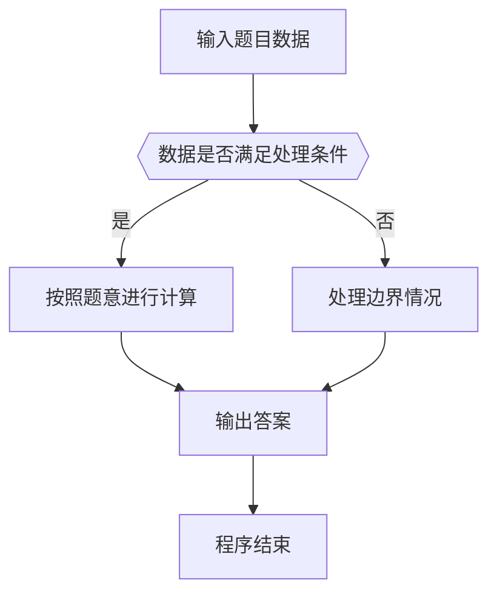

# 1053 住房空置率

- **分值：** 20分

### 题目描述

在不打扰居民的前提下，统计住房空置率的一种方法是根据每户用电量的连续变化规律进行判断。判断方法如下：

- 在观察期内，若存在超过一半的日子用电量低于某给定的阈值 $e$，则该住房为“可能空置”；

- 若观察期超过某给定阈值 $D$ 天，且满足上一个条件，则该住房为“空置”。

现给定某居民区的住户用电量数据，请你统计“可能空置”的比率和“空置”比率，即以上两种状态的住房占居民区住房总套数的百分比。

### 输入格式：

输入第一行给出正整数 $N$（$\le 1000$），为居民区住房总套数；正实数 $e$，即低电量阈值；正整数 $D$，即观察期阈值。随后 $N$ 行，每行按以下格式给出一套住房的用电量数据：

$K$ $E_1$ $E_2$ ... $E_K$

其中 $K$ 为观察的天数，$E_i$ 为第 $i$ 天的用电量。

### 输出格式：

在一行中输出“可能空置”的比率和“空置”比率的百分比值，其间以一个空格分隔，保留小数点后 1 位。

### 输入样例：
```
5 0.5 10
6 0.3 0.4 0.5 0.2 0.8 0.6
10 0.0 0.1 0.2 0.3 0.0 0.8 0.6 0.7 0.0 0.5
5 0.4 0.3 0.5 0.1 0.7
11 0.1 0.1 0.1 0.1 0.1 0.1 0.1 0.1 0.1 0.1 0.1
11 2 2 2 1 1 0.1 1 0.1 0.1 0.1 0.1
```

### 输出样例：
```
40.0% 20.0%
```

（样例解释：第2、3户为“可能空置”，第4户为“空置”，其他户不是空置。）


### 解题思路

本题的核心是：检查每户连续低用电天数，分别统计满足较短和较长阈值的户数。程序先读取题目输入，再按照上述规则完成数据处理，最后严格按照题目要求输出结果。实现时应优先根据题目约束选择合适的数据类型和数据结构，避免溢出或不必要的重复计算。

时间复杂度为 O(nD)；空间复杂度取决于输入规模，主要用于保存题目数据和中间结果。

### 代码流程说明

1. 读取 1053 住房空置率 所需的输入数据。
2. 初始化计数器、数组或其他辅助变量。
3. 检查每户连续低用电天数，分别统计满足较短和较长阈值的户数。
4. 按题目规定的格式输出计算结果。

### 代码实现

```java
import java.io.*;
import java.util.*;

public class Main {
    static class FastScanner {
        private final InputStream in; private final byte[] buffer = new byte[1 << 16]; private int ptr, len;
        FastScanner(InputStream in) { this.in = in; }
        private int read() throws IOException { if (ptr >= len) { len = in.read(buffer); ptr = 0; if (len < 0) return -1; } return buffer[ptr++]; }
        String next() throws IOException { StringBuilder b = new StringBuilder(); int c; do c = read(); while (c <= 32 && c >= 0); while (c > 32) { b.append((char)c); c = read(); } return b.toString(); }
        char[] nextChars() throws IOException { return next().toCharArray(); }
        int nextInt() throws IOException { return Integer.parseInt(next()); }
        long nextLong() throws IOException { return Long.parseLong(next()); }
        double nextDouble() throws IOException { return Double.parseDouble(next()); }
        void skip() throws IOException { next(); }
    }
    static int strlen(char[] s) { int n = 0; while (n < s.length && s[n] != 0) n++; return n; }
    static int strcmp(char[] a, char[] b) { return new String(a, 0, strlen(a)).compareTo(new String(b, 0, strlen(b))); }
    static int strncmp(char[] a, char[] b) { return strcmp(a, b); }
    static void printf(String format, Object... args) { Object[] x = new Object[args.length]; for (int i=0;i<args.length;i++) x[i] = args[i] instanceof char[] ? new String((char[])args[i], 0, strlen((char[])args[i])) : args[i]; System.out.printf(format.replace("%lld", "%d"), x); }
    static void puts(Object x) { System.out.println(x instanceof char[] ? new String((char[])x, 0, strlen((char[])x)) : x); }
    static void putchar(char c) { System.out.print(c); }
    static void putchar(int c) { System.out.print((char)c); }
    static final int EOF = -1;
    static int getchar() { return -1; }
    static int isupper(char c) { return Character.isUpperCase(c) ? 1 : 0; }
    static char tolower(int c) { return Character.toLowerCase((char)c); }
    static int strchr(char[] s, char c) { for (int i=0;i<strlen(s);i++) if (s[i]==c) return i; return -1; }
/*
 * 题目：1053 住房空置率
 * 实现原理：检查每户连续低用电天数，分别统计满足较短和较长阈值的户数。
 * 复杂度：O(nD)
 * 实现步骤：
 * 1. 读取 1053 住房空置率 所需的输入数据。
 * 2. 初始化计数器、数组或其他辅助变量。
 * 3. 检查每户连续低用电天数，分别统计满足较短和较长阈值的户数。
 * 4. 按题目规定的格式输出计算结果。
 */

static FastScanner fs = new FastScanner(System.in);

    public static void main(String[] args) throws Exception {
    int n; int d; int k; int low; int shortc = 0; int longc = 0;
    double e; double x;
    n = fs.nextInt(); e = fs.nextDouble(); d = fs.nextInt();
    for (int i = 0; i < n; i ++) {
        k = fs.nextInt();
        low = 0;
        for (int j = 0; j < k; j ++) {
            x = fs.nextDouble();
            if (x < e) low ++;
        }
        if (low * 2 > k) {
            if (k > d) longc ++;
            else shortc ++;
        }
    }
    printf("%.1f%% %.1f%%\n", 100.0 * shortc / n, 100.0 * longc / n);

}
}
```

### 代码流程图



### 解题流程图



### 常见易错点

- 注意输入数据的范围，选择足够大的整数类型，并正确处理边界值。
- 循环、数组下标和字符串结束位置要严格对应题目定义，避免越界。
- 输出格式必须与题目要求完全一致，包括空格、换行、大小写和特殊符号。
- 如果存在排序、去重、进位、约分或四舍五入等操作，应在输出前统一完成。
