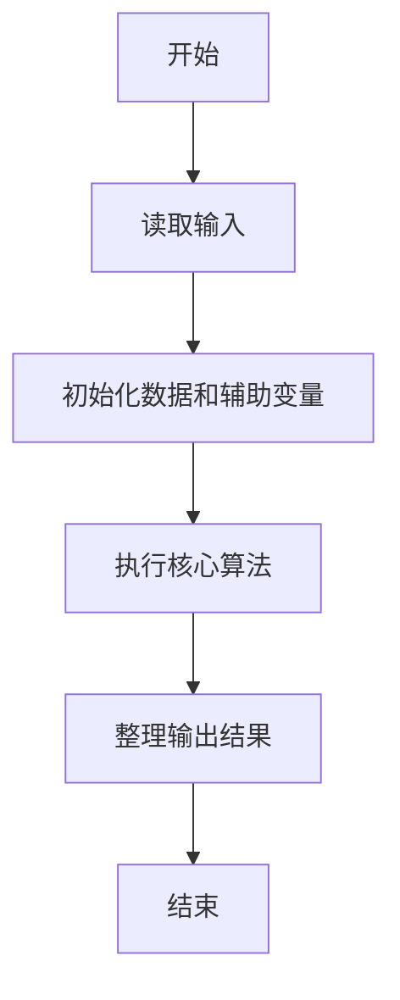
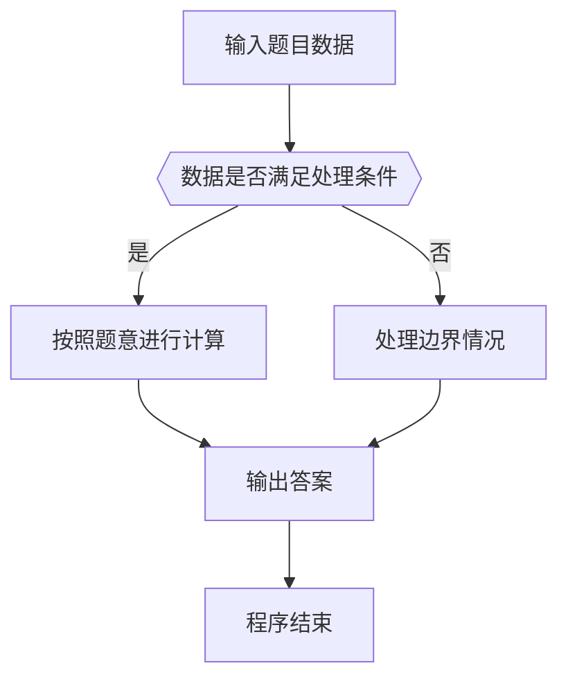

# 1058 选择题

- **分值：** 20分

### 题目描述

批改多选题是比较麻烦的事情，本题就请你写个程序帮助老师批改多选题，并且指出哪道题错的人最多。

### 输入格式：

输入在第一行给出两个正整数 N（$\le$ 1000）和 M（$\le$ 100），分别是学生人数和多选题的个数。随后 M 行，每行顺次给出一道题的满分值（不超过 5 的正整数）、选项个数（不少于 2 且不超过 5 的正整数）、正确选项个数（不超过选项个数的正整数）、所有正确选项。注意每题的选项从小写英文字母 a 开始顺次排列。各项间以 1 个空格分隔。最后 N 行，每行给出一个学生的答题情况，其每题答案格式为 `(选中的选项个数 选项1 ……)`，按题目顺序给出。注意：题目保证学生的答题情况是合法的，即不存在选中的选项数超过实际选项数的情况。

### 输出格式：

按照输入的顺序给出每个学生的得分，每个分数占一行。注意判题时只有选择全部正确才能得到该题的分数。最后一行输出错得最多的题目的错误次数和编号（题目按照输入的顺序从 1 开始编号）。如果有并列，则按编号递增顺序输出。数字间用空格分隔，行首尾不得有多余空格。如果所有题目都没有人错，则在最后一行输出 `Too simple`。

### 输入样例：
```
3 4
3 4 2 a c
2 5 1 b
5 3 2 b c
1 5 4 a b d e
(2 a c) (2 b d) (2 a c) (3 a b e)
(2 a c) (1 b) (2 a b) (4 a b d e)
(2 b d) (1 e) (2 b c) (4 a b c d)
```

### 输出样例：
```
3
6
5
2 2 3 4
```


### 解题思路

本题的核心是：读取标准答案与每题分值，逐项计算学生答案得分和各题错误人数。程序先读取题目输入，再按照上述规则完成数据处理，最后严格按照题目要求输出结果。实现时应优先根据题目约束选择合适的数据类型和数据结构，避免溢出或不必要的重复计算。

时间复杂度为 O(nm)；空间复杂度取决于输入规模，主要用于保存题目数据和中间结果。

### 代码流程说明

1. 读取 1058 选择题 所需的输入数据。
2. 初始化计数器、数组或其他辅助变量。
3. 读取标准答案与每题分值，逐项计算学生答案得分和各题错误人数。
4. 按题目规定的格式输出计算结果。

### 代码实现

```java
import java.io.*;
import java.util.*;

public class Main {
    static class FastScanner {
        private final InputStream in; private final byte[] buffer = new byte[1 << 16]; private int ptr, len;
        FastScanner(InputStream in) { this.in = in; }
        private int read() throws IOException { if (ptr >= len) { len = in.read(buffer); ptr = 0; if (len < 0) return -1; } return buffer[ptr++]; }
        String next() throws IOException { StringBuilder b = new StringBuilder(); int c; do c = read(); while (c <= 32 && c >= 0); while (c > 32) { b.append((char)c); c = read(); } return b.toString(); }
        char[] nextChars() throws IOException { return next().toCharArray(); }
        int nextInt() throws IOException { return Integer.parseInt(next()); }
        long nextLong() throws IOException { return Long.parseLong(next()); }
        double nextDouble() throws IOException { return Double.parseDouble(next()); }
        void skip() throws IOException { next(); }
    }
    static int strlen(char[] s) { int n = 0; while (n < s.length && s[n] != 0) n++; return n; }
    static int strcmp(char[] a, char[] b) { return new String(a, 0, strlen(a)).compareTo(new String(b, 0, strlen(b))); }
    static int strncmp(char[] a, char[] b) { return strcmp(a, b); }
    static void printf(String format, Object... args) { Object[] x = new Object[args.length]; for (int i=0;i<args.length;i++) x[i] = args[i] instanceof char[] ? new String((char[])args[i], 0, strlen((char[])args[i])) : args[i]; System.out.printf(format.replace("%lld", "%d"), x); }
    static void puts(Object x) { System.out.println(x instanceof char[] ? new String((char[])x, 0, strlen((char[])x)) : x); }
    static void putchar(char c) { System.out.print(c); }
    static void putchar(int c) { System.out.print((char)c); }
    static final int EOF = -1;
    static int getchar() { return -1; }
    static int isupper(char c) { return Character.isUpperCase(c) ? 1 : 0; }
    static char tolower(int c) { return Character.toLowerCase((char)c); }
    static int strchr(char[] s, char c) { for (int i=0;i<strlen(s);i++) if (s[i]==c) return i; return -1; }
/*
 * 题目：1058 选择题评分
 * 实现原理：读取标准答案与每题分值，逐项计算学生答案得分和各题错误人数。
 * 复杂度：O(nm)
 * 实现步骤：
 * 1. 读取 1058 选择题 所需的输入数据。
 * 2. 初始化计数器、数组或其他辅助变量。
 * 3. 读取标准答案与每题分值，逐项计算学生答案得分和各题错误人数。
 * 4. 按题目规定的格式输出计算结果。
 */

static FastScanner fs = new FastScanner(System.in);

    public static void main(String[] args) throws Exception {
    int n; int m;
    n = fs.nextInt(); m = fs.nextInt();
    int score[100], ans[100][5], cnt[100], wrong[100] ;
    for (int i = 0; i < m; i ++) {
        int opt;
        score[i] = fs.nextInt(); opt = fs.nextInt(); cnt[i] = fs.nextInt();
        for (int j = 0; j < cnt[i]; j ++) {
            char x;
            x = fs.next().charAt(0);
            ans[i][j] = x - 'a';
        }
    }
    for (int st = 0; st < n; st ++) {
        int total = 0;
        for (int i = 0; i < m; i ++) {
            int k; int[] sel = new int[5]; int ok = 1;
            k = fs.nextInt();
            for (int j = 0; j < k; j ++) {
                char x;
                x = fs.next().charAt(0);
                sel[x - 'a'] = 1;
            }
            fs.skip();
            int hit = 0;
            for (int j = 0; j < 5; j ++) if (sel[j] != 0) {
                int yes = 0;
                for (int q = 0; q < cnt[i]; q ++) if (ans[i][q] == j) yes = 1;
                if (yes == 0) ok = 0;
                else hit ++;
            }
            if (k == cnt[i] != 0 && ok && hit == cnt[i]) total += score[i];
            else {
                wrong[i] ++;
            }
        }
        printf("%d\n", total);
    }
    int most = 0;
    for (int i = 0; i < m; i ++) if (wrong[i] > most) most = wrong[i];
    if (most == 0) puts("Too simple");
    else {
        printf("%d", most);
        for (int i = 0; i < m; i ++) if (wrong[i] == most) printf(" %d", i + 1);
        putchar('\n');
    }

}
}
```

### 代码流程图



### 解题流程图



### 常见易错点

- 注意输入数据的范围，选择足够大的整数类型，并正确处理边界值。
- 循环、数组下标和字符串结束位置要严格对应题目定义，避免越界。
- 输出格式必须与题目要求完全一致，包括空格、换行、大小写和特殊符号。
- 如果存在排序、去重、进位、约分或四舍五入等操作，应在输出前统一完成。
