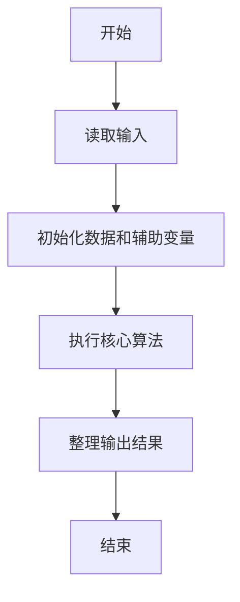
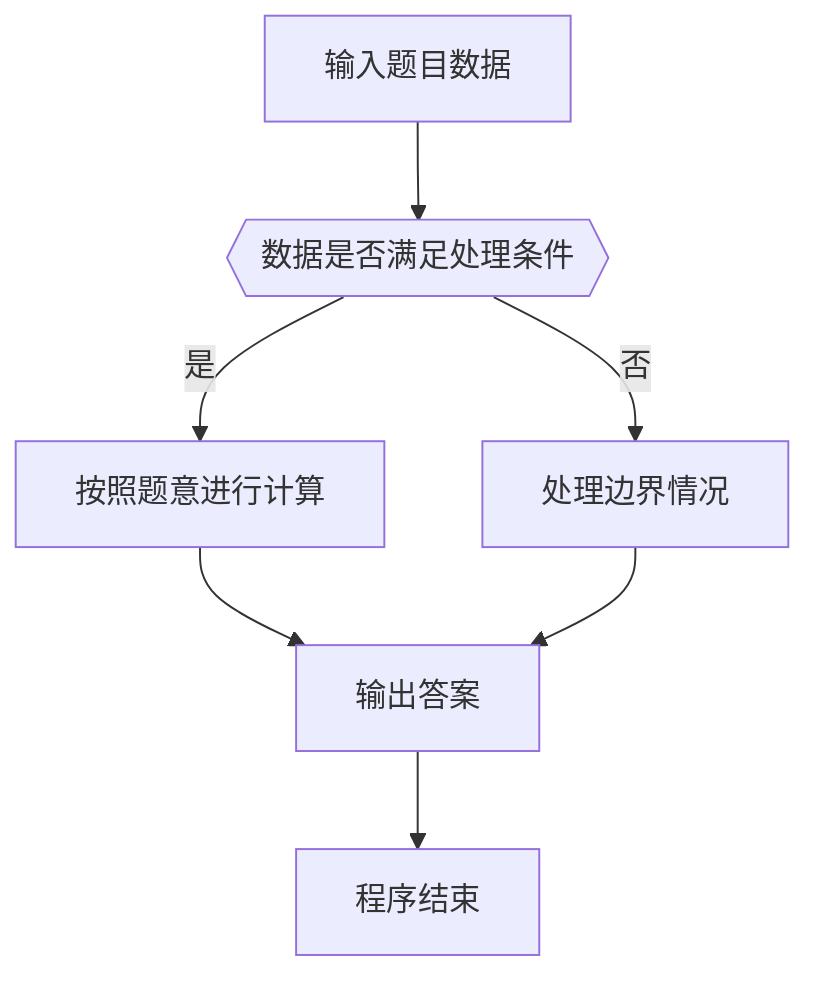

# 1059 C语言竞赛

- **分值：** 20分

### 题目描述

C 语言竞赛是浙江大学计算机学院主持的一个欢乐的竞赛。既然竞赛主旨是为了好玩，颁奖规则也就制定得很滑稽：

- 0、冠军将赢得一份“神秘大奖”（比如很巨大的一本学生研究论文集……）。
- 1、排名为素数的学生将赢得最好的奖品 —— 小黄人玩偶！
- 2、其他人将得到巧克力。

给定比赛的最终排名以及一系列参赛者的 ID，你要给出这些参赛者应该获得的奖品。

### 输入格式：

输入第一行给出一个正整数 $N$（$\le 10^4$），是参赛者人数。随后 $N$ 行给出最终排名，每行按排名顺序给出一位参赛者的 ID（4 位数字组成）。接下来给出一个正整数 $K$ 以及 $K$ 个需要查询的 ID。

### 输出格式：

对每个要查询的 ID，在一行中输出 `ID: 奖品`，其中奖品或者是 `Mystery Award`（神秘大奖）、或者是 `Minion`（小黄人）、或者是 `Chocolate`（巧克力）。如果所查 ID 根本不在排名里，打印 `Are you kidding?`（耍我呢？）。如果该 ID 已经查过了（即奖品已经领过了），打印 `ID: Checked`（不能多吃多占）。

### 输入样例：
```
6
1111
6666
8888
1234
5555
0001
6
8888
0001
1111
2222
8888
2222
```

### 输出样例：
```
8888: Minion
0001: Chocolate
1111: Mystery Award
2222: Are you kidding?
8888: Checked
2222: Are you kidding?
```


### 解题思路

本题的核心是：按成绩降序排名，并用集合标记出现过的成绩及其是否通过检查。程序先读取题目输入，再按照上述规则完成数据处理，最后严格按照题目要求输出结果。实现时应优先根据题目约束选择合适的数据类型和数据结构，避免溢出或不必要的重复计算。

时间复杂度为 O(n log n)；空间复杂度取决于输入规模，主要用于保存题目数据和中间结果。

### 代码流程说明

1. 读取 1059 C语言竞赛 所需的输入数据。
2. 初始化计数器、数组或其他辅助变量。
3. 按成绩降序排名，并用集合标记出现过的成绩及其是否通过检查。
4. 按题目规定的格式输出计算结果。

### 代码实现

```java
import java.io.*;
import java.util.*;

public class Main {
    static class FastScanner {
        private final InputStream in; private final byte[] buffer = new byte[1 << 16]; private int ptr, len;
        FastScanner(InputStream in) { this.in = in; }
        private int read() throws IOException { if (ptr >= len) { len = in.read(buffer); ptr = 0; if (len < 0) return -1; } return buffer[ptr++]; }
        String next() throws IOException { StringBuilder b = new StringBuilder(); int c; do c = read(); while (c <= 32 && c >= 0); while (c > 32) { b.append((char)c); c = read(); } return b.toString(); }
        char[] nextChars() throws IOException { return next().toCharArray(); }
        int nextInt() throws IOException { return Integer.parseInt(next()); }
        long nextLong() throws IOException { return Long.parseLong(next()); }
        double nextDouble() throws IOException { return Double.parseDouble(next()); }
        void skip() throws IOException { next(); }
    }
    static int strlen(char[] s) { int n = 0; while (n < s.length && s[n] != 0) n++; return n; }
    static int strcmp(char[] a, char[] b) { return new String(a, 0, strlen(a)).compareTo(new String(b, 0, strlen(b))); }
    static int strncmp(char[] a, char[] b) { return strcmp(a, b); }
    static void printf(String format, Object... args) { Object[] x = new Object[args.length]; for (int i=0;i<args.length;i++) x[i] = args[i] instanceof char[] ? new String((char[])args[i], 0, strlen((char[])args[i])) : args[i]; System.out.printf(format.replace("%lld", "%d"), x); }
    static void puts(Object x) { System.out.println(x instanceof char[] ? new String((char[])x, 0, strlen((char[])x)) : x); }
    static void putchar(char c) { System.out.print(c); }
    static void putchar(int c) { System.out.print((char)c); }
    static final int EOF = -1;
    static int getchar() { return -1; }
    static int isupper(char c) { return Character.isUpperCase(c) ? 1 : 0; }
    static char tolower(int c) { return Character.toLowerCase((char)c); }
    static int strchr(char[] s, char c) { for (int i=0;i<strlen(s);i++) if (s[i]==c) return i; return -1; }
/*
 * 题目：1059 C语言竞赛
 * 实现原理：按成绩降序排名，并用集合标记出现过的成绩及其是否通过检查。
 * 复杂度：O(n log n)
 * 实现步骤：
 * 1. 读取 1059 C语言竞赛 所需的输入数据。
 * 2. 初始化计数器、数组或其他辅助变量。
 * 3. 按成绩降序排名，并用集合标记出现过的成绩及其是否通过检查。
 * 4. 按题目规定的格式输出计算结果。
 */

static FastScanner fs = new FastScanner(System.in);

    public static void main(String[] args) throws Exception {
    int n; int k; int id; int[] rank = new int[10000];
    n = fs.nextInt();
    for (int i = 1; i <= n; i ++) {
        id = fs.nextInt();
        rank[id] = i;
    }
    k = fs.nextInt();
    while (k-- > 0) {
        id = fs.nextInt();
        if (rank[id] == 0) printf("%04d: Are you kidding?\n", id);
        else if (rank[id] < 0) printf("%04d: Checked\n", id);
        else {
            int r = rank[id];
            int prime = r >= 2;
            for (int d = 2; d * d <= r; d ++) if (r % d == 0) prime = 0;
            if (r == 1) printf("%04d: Mystery Award\n", id);
            else if (prime) printf("%04d: Minion\n", id);
            else printf("%04d: Chocolate\n", id);
            rank[id] = - 1;
        }
    }

}
}
```

### 代码流程图



### 解题流程图



### 常见易错点

- 注意输入数据的范围，选择足够大的整数类型，并正确处理边界值。
- 循环、数组下标和字符串结束位置要严格对应题目定义，避免越界。
- 输出格式必须与题目要求完全一致，包括空格、换行、大小写和特殊符号。
- 如果存在排序、去重、进位、约分或四舍五入等操作，应在输出前统一完成。
