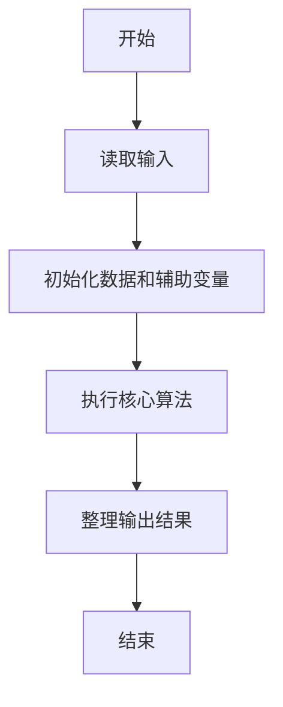
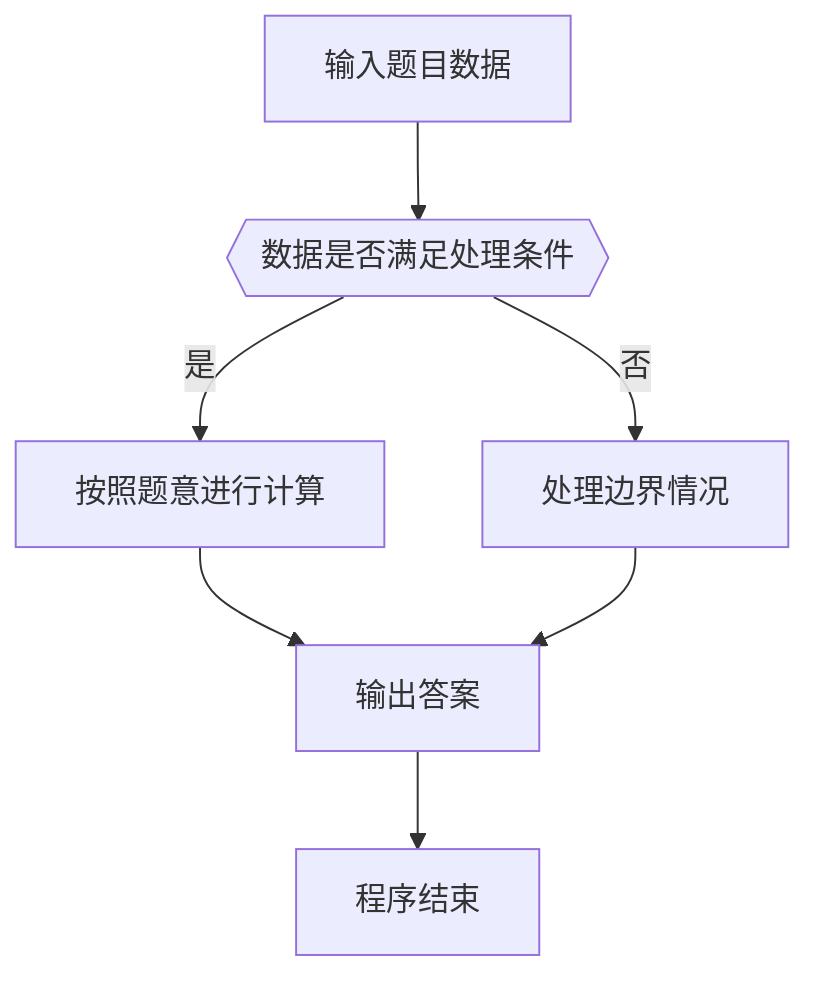

# 1064 朋友数

- **分值：** 20分

### 题目描述

如果两个整数各位数字的和是一样的，则被称为是“朋友数”，而那个公共的和就是它们的“朋友证号”。例如 123 和 51 就是朋友数，因为 1+2+3 = 5+1 = 6，而 6 就是它们的朋友证号。给定一些整数，要求你统计一下它们中有多少个不同的朋友证号。

### 输入格式：

输入第一行给出正整数 N。随后一行给出 N 个正整数，数字间以空格分隔。题目保证所有数字小于 $10^4$。

### 输出格式：

首先第一行输出给定数字中不同的朋友证号的个数；随后一行按递增顺序输出这些朋友证号，数字间隔一个空格，且行末不得有多余空格。

### 输入样例：
```
8
123 899 51 998 27 33 36 12
```

### 输出样例：
```
4
3 6 9 26
```


### 解题思路

本题的核心是：计算每个数各位数字和，去重后排序输出。程序先读取题目输入，再按照上述规则完成数据处理，最后严格按照题目要求输出结果。实现时应优先根据题目约束选择合适的数据类型和数据结构，避免溢出或不必要的重复计算。

时间复杂度为 O(nL)；空间复杂度取决于输入规模，主要用于保存题目数据和中间结果。

### 代码流程说明

1. 读取 1064 朋友数 所需的输入数据。
2. 初始化计数器、数组或其他辅助变量。
3. 计算每个数各位数字和，去重后排序输出。
4. 按题目规定的格式输出计算结果。

### 代码实现

```java
import java.io.*;
import java.util.*;

public class Main {
    static class FastScanner {
        private final InputStream in; private final byte[] buffer = new byte[1 << 16]; private int ptr, len;
        FastScanner(InputStream in) { this.in = in; }
        private int read() throws IOException { if (ptr >= len) { len = in.read(buffer); ptr = 0; if (len < 0) return -1; } return buffer[ptr++]; }
        String next() throws IOException { StringBuilder b = new StringBuilder(); int c; do c = read(); while (c <= 32 && c >= 0); while (c > 32) { b.append((char)c); c = read(); } return b.toString(); }
        char[] nextChars() throws IOException { return next().toCharArray(); }
        int nextInt() throws IOException { return Integer.parseInt(next()); }
        long nextLong() throws IOException { return Long.parseLong(next()); }
        double nextDouble() throws IOException { return Double.parseDouble(next()); }
        void skip() throws IOException { next(); }
    }
    static int strlen(char[] s) { int n = 0; while (n < s.length && s[n] != 0) n++; return n; }
    static int strcmp(char[] a, char[] b) { return new String(a, 0, strlen(a)).compareTo(new String(b, 0, strlen(b))); }
    static int strncmp(char[] a, char[] b) { return strcmp(a, b); }
    static void printf(String format, Object... args) { Object[] x = new Object[args.length]; for (int i=0;i<args.length;i++) x[i] = args[i] instanceof char[] ? new String((char[])args[i], 0, strlen((char[])args[i])) : args[i]; System.out.printf(format.replace("%lld", "%d"), x); }
    static void puts(Object x) { System.out.println(x instanceof char[] ? new String((char[])x, 0, strlen((char[])x)) : x); }
    static void putchar(char c) { System.out.print(c); }
    static void putchar(int c) { System.out.print((char)c); }
    static final int EOF = -1;
    static int getchar() { return -1; }
    static int isupper(char c) { return Character.isUpperCase(c) ? 1 : 0; }
    static char tolower(int c) { return Character.toLowerCase((char)c); }
    static int strchr(char[] s, char c) { for (int i=0;i<strlen(s);i++) if (s[i]==c) return i; return -1; }
/*
 * 题目：1064 朋友数
 * 实现原理：计算每个数各位数字和，去重后排序输出。
 * 复杂度：O(nL)
 * 实现步骤：
 * 1. 读取 1064 朋友数 所需的输入数据。
 * 2. 初始化计数器、数组或其他辅助变量。
 * 3. 计算每个数各位数字和，去重后排序输出。
 * 4. 按题目规定的格式输出计算结果。
 */

static int sum(int x) {
    int s = 0;
    while (x != 0) {
        s += x % 10;
        x /= 10;
    }
    return s;
}
static FastScanner fs = new FastScanner(System.in);

    public static void main(String[] args) throws Exception {
    int n; int x; int[] a = new int[10000]; int k = 0;
    n = fs.nextInt();
    while (n-- > 0) {
        x = fs.nextInt();
        int y = sum(x); int seen = 0;
        for (int i = 0; i < k; i ++) if (a[i] == y) seen = 1;
        if (seen == 0) a[k ++] = y;
    }
    for (int i = 0; i < k; i ++) for (int j = i + 1; j < k; j ++) if (a[i] > a[j]) {
        int t = a[i];
        a[i] = a[j];
        a[j] = t;
    }
    printf("%d\n", k);
    for (int i = 0; i < k; i ++) printf("%d%c", a[i], i + 1 == k ? '\n' : ' ');

}
}
```

### 代码流程图



### 解题流程图



### 常见易错点

- 注意输入数据的范围，选择足够大的整数类型，并正确处理边界值。
- 循环、数组下标和字符串结束位置要严格对应题目定义，避免越界。
- 输出格式必须与题目要求完全一致，包括空格、换行、大小写和特殊符号。
- 如果存在排序、去重、进位、约分或四舍五入等操作，应在输出前统一完成。
