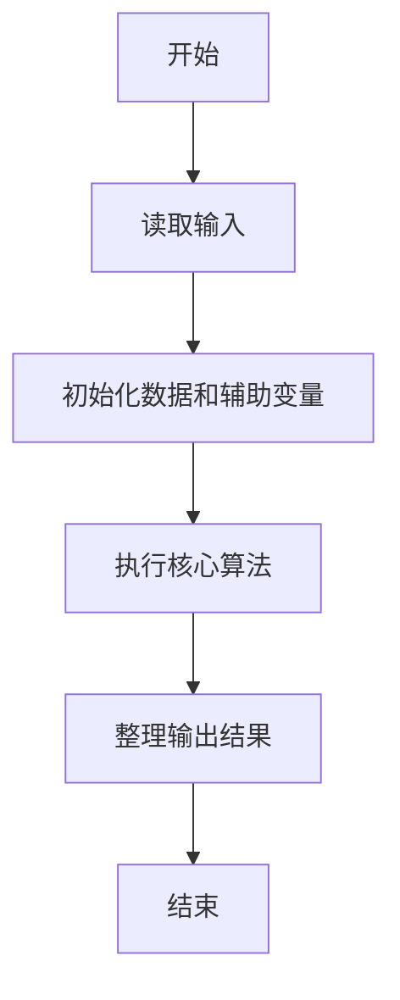
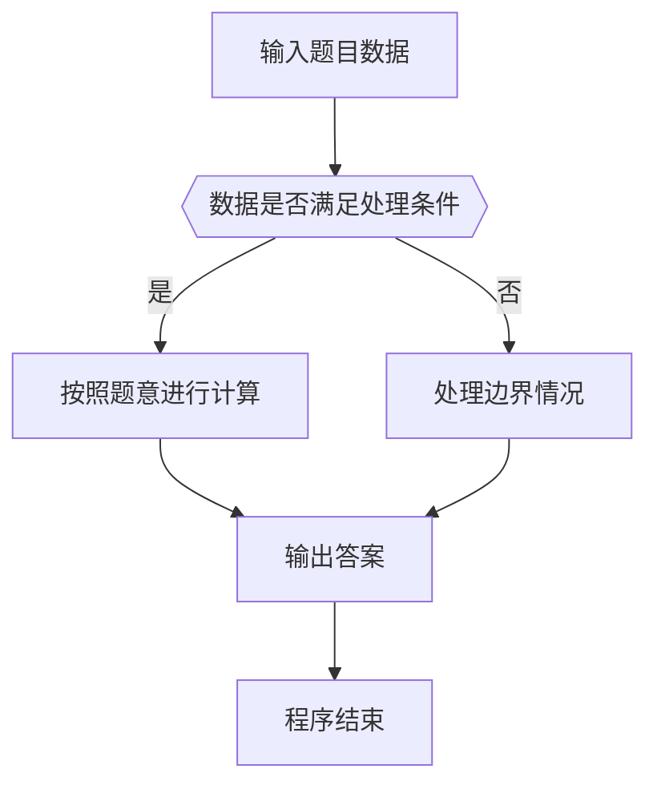

# 1065 单身狗

- **分值：** 25分

### 题目描述

“单身狗”是中文对于单身人士的一种爱称。本题请你从上万人的大型派对中找出落单的客人，以便给予特殊关爱。

### 输入格式：

输入第一行给出一个正整数 N（$\le$ 50 000），是已知夫妻/伴侣的对数；随后 N 行，每行给出一对夫妻/伴侣——为方便起见，每人对应一个 ID 号，为 5 位数字（从 00000 到 99999），ID 间以空格分隔；之后给出一个正整数 M（$\le$ 10 000），为参加派对的总人数；随后一行给出这 M 位客人的 ID，以空格分隔。题目保证无人重婚或脚踩两条船。

### 输出格式：

首先第一行输出落单客人的总人数；随后第二行按 ID 递增顺序列出落单的客人。ID 间用 1 个空格分隔，行的首尾不得有多余空格。

### 输入样例：
```
3
11111 22222
33333 44444
55555 66666
7
55555 44444 10000 88888 22222 11111 23333
```

### 输出样例：
```
5
10000 23333 44444 55555 88888
```


### 解题思路

本题的核心是：建立情侣映射，用集合判断现场出现者是否有伴侣；没有伴侣的即为单身。程序先读取题目输入，再按照上述规则完成数据处理，最后严格按照题目要求输出结果。实现时应优先根据题目约束选择合适的数据类型和数据结构，避免溢出或不必要的重复计算。

时间复杂度为 O(n + m)；空间复杂度取决于输入规模，主要用于保存题目数据和中间结果。

### 代码流程说明

1. 读取 1065 单身狗 所需的输入数据。
2. 初始化计数器、数组或其他辅助变量。
3. 建立情侣映射，用集合判断现场出现者是否有伴侣；没有伴侣的即为单身。
4. 按题目规定的格式输出计算结果。

### 代码实现

```java
import java.io.*;
import java.util.*;

public class Main {
    static class FastScanner {
        private final InputStream in; private final byte[] buffer = new byte[1 << 16]; private int ptr, len;
        FastScanner(InputStream in) { this.in = in; }
        private int read() throws IOException { if (ptr >= len) { len = in.read(buffer); ptr = 0; if (len < 0) return -1; } return buffer[ptr++]; }
        String next() throws IOException { StringBuilder b = new StringBuilder(); int c; do c = read(); while (c <= 32 && c >= 0); while (c > 32) { b.append((char)c); c = read(); } return b.toString(); }
        char[] nextChars() throws IOException { return next().toCharArray(); }
        int nextInt() throws IOException { return Integer.parseInt(next()); }
        long nextLong() throws IOException { return Long.parseLong(next()); }
        double nextDouble() throws IOException { return Double.parseDouble(next()); }
        void skip() throws IOException { next(); }
    }
    static int strlen(char[] s) { int n = 0; while (n < s.length && s[n] != 0) n++; return n; }
    static int strcmp(char[] a, char[] b) { return new String(a, 0, strlen(a)).compareTo(new String(b, 0, strlen(b))); }
    static int strncmp(char[] a, char[] b) { return strcmp(a, b); }
    static void printf(String format, Object... args) { Object[] x = new Object[args.length]; for (int i=0;i<args.length;i++) x[i] = args[i] instanceof char[] ? new String((char[])args[i], 0, strlen((char[])args[i])) : args[i]; System.out.printf(format.replace("%lld", "%d"), x); }
    static void puts(Object x) { System.out.println(x instanceof char[] ? new String((char[])x, 0, strlen((char[])x)) : x); }
    static void putchar(char c) { System.out.print(c); }
    static void putchar(int c) { System.out.print((char)c); }
    static final int EOF = -1;
    static int getchar() { return -1; }
    static int isupper(char c) { return Character.isUpperCase(c) ? 1 : 0; }
    static char tolower(int c) { return Character.toLowerCase((char)c); }
    static int strchr(char[] s, char c) { for (int i=0;i<strlen(s);i++) if (s[i]==c) return i; return -1; }
/*
 * 题目：1065 单身狗
 * 实现原理：建立情侣映射，用集合判断现场出现者是否有伴侣；没有伴侣的即为单身。
 * 复杂度：O(n + m)
 * 实现步骤：
 * 1. 读取 1065 单身狗 所需的输入数据。
 * 2. 初始化计数器、数组或其他辅助变量。
 * 3. 建立情侣映射，用集合判断现场出现者是否有伴侣；没有伴侣的即为单身。
 * 4. 按题目规定的格式输出计算结果。
 */

static FastScanner fs = new FastScanner(System.in);

    public static void main(String[] args) throws Exception {
    int n; int[] c = new int[100000]; int[] p = new int[100000]; int m; int x; int k = 0;
    for (int i = 0; i < 100000; i ++) p[i] = - 1;
    n = fs.nextInt();
    while (n-- > 0) {
        int a; int b;
        a = fs.nextInt(); b = fs.nextInt();
        p[a] = b;
        p[b] = a;
    }
    m = fs.nextInt();
    while (m-- > 0) {
        x = fs.nextInt();
        c[k ++] = x;
    }
    int[] ans = new int[100000]; int z = 0;
    for (int i = 0; i < k; i ++) {
        int q = p[c[i]]; int found = 0;
        for (int j = 0; j < k; j ++) if (c[j] == q) found = 1;
        if (found == 0) ans[z ++] = c[i];
    }
    for (int i = 0; i < z; i ++) for (int j = i + 1; j < z; j ++) if (ans[i] > ans[j]) {
        int t = ans[i];
        ans[i] = ans[j];
        ans[j] = t;
    }
    printf("%d\n", z);
    for (int i = 0; i < z; i ++) printf("%05d%c", ans[i], i + 1 == z ? '\n' : ' ');

}
}
```

### 代码流程图



### 解题流程图



### 常见易错点

- 注意输入数据的范围，选择足够大的整数类型，并正确处理边界值。
- 循环、数组下标和字符串结束位置要严格对应题目定义，避免越界。
- 输出格式必须与题目要求完全一致，包括空格、换行、大小写和特殊符号。
- 如果存在排序、去重、进位、约分或四舍五入等操作，应在输出前统一完成。
