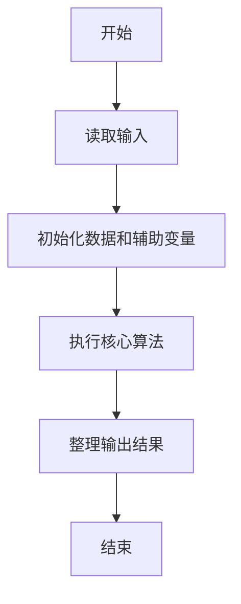
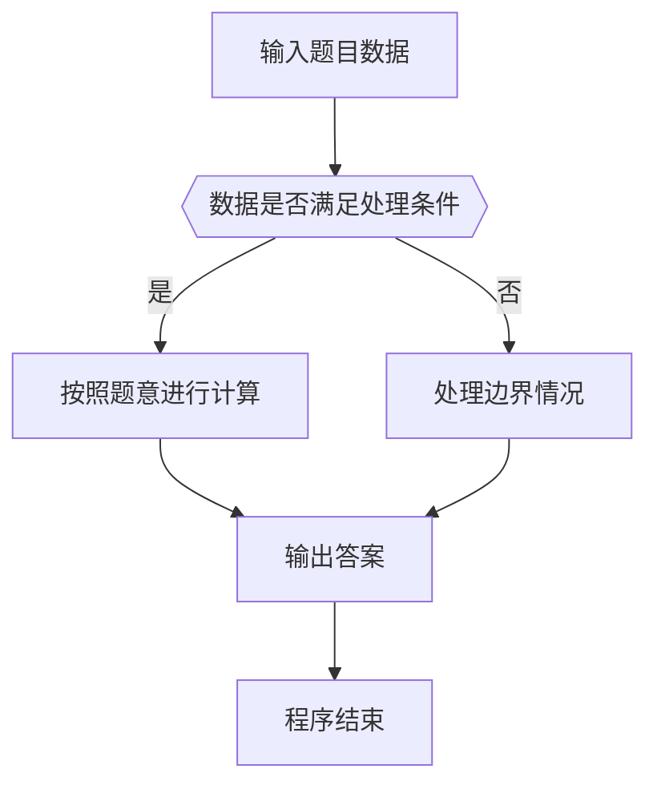

# 1066 图像过滤

- **分值：** 15分

### 题目描述

图像过滤是把图像中不重要的像素都染成背景色，使得重要部分被凸显出来。现给定一幅黑白图像，要求你将灰度值位于某指定区间内的所有像素颜色都用一种指定的颜色替换。

### 输入格式：

输入在第一行给出一幅图像的分辨率，即两个正整数 $M$ 和 $N$（$0 < M, N \le 500$），另外是待过滤的灰度值区间端点 $A$ 和 $B$（$0 \le A < B \le 255$）、以及指定的替换灰度值。随后 $M$ 行，每行给出 $N$ 个像素点的灰度值，其间以空格分隔。所有灰度值都在 [0, 255] 区间内。

### 输出格式：

输出按要求过滤后的图像。即输出 $M$ 行，每行 $N$ 个像素灰度值，每个灰度值占 3 位（例如黑色要显示为 `000`），其间以一个空格分隔。行首尾不得有多余空格。

### 输入样例：
```
3 5 100 150 0
3 189 254 101 119
150 233 151 99 100
88 123 149 0 255
```

### 输出样例：
```
003 189 254 000 000
000 233 151 099 000
088 000 000 000 255
```


### 解题思路

本题的核心是：逐个检查像素值，落在闭区间内则替换为给定颜色。程序先读取题目输入，再按照上述规则完成数据处理，最后严格按照题目要求输出结果。实现时应优先根据题目约束选择合适的数据类型和数据结构，避免溢出或不必要的重复计算。

时间复杂度为 O(RC)；空间复杂度取决于输入规模，主要用于保存题目数据和中间结果。

### 代码流程说明

1. 读取 1066 图像过滤 所需的输入数据。
2. 初始化计数器、数组或其他辅助变量。
3. 逐个检查像素值，落在闭区间内则替换为给定颜色。
4. 按题目规定的格式输出计算结果。

### 代码实现

```java
import java.io.*;
import java.util.*;

public class Main {
    static class FastScanner {
        private final InputStream in; private final byte[] buffer = new byte[1 << 16]; private int ptr, len;
        FastScanner(InputStream in) { this.in = in; }
        private int read() throws IOException { if (ptr >= len) { len = in.read(buffer); ptr = 0; if (len < 0) return -1; } return buffer[ptr++]; }
        String next() throws IOException { StringBuilder b = new StringBuilder(); int c; do c = read(); while (c <= 32 && c >= 0); while (c > 32) { b.append((char)c); c = read(); } return b.toString(); }
        char[] nextChars() throws IOException { return next().toCharArray(); }
        int nextInt() throws IOException { return Integer.parseInt(next()); }
        long nextLong() throws IOException { return Long.parseLong(next()); }
        double nextDouble() throws IOException { return Double.parseDouble(next()); }
        void skip() throws IOException { next(); }
    }
    static int strlen(char[] s) { int n = 0; while (n < s.length && s[n] != 0) n++; return n; }
    static int strcmp(char[] a, char[] b) { return new String(a, 0, strlen(a)).compareTo(new String(b, 0, strlen(b))); }
    static int strncmp(char[] a, char[] b) { return strcmp(a, b); }
    static void printf(String format, Object... args) { Object[] x = new Object[args.length]; for (int i=0;i<args.length;i++) x[i] = args[i] instanceof char[] ? new String((char[])args[i], 0, strlen((char[])args[i])) : args[i]; System.out.printf(format.replace("%lld", "%d"), x); }
    static void puts(Object x) { System.out.println(x instanceof char[] ? new String((char[])x, 0, strlen((char[])x)) : x); }
    static void putchar(char c) { System.out.print(c); }
    static void putchar(int c) { System.out.print((char)c); }
    static final int EOF = -1;
    static int getchar() { return -1; }
    static int isupper(char c) { return Character.isUpperCase(c) ? 1 : 0; }
    static char tolower(int c) { return Character.toLowerCase((char)c); }
    static int strchr(char[] s, char c) { for (int i=0;i<strlen(s);i++) if (s[i]==c) return i; return -1; }
/*
 * 题目：1066 图像过滤
 * 实现原理：逐个检查像素值，落在闭区间内则替换为给定颜色。
 * 复杂度：O(RC)
 * 实现步骤：
 * 1. 读取 1066 图像过滤 所需的输入数据。
 * 2. 初始化计数器、数组或其他辅助变量。
 * 3. 逐个检查像素值，落在闭区间内则替换为给定颜色。
 * 4. 按题目规定的格式输出计算结果。
 */

static FastScanner fs = new FastScanner(System.in);

    public static void main(String[] args) throws Exception {
    int m; int n; int a; int b; int c; int x;
    m = fs.nextInt(); n = fs.nextInt(); a = fs.nextInt(); b = fs.nextInt(); c = fs.nextInt();
    for (int i = 0; i < m; i ++) for (int j = 0; j < n; j ++) {
        x = fs.nextInt();
        if (x >= a && x <= b) x = c;
        printf("%03d%c", x, j + 1 == n ? '\n' : ' ');
    }

}
}
```

### 代码流程图



### 解题流程图



### 常见易错点

- 注意输入数据的范围，选择足够大的整数类型，并正确处理边界值。
- 循环、数组下标和字符串结束位置要严格对应题目定义，避免越界。
- 输出格式必须与题目要求完全一致，包括空格、换行、大小写和特殊符号。
- 如果存在排序、去重、进位、约分或四舍五入等操作，应在输出前统一完成。
