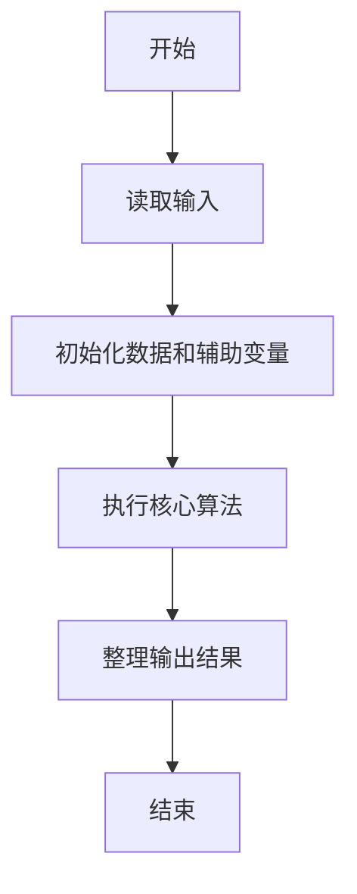
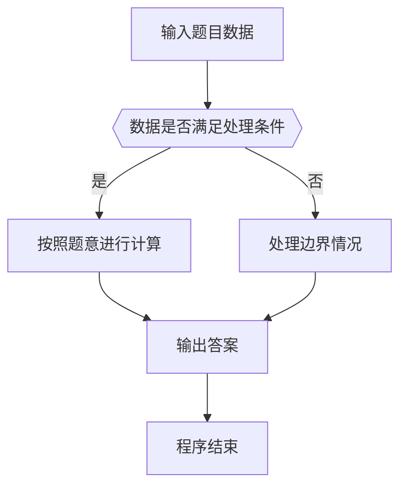

# 1067 试密码

- **分值：** 20分

### 题目描述

当你试图登录某个系统却忘了密码时，系统一般只会允许你尝试有限多次，当超出允许次数时，账号就会被锁死。本题就请你实现这个小功能。

### 输入格式：

输入在第一行给出一个密码（长度不超过 20 的、不包含空格、Tab、回车的非空字符串）和一个正整数 N（$\le$ 10），分别是正确的密码和系统允许尝试的次数。随后每行给出一个以回车结束的非空字符串，是用户尝试输入的密码。输入保证至少有一次尝试。当读到一行只有单个 # 字符时，输入结束，并且这一行不是用户的输入。

### 输出格式：

对用户的每个输入，如果是正确的密码且尝试次数不超过 N，则在一行中输出 `Welcome in`，并结束程序；如果是错误的，则在一行中按格式输出 `Wrong password: 用户输入的错误密码`；当错误尝试达到 N 次时，再输出一行 `Account locked`，并结束程序。

### 输入样例 1：
```
Correct%pw 3
correct%pw
Correct@PW
whatisthepassword!
Correct%pw
#
```

### 输出样例 1：
```
Wrong password: correct%pw
Wrong password: Correct@PW
Wrong password: whatisthepassword!
Account locked
```

### 输入样例 2：
```
cool@gplt 3
coolman@gplt
coollady@gplt
cool@gplt
try again
#
```

### 输出样例 2：
```
Wrong password: coolman@gplt
Wrong password: coollady@gplt
Welcome in
```


### 解题思路

本题的核心是：逐行读取密码，与正确密码比较；遇到结束标记或达到尝试次数即停止。程序先读取题目输入，再按照上述规则完成数据处理，最后严格按照题目要求输出结果。实现时应优先根据题目约束选择合适的数据类型和数据结构，避免溢出或不必要的重复计算。

时间复杂度为 O(nL)；空间复杂度取决于输入规模，主要用于保存题目数据和中间结果。

### 代码流程说明

1. 读取 1067 试密码 所需的输入数据。
2. 初始化计数器、数组或其他辅助变量。
3. 逐行读取密码，与正确密码比较；遇到结束标记或达到尝试次数即停止。
4. 按题目规定的格式输出计算结果。

### 代码实现

```java
import java.io.*;
import java.util.*;

public class Main {
    static class FastScanner {
        private final InputStream in; private final byte[] buffer = new byte[1 << 16]; private int ptr, len;
        FastScanner(InputStream in) { this.in = in; }
        private int read() throws IOException { if (ptr >= len) { len = in.read(buffer); ptr = 0; if (len < 0) return -1; } return buffer[ptr++]; }
        String next() throws IOException { StringBuilder b = new StringBuilder(); int c; do c = read(); while (c <= 32 && c >= 0); while (c > 32) { b.append((char)c); c = read(); } return b.toString(); }
        char[] nextChars() throws IOException { return next().toCharArray(); }
        int nextInt() throws IOException { return Integer.parseInt(next()); }
        long nextLong() throws IOException { return Long.parseLong(next()); }
        double nextDouble() throws IOException { return Double.parseDouble(next()); }
        void skip() throws IOException { next(); }
    }
    static int strlen(char[] s) { int n = 0; while (n < s.length && s[n] != 0) n++; return n; }
    static int strcmp(char[] a, char[] b) { return new String(a, 0, strlen(a)).compareTo(new String(b, 0, strlen(b))); }
    static int strncmp(char[] a, char[] b) { return strcmp(a, b); }
    static void printf(String format, Object... args) { Object[] x = new Object[args.length]; for (int i=0;i<args.length;i++) x[i] = args[i] instanceof char[] ? new String((char[])args[i], 0, strlen((char[])args[i])) : args[i]; System.out.printf(format.replace("%lld", "%d"), x); }
    static void puts(Object x) { System.out.println(x instanceof char[] ? new String((char[])x, 0, strlen((char[])x)) : x); }
    static void putchar(char c) { System.out.print(c); }
    static void putchar(int c) { System.out.print((char)c); }
    static final int EOF = -1;
    static int getchar() { return -1; }
    static int isupper(char c) { return Character.isUpperCase(c) ? 1 : 0; }
    static char tolower(int c) { return Character.toLowerCase((char)c); }
    static int strchr(char[] s, char c) { for (int i=0;i<strlen(s);i++) if (s[i]==c) return i; return -1; }
/*
 * 题目：1067 试密码
 * 实现原理：逐行读取密码，与正确密码比较；遇到结束标记或达到尝试次数即停止。
 * 复杂度：O(nL)
 * 实现步骤：
 * 1. 读取 1067 试密码 所需的输入数据。
 * 2. 初始化计数器、数组或其他辅助变量。
 * 3. 逐行读取密码，与正确密码比较；遇到结束标记或达到尝试次数即停止。
 * 4. 按题目规定的格式输出计算结果。
 */

static FastScanner fs = new FastScanner(System.in);

    public static void main(String[] args) throws Exception {
    char[] pass = new char[25]; char[] s = new char[105];
    int n;
    pass = fs.nextChars(); n = fs.nextInt();
    getchar();
    while (n -- && fgets(s, sizeof s, stdin)) {
        s[strcspn(s, "\r\n")] = 0;
        if (strcmp == 0(s, "#")) break;
        if (strcmp == 0(s, pass)) {
            puts("Welcome in");
            return 0;
        }
        printf("Wrong password: %s\n", s);
    }
    puts("Account locked");

}
}
```

### 代码流程图



### 解题流程图



### 常见易错点

- 注意输入数据的范围，选择足够大的整数类型，并正确处理边界值。
- 循环、数组下标和字符串结束位置要严格对应题目定义，避免越界。
- 输出格式必须与题目要求完全一致，包括空格、换行、大小写和特殊符号。
- 如果存在排序、去重、进位、约分或四舍五入等操作，应在输出前统一完成。
