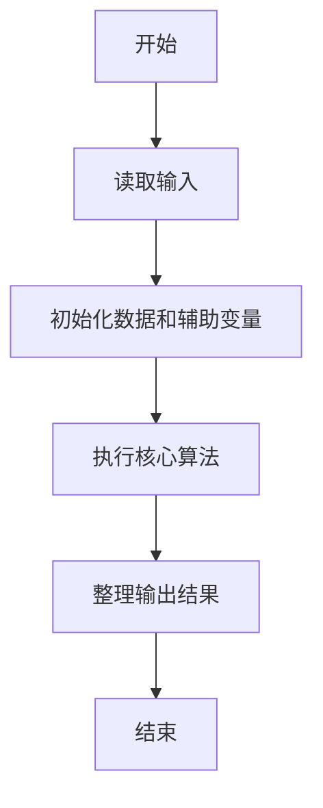
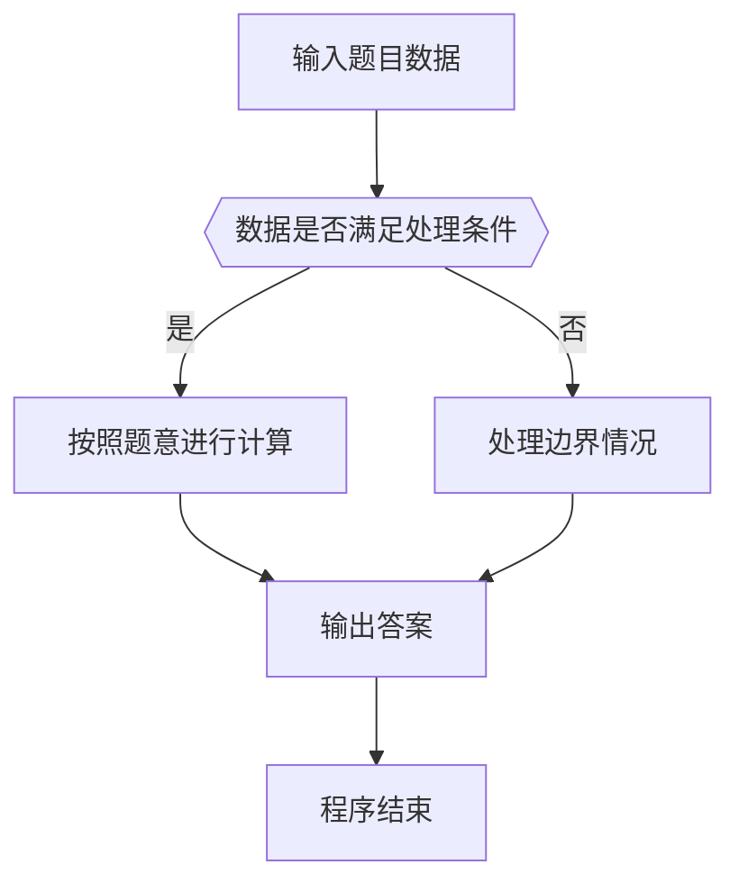

# 1068 万绿丛中一点红

- **分值：** 20分

### 题目描述

对于计算机而言，颜色不过是像素点对应的一个 24 位的数值。现给定一幅分辨率为 $M\times N$ 的画，要求你找出万绿丛中的一点红，即有独一无二颜色的那个像素点，并且该点的颜色与其周围 8 个相邻像素的颜色差充分大。

### 输入格式：

输入第一行给出三个正整数，分别是 $M$ 和 $N$（$\le$ 1000），即图像的分辨率；以及 TOL，是所求像素点与相邻点的颜色差阈值，色差超过 TOL 的点才被考虑。随后 $N$ 行，每行给出 $M$ 个像素的颜色值，范围在 $[0, 2^{24})$ 内。所有同行数字间用空格或 TAB 分开。

### 输出格式：

在一行中按照 `(x, y): color` 的格式输出所求像素点的位置以及颜色值，其中位置 `x` 和 `y` 分别是该像素在图像矩阵中的列、行编号（从 1 开始编号）。如果这样的点不唯一，则输出 `Not Unique`；如果这样的点不存在，则输出 `Not Exist`。

### 输入样例 1：
```
8 6 200
0 	 0 	  0 	   0	    0 	     0 	      0        0
65280 	 65280    65280    16711479 65280    65280    65280    65280
16711479 65280    65280    65280    16711680 65280    65280    65280
65280 	 65280    65280    65280    65280    65280    165280   165280
65280 	 65280 	  16777015 65280    65280    165280   65480    165280
16777215 16777215 16777215 16777215 16777215 16777215 16777215 16777215
```

### 输出样例 1：
```
(5, 3): 16711680
```

### 输入样例 2：
```
4 5 2
0 0 0 0
0 0 3 0
0 0 0 0
0 5 0 0
0 0 0 0
```

### 输出样例 2：
```
Not Unique
```

### 输入样例 3：
```
3 3 5
1 2 3
3 4 5
5 6 7
```

### 输出样例 3：
```
Not Exist
```


### 解题思路

本题的核心是：逐个检查像素与其八邻域的差值，筛选唯一满足阈值条件的像素。程序先读取题目输入，再按照上述规则完成数据处理，最后严格按照题目要求输出结果。实现时应优先根据题目约束选择合适的数据类型和数据结构，避免溢出或不必要的重复计算。

时间复杂度为 O(RC)；空间复杂度取决于输入规模，主要用于保存题目数据和中间结果。

### 代码流程说明

1. 读取 1068 万绿丛中一点红 所需的输入数据。
2. 初始化计数器、数组或其他辅助变量。
3. 逐个检查像素与其八邻域的差值，筛选唯一满足阈值条件的像素。
4. 按题目规定的格式输出计算结果。

### 代码实现

```java
import java.io.*;
import java.util.*;

public class Main {
    static class FastScanner {
        private final InputStream in; private final byte[] buffer = new byte[1 << 16]; private int ptr, len;
        FastScanner(InputStream in) { this.in = in; }
        private int read() throws IOException { if (ptr >= len) { len = in.read(buffer); ptr = 0; if (len < 0) return -1; } return buffer[ptr++]; }
        String next() throws IOException { StringBuilder b = new StringBuilder(); int c; do c = read(); while (c <= 32 && c >= 0); while (c > 32) { b.append((char)c); c = read(); } return b.toString(); }
        char[] nextChars() throws IOException { return next().toCharArray(); }
        int nextInt() throws IOException { return Integer.parseInt(next()); }
        long nextLong() throws IOException { return Long.parseLong(next()); }
        double nextDouble() throws IOException { return Double.parseDouble(next()); }
        void skip() throws IOException { next(); }
    }
    static int strlen(char[] s) { int n = 0; while (n < s.length && s[n] != 0) n++; return n; }
    static int strcmp(char[] a, char[] b) { return new String(a, 0, strlen(a)).compareTo(new String(b, 0, strlen(b))); }
    static int strncmp(char[] a, char[] b) { return strcmp(a, b); }
    static void printf(String format, Object... args) { Object[] x = new Object[args.length]; for (int i=0;i<args.length;i++) x[i] = args[i] instanceof char[] ? new String((char[])args[i], 0, strlen((char[])args[i])) : args[i]; System.out.printf(format.replace("%lld", "%d"), x); }
    static void puts(Object x) { System.out.println(x instanceof char[] ? new String((char[])x, 0, strlen((char[])x)) : x); }
    static void putchar(char c) { System.out.print(c); }
    static void putchar(int c) { System.out.print((char)c); }
    static final int EOF = -1;
    static int getchar() { return -1; }
    static int isupper(char c) { return Character.isUpperCase(c) ? 1 : 0; }
    static char tolower(int c) { return Character.toLowerCase((char)c); }
    static int strchr(char[] s, char c) { for (int i=0;i<strlen(s);i++) if (s[i]==c) return i; return -1; }
/*
 * 题目：1068 聪明的打字员
 * 实现原理：统计每个数字九宫格邻域内的数字，只有唯一邻居满足条件时记录。
 * 复杂度：O(RC)
 * 实现步骤：
 * 1. 读取 1068 万绿丛中一点红 所需的输入数据。
 * 2. 初始化计数器、数组或其他辅助变量。
 * 3. 逐个检查像素与其八邻域的差值，筛选唯一满足阈值条件的像素。
 * 4. 按题目规定的格式输出计算结果。
 */

static int count_value(int[] a, int n, int value) {
    int left = 0, right = n;
    while (left < right) {
        int mid = (left + right) / 2;
        if (a[mid] < value) left = mid + 1;
        else right = mid;
    }
    int first = left;
    right = n;
    while (left < right) {
        int mid = (left + right) / 2;
        if (a[mid] <= value) left = mid + 1;
        else right = mid;
    }
    return left - first;
}

static FastScanner fs = new FastScanner(System.in);

    public static void main(String[] args) throws Exception {
    int m; int n; int t;
    m = fs.nextInt(); n = fs.nextInt(); t = fs.nextInt();
    int[] a = new int[(int) m * n];
    for (int i = 0; i < n; i ++) for (int j = 0; j < m; j ++) a[i * m + j] = fs.nextInt();
    int total = m * n;
    int[] sorted = new int[total];
    memcpy(sorted, a, (int) total * sizeof(int));
    Arrays.sort(sorted, 0, total);
    int cnt = 0; int px = 0; int py = 0;
    for (int i = 1; i < n - 1; i ++) for (int j = 1; j < m - 1; j ++) {
        if (count_value(sorted, total, a[i * m + j]) != 1) continue;
        int ok = 1;
        for (int di = - 1; di <= 1; di ++) for (int dj = - 1; dj <= 1; dj ++) if ((di || dj) && i + di >= 0 && i + di < n && j + dj >= 0 && j + dj < m && abs(a[i * m + j] - a[(i + di) * m + j + dj]) <= t) ok = 0;
        if (ok != 0) {
            cnt ++;
            px = j;
            py = i;
        }
    }
    if (cnt == 1) printf("(%d, %d): %d\n", px + 1, py + 1, a[py * m + px]);
    else if (cnt == 0) puts("Not Exist");
    else puts("Not Unique");


}
}
```

### 代码流程图



### 解题流程图



### 常见易错点

- 注意输入数据的范围，选择足够大的整数类型，并正确处理边界值。
- 循环、数组下标和字符串结束位置要严格对应题目定义，避免越界。
- 输出格式必须与题目要求完全一致，包括空格、换行、大小写和特殊符号。
- 如果存在排序、去重、进位、约分或四舍五入等操作，应在输出前统一完成。
