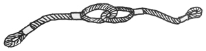
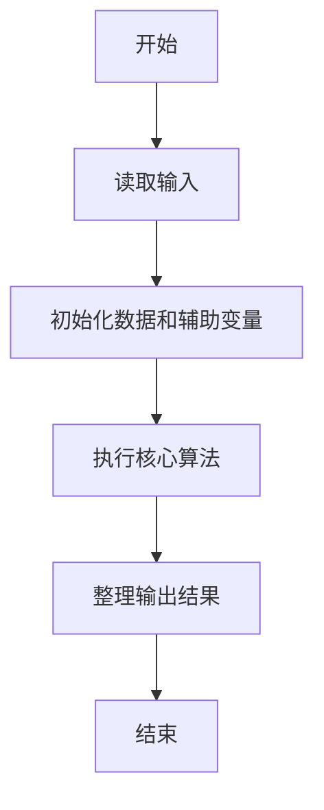
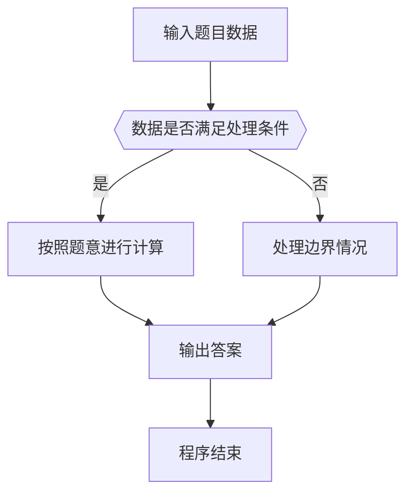

# 1070 结绳

- **分值：** 25分

### 题目描述

给定一段一段的绳子，你需要把它们串成一条绳。每次串连的时候，是把两段绳子对折，再如下图所示套接在一起。这样得到的绳子又被当成是另一段绳子，可以再次对折去跟另一段绳子串连。每次串连后，原来两段绳子的长度就会减半。



给定 $N$ 段绳子的长度，你需要找出它们能串成的绳子的最大长度。

### 输入格式：

每个输入包含 1 个测试用例。每个测试用例第 1 行给出正整数 $N$ ($2 \le N \le 10^{4}$)；第 2 行给出 $N$ 个正整数，即原始绳段的长度，数字间以空格分隔。所有整数都不超过$10^{4}$。

### 输出格式：

在一行中输出能够串成的绳子的最大长度。结果向下取整，即取为不超过最大长度的最近整数。

### 输入样例：
```
8
10 15 12 3 4 13 1 15
```

### 输出样例：
```
14
```


### 解题思路

本题的核心是：反复取两个最小长度合并，使用最小堆计算最终平均长度。程序先读取题目输入，再按照上述规则完成数据处理，最后严格按照题目要求输出结果。实现时应优先根据题目约束选择合适的数据类型和数据结构，避免溢出或不必要的重复计算。

时间复杂度为 O(n log n)；空间复杂度取决于输入规模，主要用于保存题目数据和中间结果。

### 代码流程说明

1. 读取 1070 结绳 所需的输入数据。
2. 初始化计数器、数组或其他辅助变量。
3. 反复取两个最小长度合并，使用最小堆计算最终平均长度。
4. 按题目规定的格式输出计算结果。

### 代码实现

```java
import java.io.*;
import java.util.*;

public class Main {
    static class FastScanner {
        private final InputStream in; private final byte[] buffer = new byte[1 << 16]; private int ptr, len;
        FastScanner(InputStream in) { this.in = in; }
        private int read() throws IOException { if (ptr >= len) { len = in.read(buffer); ptr = 0; if (len < 0) return -1; } return buffer[ptr++]; }
        String next() throws IOException { StringBuilder b = new StringBuilder(); int c; do c = read(); while (c <= 32 && c >= 0); while (c > 32) { b.append((char)c); c = read(); } return b.toString(); }
        char[] nextChars() throws IOException { return next().toCharArray(); }
        int nextInt() throws IOException { return Integer.parseInt(next()); }
        long nextLong() throws IOException { return Long.parseLong(next()); }
        double nextDouble() throws IOException { return Double.parseDouble(next()); }
        void skip() throws IOException { next(); }
    }
    static int strlen(char[] s) { int n = 0; while (n < s.length && s[n] != 0) n++; return n; }
    static int strcmp(char[] a, char[] b) { return new String(a, 0, strlen(a)).compareTo(new String(b, 0, strlen(b))); }
    static int strncmp(char[] a, char[] b) { return strcmp(a, b); }
    static void printf(String format, Object... args) { Object[] x = new Object[args.length]; for (int i=0;i<args.length;i++) x[i] = args[i] instanceof char[] ? new String((char[])args[i], 0, strlen((char[])args[i])) : args[i]; System.out.printf(format.replace("%lld", "%d"), x); }
    static void puts(Object x) { System.out.println(x instanceof char[] ? new String((char[])x, 0, strlen((char[])x)) : x); }
    static void putchar(char c) { System.out.print(c); }
    static void putchar(int c) { System.out.print((char)c); }
    static final int EOF = -1;
    static int getchar() { return -1; }
    static int isupper(char c) { return Character.isUpperCase(c) ? 1 : 0; }
    static char tolower(int c) { return Character.toLowerCase((char)c); }
    static int strchr(char[] s, char c) { for (int i=0;i<strlen(s);i++) if (s[i]==c) return i; return -1; }
/*
 * 题目：1070 结绳
 * 实现原理：反复取两个最小长度合并，使用最小堆计算最终平均长度。
 * 复杂度：O(n log n)
 * 实现步骤：
 * 1. 读取 1070 结绳 所需的输入数据。
 * 2. 初始化计数器、数组或其他辅助变量。
 * 3. 反复取两个最小长度合并，使用最小堆计算最终平均长度。
 * 4. 按题目规定的格式输出计算结果。
 */

static void down(int[] h, int n, int i) {
    while (true) {
        int c = i * 2 + 1;
        if (c >= n) return;
        if (c + 1 < n && h[c + 1] < h[c]) c ++;
        if (h[i] <= h[c]) return;
        int t = h[i];
        h[i] = h[c];
        h[c] = t;
        i = c;
    }
}
static int pop(int[] h, int[] n) {
    int x = h[0];
    h[0] = h[ -- * n];
    down(h, * n, 0);
    return x;
}
static void push(int[] h, int[] n, int x) {
    int i = ( * n) ++;
    while (i && h[(i - 1) / 2] > x) h[i] = h[(i - 1) / 2], i = (i - 1) / 2;
    h[i] = x;
}
static FastScanner fs = new FastScanner(System.in);

    public static void main(String[] args) throws Exception {
    int n; int[] h = new int[10005];
    n = fs.nextInt();
    for (int i = 0; i < n; i ++) h[i] = fs.nextInt();
    for (int i = n / 2 - 1; i >= 0; i --) down(h, n, i);
    while (n > 1) push(h, & n, (pop(h, & n) + pop(h, & n)) / 2);
    printf("%d\n", h[0]);

}
}
```

### 代码流程图



### 解题流程图



### 常见易错点

- 注意输入数据的范围，选择足够大的整数类型，并正确处理边界值。
- 循环、数组下标和字符串结束位置要严格对应题目定义，避免越界。
- 输出格式必须与题目要求完全一致，包括空格、换行、大小写和特殊符号。
- 如果存在排序、去重、进位、约分或四舍五入等操作，应在输出前统一完成。
