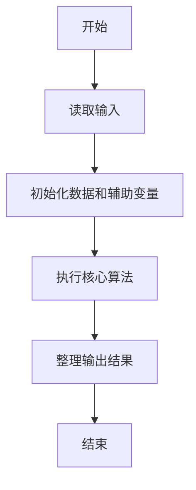
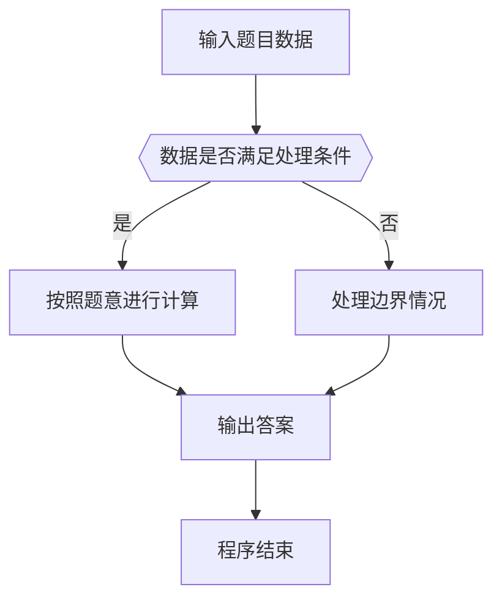

# 1071 小赌怡情

- **分值：** 15分

### 题目描述

常言道“小赌怡情”。这是一个很简单的小游戏：首先由计算机给出第一个整数；然后玩家下注赌第二个整数将会比第一个数大还是小；玩家下注 t 个筹码后，计算机给出第二个数。若玩家猜对了，则系统奖励玩家 t 个筹码；否则扣除玩家 t 个筹码。

注意：玩家下注的筹码数不能超过自己帐户上拥有的筹码数。当玩家输光了全部筹码后，游戏就结束。

### 输入格式：

输入在第一行给出 2 个正整数 T 和 K（$\le$ 100），分别是系统在初始状态下赠送给玩家的筹码数、以及需要处理的游戏次数。随后 K 行，每行对应一次游戏，顺序给出 4 个数字：
```
n1 b t n2
```
其中 `n1` 和 `n2` 是计算机先后给出的两个[0, 9]内的整数，保证两个数字不相等。`b` 为 0 表示玩家赌`小`，为 1 表示玩家赌`大`。`t` 表示玩家下注的筹码数，保证在整型范围内。

### 输出格式：

对每一次游戏，根据下列情况对应输出（其中 `t` 是玩家下注量，`x` 是玩家当前持有的筹码量）：

- 玩家赢，输出 `Win t!  Total = x.`；
- 玩家输，输出 `Lose t.  Total = x.`；
- 玩家下注超过持有的筹码量，输出 `Not enough tokens.  Total = x.`；
- 玩家输光后，输出 `Game Over.` 并结束程序。

### 输入样例 1：
```
100 4
8 0 100 2
3 1 50 1
5 1 200 6
7 0 200 8
```

### 输出样例 1：
```
Win 100!  Total = 200.
Lose 50.  Total = 150.
Not enough tokens.  Total = 150.
Not enough tokens.  Total = 150.
```

### 输入样例 2：
```
100 4
8 0 100 2
3 1 200 1
5 1 200 6
7 0 200 8
```

### 输出样例 2：
```
Win 100!  Total = 200.
Lose 200.  Total = 0.
Game Over.
```


### 解题思路

本题的核心是：按每局下注额和结果更新余额，余额不足时立即停止。程序先读取题目输入，再按照上述规则完成数据处理，最后严格按照题目要求输出结果。实现时应优先根据题目约束选择合适的数据类型和数据结构，避免溢出或不必要的重复计算。

时间复杂度为 O(n)；空间复杂度取决于输入规模，主要用于保存题目数据和中间结果。

### 代码流程说明

1. 读取 1071 小赌怡情 所需的输入数据。
2. 初始化计数器、数组或其他辅助变量。
3. 按每局下注额和结果更新余额，余额不足时立即停止。
4. 按题目规定的格式输出计算结果。

### 代码实现

```java
import java.io.*;
import java.util.*;

public class Main {
    static class FastScanner {
        private final InputStream in; private final byte[] buffer = new byte[1 << 16]; private int ptr, len;
        FastScanner(InputStream in) { this.in = in; }
        private int read() throws IOException { if (ptr >= len) { len = in.read(buffer); ptr = 0; if (len < 0) return -1; } return buffer[ptr++]; }
        String next() throws IOException { StringBuilder b = new StringBuilder(); int c; do c = read(); while (c <= 32 && c >= 0); while (c > 32) { b.append((char)c); c = read(); } return b.toString(); }
        char[] nextChars() throws IOException { return next().toCharArray(); }
        int nextInt() throws IOException { return Integer.parseInt(next()); }
        long nextLong() throws IOException { return Long.parseLong(next()); }
        double nextDouble() throws IOException { return Double.parseDouble(next()); }
        void skip() throws IOException { next(); }
    }
    static int strlen(char[] s) { int n = 0; while (n < s.length && s[n] != 0) n++; return n; }
    static int strcmp(char[] a, char[] b) { return new String(a, 0, strlen(a)).compareTo(new String(b, 0, strlen(b))); }
    static int strncmp(char[] a, char[] b) { return strcmp(a, b); }
    static void printf(String format, Object... args) { Object[] x = new Object[args.length]; for (int i=0;i<args.length;i++) x[i] = args[i] instanceof char[] ? new String((char[])args[i], 0, strlen((char[])args[i])) : args[i]; System.out.printf(format.replace("%lld", "%d"), x); }
    static void puts(Object x) { System.out.println(x instanceof char[] ? new String((char[])x, 0, strlen((char[])x)) : x); }
    static void putchar(char c) { System.out.print(c); }
    static void putchar(int c) { System.out.print((char)c); }
    static final int EOF = -1;
    static int getchar() { return -1; }
    static int isupper(char c) { return Character.isUpperCase(c) ? 1 : 0; }
    static char tolower(int c) { return Character.toLowerCase((char)c); }
    static int strchr(char[] s, char c) { for (int i=0;i<strlen(s);i++) if (s[i]==c) return i; return -1; }
/*
 * 题目：1071 小赌怡情
 * 实现原理：按每局下注额和结果更新余额，余额不足时立即停止。
 * 复杂度：O(n)
 * 实现步骤：
 * 1. 读取 1071 小赌怡情 所需的输入数据。
 * 2. 初始化计数器、数组或其他辅助变量。
 * 3. 按每局下注额和结果更新余额，余额不足时立即停止。
 * 4. 按题目规定的格式输出计算结果。
 */

static FastScanner fs = new FastScanner(System.in);

    public static void main(String[] args) throws Exception {
    int T; int K; int n1; int b; int n2;
    long bet;
    T = fs.nextInt(); K = fs.nextInt();
    while (K-- > 0) {
        n1 = fs.nextInt(); b = fs.nextInt(); bet = fs.nextLong(); n2 = fs.nextInt();
        if (bet > T) {
            printf("Not enough tokens.  Total = %d.\n", T);
            continue;
        }
        int even = (n1 + n2) % 2 == 0;
        if (even == (b == 0)) {
            T += bet;
            printf("Win %lldTotal == 0 = %d.\n", bet, T);
        } else {
            T -= bet;
            printf("Lose %lld.  Total = %d.\n", bet, T);
            if (T == 0) {
                puts("Game Over.");
                return 0;
            }
        }
    }

}
}
```

### 代码流程图



### 解题流程图



### 常见易错点

- 注意输入数据的范围，选择足够大的整数类型，并正确处理边界值。
- 循环、数组下标和字符串结束位置要严格对应题目定义，避免越界。
- 输出格式必须与题目要求完全一致，包括空格、换行、大小写和特殊符号。
- 如果存在排序、去重、进位、约分或四舍五入等操作，应在输出前统一完成。
