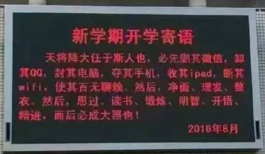
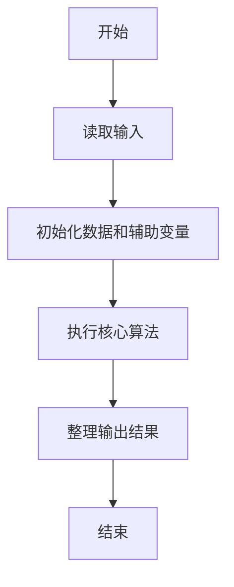
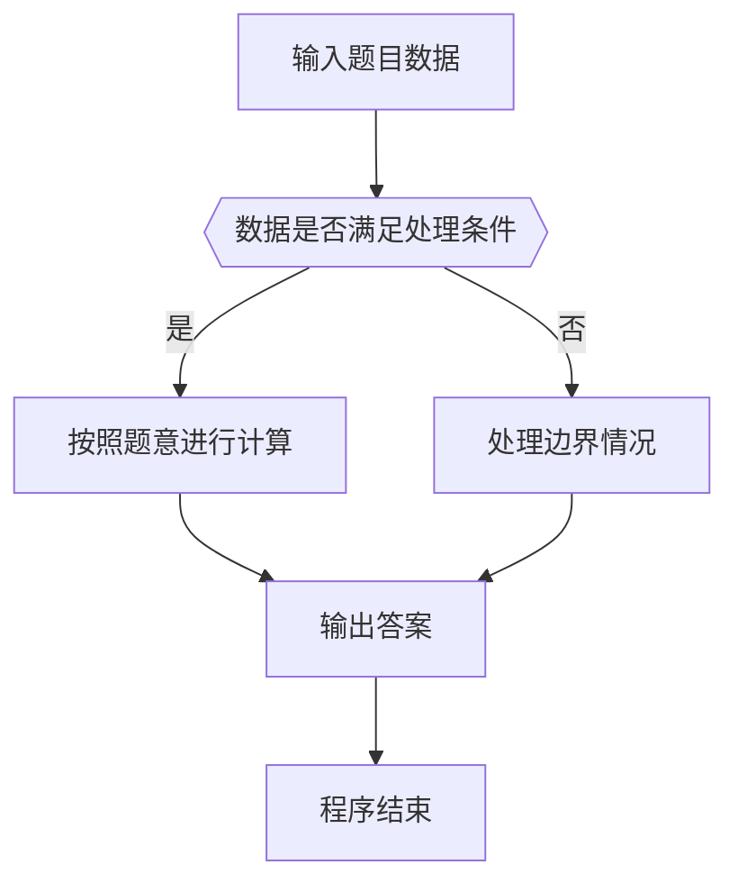

# 1072 开学寄语

- **分值：** 20分

### 题目描述

下图是上海某校的新学期开学寄语：天将降大任于斯人也，必先删其微博，卸其 QQ，封其电脑，夺其手机，收其 ipad，断其 wifi，使其百无聊赖，然后，净面、理发、整衣，然后思过、读书、锻炼、明智、开悟、精进。而后必成大器也！



本题要求你写个程序帮助这所学校的老师检查所有学生的物品，以助其成大器。

### 输入格式：

输入第一行给出两个正整数 N（$\le$ 1000）和 M（$\le$ 6），分别是学生人数和需要被查缴的物品种类数。第二行给出 M 个需要被查缴的物品编号，其中编号为 4 位数字。随后 N 行，每行给出一位学生的姓名缩写（由 1-4 个大写英文字母组成）、个人物品数量 K（0 $\le$ K $\le$ 10）、以及 K 个物品的编号。

### 输出格式：

顺次检查每个学生携带的物品，如果有需要被查缴的物品存在，则按以下格式输出该生的信息和其需要被查缴的物品的信息（注意行末不得有多余空格）：
```
姓名缩写: 物品编号1 物品编号2 ……
```
最后一行输出存在问题的学生的总人数和被查缴物品的总数。

### 输入样例：
```
4 2
2333 6666
CYLL 3 1234 2345 3456
U 4 9966 6666 8888 6666
GG 2 2333 7777
JJ 3 0012 6666 2333
```

### 输出样例：
```
U: 6666 6666
GG: 2333
JJ: 6666 2333
3 5
```


### 解题思路

本题的核心是：记录危险物品编号集合，逐个检查学生携带物品并统计数量。程序先读取题目输入，再按照上述规则完成数据处理，最后严格按照题目要求输出结果。实现时应优先根据题目约束选择合适的数据类型和数据结构，避免溢出或不必要的重复计算。

时间复杂度为 O(nm)；空间复杂度取决于输入规模，主要用于保存题目数据和中间结果。

### 代码流程说明

1. 读取 1072 开学寄语 所需的输入数据。
2. 初始化计数器、数组或其他辅助变量。
3. 记录危险物品编号集合，逐个检查学生携带物品并统计数量。
4. 按题目规定的格式输出计算结果。

### 代码实现

```java
import java.io.*;
import java.util.*;

public class Main {
    static class FastScanner {
        private final InputStream in; private final byte[] buffer = new byte[1 << 16]; private int ptr, len;
        FastScanner(InputStream in) { this.in = in; }
        private int read() throws IOException { if (ptr >= len) { len = in.read(buffer); ptr = 0; if (len < 0) return -1; } return buffer[ptr++]; }
        String next() throws IOException { StringBuilder b = new StringBuilder(); int c; do c = read(); while (c <= 32 && c >= 0); while (c > 32) { b.append((char)c); c = read(); } return b.toString(); }
        char[] nextChars() throws IOException { return next().toCharArray(); }
        int nextInt() throws IOException { return Integer.parseInt(next()); }
        long nextLong() throws IOException { return Long.parseLong(next()); }
        double nextDouble() throws IOException { return Double.parseDouble(next()); }
        void skip() throws IOException { next(); }
    }
    static int strlen(char[] s) { int n = 0; while (n < s.length && s[n] != 0) n++; return n; }
    static int strcmp(char[] a, char[] b) { return new String(a, 0, strlen(a)).compareTo(new String(b, 0, strlen(b))); }
    static int strncmp(char[] a, char[] b) { return strcmp(a, b); }
    static void printf(String format, Object... args) { Object[] x = new Object[args.length]; for (int i=0;i<args.length;i++) x[i] = args[i] instanceof char[] ? new String((char[])args[i], 0, strlen((char[])args[i])) : args[i]; System.out.printf(format.replace("%lld", "%d"), x); }
    static void puts(Object x) { System.out.println(x instanceof char[] ? new String((char[])x, 0, strlen((char[])x)) : x); }
    static void putchar(char c) { System.out.print(c); }
    static void putchar(int c) { System.out.print((char)c); }
    static final int EOF = -1;
    static int getchar() { return -1; }
    static int isupper(char c) { return Character.isUpperCase(c) ? 1 : 0; }
    static char tolower(int c) { return Character.toLowerCase((char)c); }
    static int strchr(char[] s, char c) { for (int i=0;i<strlen(s);i++) if (s[i]==c) return i; return -1; }
/*
 * 题目：1072 开学寄语
 * 实现原理：记录危险物品编号集合，逐个检查学生携带物品并统计数量。
 * 复杂度：O(nm)
 * 实现步骤：
 * 1. 读取 1072 开学寄语 所需的输入数据。
 * 2. 初始化计数器、数组或其他辅助变量。
 * 3. 记录危险物品编号集合，逐个检查学生携带物品并统计数量。
 * 4. 按题目规定的格式输出计算结果。
 */

static FastScanner fs = new FastScanner(System.in);

    public static void main(String[] args) throws Exception {
    int n; int m; int k; int x; int[] need = new int[10000]; int total = 0; int students = 0;
    char[] name = new char[10];
    n = fs.nextInt(); m = fs.nextInt();
    while (m-- > 0) {
        x = fs.nextInt();
        need[x] = 1;
    }
    for (int i = 0; i < n; i ++) {
        name = fs.nextChars(); k = fs.nextInt();
        int c = 0;
        for (int j = 0; j < k; j ++) {
            x = fs.nextInt();
            if (need[x] != 0) {
                if (c == 0) printf("%s:", name);
                printf(" %04d", x);
                c ++;
                total ++;
            }
        }
        if (c) students ++, printf("\n");
    }
    printf("%d %d\n", students, total);

}
}
```

### 代码流程图



### 解题流程图



### 常见易错点

- 注意输入数据的范围，选择足够大的整数类型，并正确处理边界值。
- 循环、数组下标和字符串结束位置要严格对应题目定义，避免越界。
- 输出格式必须与题目要求完全一致，包括空格、换行、大小写和特殊符号。
- 如果存在排序、去重、进位、约分或四舍五入等操作，应在输出前统一完成。
