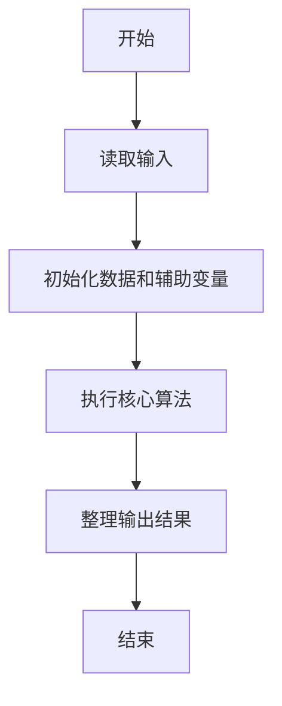
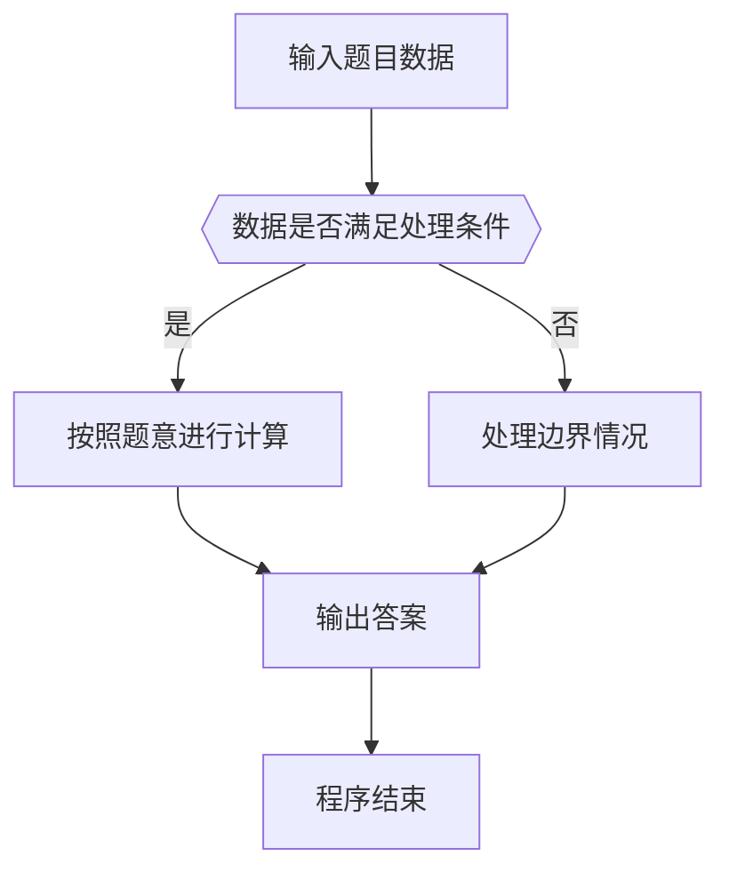

# 1074 宇宙无敌加法器

- **分值：** 20分

### 题目描述

地球人习惯使用十进制数，并且默认一个数字的每一位都是十进制的。而在 PAT 星人开挂的世界里，每个数字的每一位都是不同进制的，这种神奇的数字称为“PAT数”。每个 PAT 星人都必须熟记各位数字的进制表，例如“……0527”就表示最低位是 7 进制数、第 2 位是 2 进制数、第 3 位是 5 进制数、第 4 位是 10 进制数，等等。每一位的进制 d 或者是 0（表示十进制）、或者是 [2，9] 区间内的整数。理论上这个进制表应该包含无穷多位数字，但从实际应用出发，PAT 星人通常只需要记住前 20 位就够用了，以后各位默认为 10 进制。

在这样的数字系统中，即使是简单的加法运算也变得不简单。例如对应进制表“0527”，该如何计算“6203 + 415”呢？我们得首先计算最低位：3 + 5 = 8；因为最低位是 7 进制的，所以我们得到 1 和 1 个进位。第 2 位是：0 + 1 + 1（进位）= 2；因为此位是 2 进制的，所以我们得到 0 和 1 个进位。第 3 位是：2 + 4 + 1（进位）= 7；因为此位是 5 进制的，所以我们得到 2 和 1 个进位。第 4 位是：6 + 1（进位）= 7；因为此位是 10 进制的，所以我们就得到 7。最后我们得到：6203 + 415 = 7201。

### 输入格式：

输入首先在第一行给出一个 N 位的进制表（0 $<$ N $\le$ 20），以回车结束。 随后两行，每行给出一个不超过 N 位的非负的 PAT 数。

### 输出格式：

在一行中输出两个 PAT 数之和。

### 输入样例：
```
30527
06203
415
```

### 输出样例：
```
7201
```


### 解题思路

本题的核心是：逐位从低位相加，使用当前位进制处理余数和进位；进制 0 按 10 处理。程序先读取题目输入，再按照上述规则完成数据处理，最后严格按照题目要求输出结果。实现时应优先根据题目约束选择合适的数据类型和数据结构，避免溢出或不必要的重复计算。

时间复杂度为 O(L)；空间复杂度取决于输入规模，主要用于保存题目数据和中间结果。

### 代码流程说明

1. 读取 1074 宇宙无敌加法器 所需的输入数据。
2. 初始化计数器、数组或其他辅助变量。
3. 逐位从低位相加，使用当前位进制处理余数和进位；进制 0 按 10 处理。
4. 按题目规定的格式输出计算结果。

### 代码实现

```java
import java.io.*;
import java.util.*;

public class Main {
    static class FastScanner {
        private final InputStream in; private final byte[] buffer = new byte[1 << 16]; private int ptr, len;
        FastScanner(InputStream in) { this.in = in; }
        private int read() throws IOException { if (ptr >= len) { len = in.read(buffer); ptr = 0; if (len < 0) return -1; } return buffer[ptr++]; }
        String next() throws IOException { StringBuilder b = new StringBuilder(); int c; do c = read(); while (c <= 32 && c >= 0); while (c > 32) { b.append((char)c); c = read(); } return b.toString(); }
        char[] nextChars() throws IOException { return next().toCharArray(); }
        int nextInt() throws IOException { return Integer.parseInt(next()); }
        long nextLong() throws IOException { return Long.parseLong(next()); }
        double nextDouble() throws IOException { return Double.parseDouble(next()); }
        void skip() throws IOException { next(); }
    }
    static int strlen(char[] s) { int n = 0; while (n < s.length && s[n] != 0) n++; return n; }
    static int strcmp(char[] a, char[] b) { return new String(a, 0, strlen(a)).compareTo(new String(b, 0, strlen(b))); }
    static int strncmp(char[] a, char[] b) { return strcmp(a, b); }
    static void printf(String format, Object... args) { Object[] x = new Object[args.length]; for (int i=0;i<args.length;i++) x[i] = args[i] instanceof char[] ? new String((char[])args[i], 0, strlen((char[])args[i])) : args[i]; System.out.printf(format.replace("%lld", "%d"), x); }
    static void puts(Object x) { System.out.println(x instanceof char[] ? new String((char[])x, 0, strlen((char[])x)) : x); }
    static void putchar(char c) { System.out.print(c); }
    static void putchar(int c) { System.out.print((char)c); }
    static final int EOF = -1;
    static int getchar() { return -1; }
    static int isupper(char c) { return Character.isUpperCase(c) ? 1 : 0; }
    static char tolower(int c) { return Character.toLowerCase((char)c); }
    static int strchr(char[] s, char c) { for (int i=0;i<strlen(s);i++) if (s[i]==c) return i; return -1; }
/*
 * 题目：1074 宇宙无敌加法器
 * 实现原理：逐位从低位相加，使用当前位进制处理余数和进位；进制 0 按 10 处理。
 * 复杂度：O(L)
 * 实现步骤：
 * 1. 读取 1074 宇宙无敌加法器 所需的输入数据。
 * 2. 初始化计数器、数组或其他辅助变量。
 * 3. 逐位从低位相加，使用当前位进制处理余数和进位；进制 0 按 10 处理。
 * 4. 按题目规定的格式输出计算结果。
 */

static int val(char c) {
    return c <= '9' ? c - '0' : c - 'a' + 10;
}
char dig(int x) {
    return x < 10 ? '0' + x : 'a' + x - 10;
}
static int radix(char[]  base, int n, int i) {
    int r = i < n ? base[n - 1 - i] - '0' : 10;
    return r ? r : 10;
}
static FastScanner fs = new FastScanner(System.in);

    public static void main(String[] args) throws Exception {
    char[] base = new char[25]; char[] a = new char[100005]; char[] b = new char[100005]; char[] r = new char[100006];
    base = fs.nextChars(); a = fs.nextChars(); b = fs.nextChars();
    int nb = strlen(base); int la = strlen(a); int lb = strlen(b); int l = la > lb ? la : lb; int k = 0; int carry = 0;
    for (int i = 0; i < l; i ++) {
        int x = la - 1 - i >= 0 ? val(a[la - 1 - i]) : 0; int y = lb - 1 - i >= 0 ? val(b[lb - 1 - i]) : 0; int rad = radix(base, nb, i);
        int z = x + y + carry;
        r[k ++] = dig(z % rad);
        carry = z / rad;
    } while (carry != 0) {
        int rad = radix(base, nb, l);
        r[k ++] = dig(carry % rad);
        carry /= rad;
        l ++;
    } while (k > 1 && r[k - 1] == '0') k --;
    for (int i = k - 1; i >= 0; i --) putchar(r[i]);
    putchar('\n');

}
}
```

### 代码流程图



### 解题流程图



### 常见易错点

- 注意输入数据的范围，选择足够大的整数类型，并正确处理边界值。
- 循环、数组下标和字符串结束位置要严格对应题目定义，避免越界。
- 输出格式必须与题目要求完全一致，包括空格、换行、大小写和特殊符号。
- 如果存在排序、去重、进位、约分或四舍五入等操作，应在输出前统一完成。
