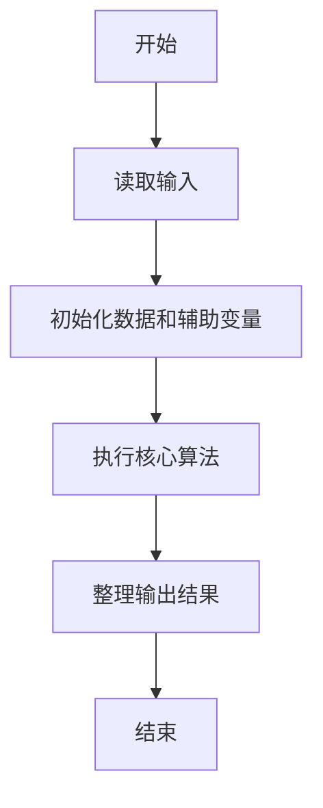
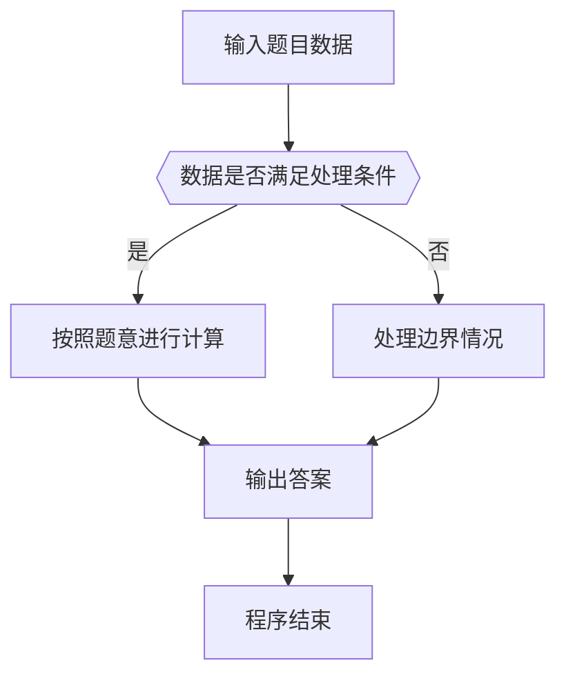

# 1088 三人行

- **分值：** 20分

### 题目描述

子曰：“三人行，必有我师焉。择其善者而从之，其不善者而改之。”

本题给定甲、乙、丙三个人的能力值关系为：甲的能力值确定是 2 位正整数；把甲的能力值的 2 个数字调换位置就是乙的能力值；甲乙两人能力差是丙的能力值的 X 倍；乙的能力值是丙的 Y 倍。请你指出谁比你强应“从之”，谁比你弱应“改之”。

### 输入格式：

输入在一行中给出三个数，依次为：M（你自己的能力值）、X 和 Y。三个数字均为不超过 1000 的正整数。

### 输出格式：

在一行中首先输出甲的能力值，随后依次输出甲、乙、丙三人与你的关系：如果其比你强，输出 `Cong`；平等则输出 `Ping`；比你弱则输出 `Gai`。其间以 1 个空格分隔，行首尾不得有多余空格。

注意：如果解不唯一，则以甲的最大解为准进行判断；如果解不存在，则输出 `No Solution`。

### 输入样例 1：
```
48 3 7
```

### 输出样例 1：
```
48 Ping Cong Gai
```

### 输入样例 2：
```
48 11 6
```

### 输出样例 2：
```
No Solution
```


### 解题思路

本题的核心是：枚举甲乙丙的三位数字，逐项验证三人的真假陈述。程序先读取题目输入，再按照上述规则完成数据处理，最后严格按照题目要求输出结果。实现时应优先根据题目约束选择合适的数据类型和数据结构，避免溢出或不必要的重复计算。

时间复杂度为 O(10³)；空间复杂度取决于输入规模，主要用于保存题目数据和中间结果。

### 代码流程说明

1. 读取 1088 三人行 所需的输入数据。
2. 初始化计数器、数组或其他辅助变量。
3. 枚举甲乙丙的三位数字，逐项验证三人的真假陈述。
4. 按题目规定的格式输出计算结果。

### 代码实现

```java
import java.io.*;
import java.util.*;

public class Main {
    static class FastScanner {
        private final InputStream in; private final byte[] buffer = new byte[1 << 16]; private int ptr, len;
        FastScanner(InputStream in) { this.in = in; }
        private int read() throws IOException { if (ptr >= len) { len = in.read(buffer); ptr = 0; if (len < 0) return -1; } return buffer[ptr++]; }
        String next() throws IOException { StringBuilder b = new StringBuilder(); int c; do c = read(); while (c <= 32 && c >= 0); while (c > 32) { b.append((char)c); c = read(); } return b.toString(); }
        char[] nextChars() throws IOException { return next().toCharArray(); }
        int nextInt() throws IOException { return Integer.parseInt(next()); }
        long nextLong() throws IOException { return Long.parseLong(next()); }
        double nextDouble() throws IOException { return Double.parseDouble(next()); }
        void skip() throws IOException { next(); }
    }
    static int strlen(char[] s) { int n = 0; while (n < s.length && s[n] != 0) n++; return n; }
    static int strcmp(char[] a, char[] b) { return new String(a, 0, strlen(a)).compareTo(new String(b, 0, strlen(b))); }
    static int strncmp(char[] a, char[] b) { return strcmp(a, b); }
    static void printf(String format, Object... args) { Object[] x = new Object[args.length]; for (int i=0;i<args.length;i++) x[i] = args[i] instanceof char[] ? new String((char[])args[i], 0, strlen((char[])args[i])) : args[i]; System.out.printf(format.replace("%lld", "%d"), x); }
    static void puts(Object x) { System.out.println(x instanceof char[] ? new String((char[])x, 0, strlen((char[])x)) : x); }
    static void putchar(char c) { System.out.print(c); }
    static void putchar(int c) { System.out.print((char)c); }
    static final int EOF = -1;
    static int getchar() { return -1; }
    static int isupper(char c) { return Character.isUpperCase(c) ? 1 : 0; }
    static char tolower(int c) { return Character.toLowerCase((char)c); }
    static int strchr(char[] s, char c) { for (int i=0;i<strlen(s);i++) if (s[i]==c) return i; return -1; }
/*
 * 题目：1088 三人行
 * 实现原理：枚举甲乙丙的三位数字，逐项验证三人的真假陈述。
 * 复杂度：O(10³)
 * 实现步骤：
 * 1. 读取 1088 三人行 所需的输入数据。
 * 2. 初始化计数器、数组或其他辅助变量。
 * 3. 枚举甲乙丙的三位数字，逐项验证三人的真假陈述。
 * 4. 按题目规定的格式输出计算结果。
 */

char[]  rel(double a, double m) {
    return a > m ? "Cong" : a < m ? "Gai" : "Ping";
}
static FastScanner fs = new FastScanner(System.in);

    public static void main(String[] args) throws Exception {
    int m; int x; int y; int best = - 1; int bb = 0;
    double cc = 0;
    m = fs.nextInt(); x = fs.nextInt(); y = fs.nextInt();
    for (int a = 10; a <= 99; a ++) {
        int b = a % 10 * 10 + a / 10;
        if (b == a) continue;
        int diff = a > b ? a - b : b - a;
        if (diff % x) continue;
        double c = (double) diff / x;
        if (fabs(b - c * y) > 1e-8) continue;
        if (a > best) best = a, bb = b, cc = c;
    }
    if (best < 0) puts("No Solution");
    else printf("%d %s %s %s\n", best, rel(best, m), rel(bb, m), rel(cc, m));

}
}
```

### 代码流程图



### 解题流程图



### 常见易错点

- 注意输入数据的范围，选择足够大的整数类型，并正确处理边界值。
- 循环、数组下标和字符串结束位置要严格对应题目定义，避免越界。
- 输出格式必须与题目要求完全一致，包括空格、换行、大小写和特殊符号。
- 如果存在排序、去重、进位、约分或四舍五入等操作，应在输出前统一完成。
