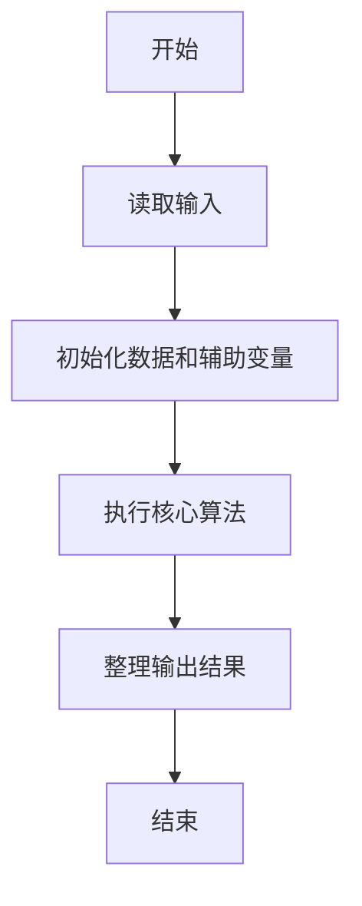
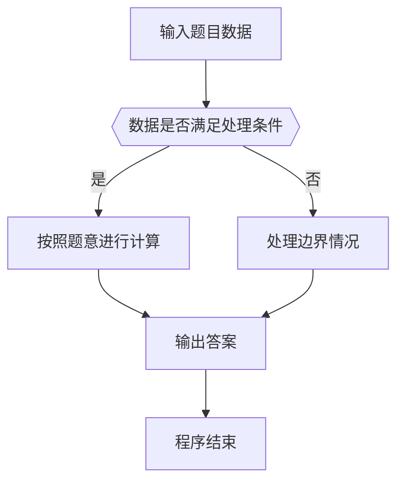

# 1089 狼人杀-简单版

- **分值：** 20分

### 题目描述

以下文字摘自《灵机一动·好玩的数学》：“狼人杀”游戏分为狼人、好人两大阵营。在一局“狼人杀”游戏中，1 号玩家说：“2 号是狼人”，2 号玩家说：“3 号是好人”，3 号玩家说：“4 号是狼人”，4 号玩家说：“5 号是好人”，5 号玩家说：“4 号是好人”。已知这 5 名玩家中有 2 人扮演狼人角色，有 2 人说的不是实话，有狼人撒谎但并不是所有狼人都在撒谎。扮演狼人角色的是哪两号玩家？

本题是这个问题的升级版：已知 $N$ 名玩家中有 2 人扮演狼人角色，有 2 人说的不是实话，有狼人撒谎但并不是所有狼人都在撒谎。要求你找出扮演狼人角色的是哪几号玩家？

### 输入格式：

输入在第一行中给出一个正整数 $N$（$5 \le N \le 100$）。随后 $N$ 行，第 $i$ 行给出第 $i$ 号玩家说的话（$1 \le i \le N$），即一个玩家编号，用正号表示好人，负号表示狼人。

### 输出格式：

如果有解，在一行中按递增顺序输出 2 个狼人的编号，其间以空格分隔，行首尾不得有多余空格。如果解不唯一，则输出最小序列解 —— 即对于两个序列 $A = { a[1], ..., a[M] }$ 和 $B = { b[1], ..., b[M] }$，若存在 $0 \le k < M$ 使得 $a[i]=b[i]$ （$i \le k$），且 $a[k+1]<b[k+1]$，则称序列 $A$ 小于序列 $B$。若无解则输出 `No Solution`。

### 输入样例 1：
```
5
-2
+3
-4
+5
+4
```

### 输出样例 1：
```
1 4
```

### 输入样例 2：
```
6
+6
+3
+1
-5
-2
+4
```

### 输出样例 2（解不唯一）：
```
1 5
```

### 输入样例 3：
```
5
-2
-3
-4
-5
-1
```

### 输出样例 3：
```
No Solution
```


### 解题思路

本题的核心是：枚举两名狼人和两名说谎者，检查所有陈述后输出满足条件的组合。程序先读取题目输入，再按照上述规则完成数据处理，最后严格按照题目要求输出结果。实现时应优先根据题目约束选择合适的数据类型和数据结构，避免溢出或不必要的重复计算。

时间复杂度为 O(n⁴)；空间复杂度取决于输入规模，主要用于保存题目数据和中间结果。

### 代码流程说明

1. 读取 1089 狼人杀-简单版 所需的输入数据。
2. 初始化计数器、数组或其他辅助变量。
3. 枚举两名狼人和两名说谎者，检查所有陈述后输出满足条件的组合。
4. 按题目规定的格式输出计算结果。

### 代码实现

```java
import java.io.*;
import java.util.*;

public class Main {
    static class FastScanner {
        private final InputStream in; private final byte[] buffer = new byte[1 << 16]; private int ptr, len;
        FastScanner(InputStream in) { this.in = in; }
        private int read() throws IOException { if (ptr >= len) { len = in.read(buffer); ptr = 0; if (len < 0) return -1; } return buffer[ptr++]; }
        String next() throws IOException { StringBuilder b = new StringBuilder(); int c; do c = read(); while (c <= 32 && c >= 0); while (c > 32) { b.append((char)c); c = read(); } return b.toString(); }
        char[] nextChars() throws IOException { return next().toCharArray(); }
        int nextInt() throws IOException { return Integer.parseInt(next()); }
        long nextLong() throws IOException { return Long.parseLong(next()); }
        double nextDouble() throws IOException { return Double.parseDouble(next()); }
        void skip() throws IOException { next(); }
    }
    static int strlen(char[] s) { int n = 0; while (n < s.length && s[n] != 0) n++; return n; }
    static int strcmp(char[] a, char[] b) { return new String(a, 0, strlen(a)).compareTo(new String(b, 0, strlen(b))); }
    static int strncmp(char[] a, char[] b) { return strcmp(a, b); }
    static void printf(String format, Object... args) { Object[] x = new Object[args.length]; for (int i=0;i<args.length;i++) x[i] = args[i] instanceof char[] ? new String((char[])args[i], 0, strlen((char[])args[i])) : args[i]; System.out.printf(format.replace("%lld", "%d"), x); }
    static void puts(Object x) { System.out.println(x instanceof char[] ? new String((char[])x, 0, strlen((char[])x)) : x); }
    static void putchar(char c) { System.out.print(c); }
    static void putchar(int c) { System.out.print((char)c); }
    static final int EOF = -1;
    static int getchar() { return -1; }
    static int isupper(char c) { return Character.isUpperCase(c) ? 1 : 0; }
    static char tolower(int c) { return Character.toLowerCase((char)c); }
    static int strchr(char[] s, char c) { for (int i=0;i<strlen(s);i++) if (s[i]==c) return i; return -1; }
/*
 * 题目：1089 狼人杀
 * 实现原理：枚举两名狼人和两名说谎者，检查所有陈述后输出满足条件的组合。
 * 复杂度：O(n⁴)
 * 实现步骤：
 * 1. 读取 1089 狼人杀-简单版 所需的输入数据。
 * 2. 初始化计数器、数组或其他辅助变量。
 * 3. 枚举两名狼人和两名说谎者，检查所有陈述后输出满足条件的组合。
 * 4. 按题目规定的格式输出计算结果。
 */

static FastScanner fs = new FastScanner(System.in);

    public static void main(String[] args) throws Exception {
    int n; int[] a = new int[105];
    n = fs.nextInt();
    for (int i = 1; i <= n; i ++) a[i] = fs.nextInt();
    for (int w1 = 1; w1 <= n; w1 ++) for (int w2 = w1 + 1; w2 <= n; w2 ++) {
        int lies = 0; int lw = 0;
        for (int i = 1; i <= n; i ++) {
            int said = a[i]; int role = abs(said) == w1 || abs(said) == w2 ? - 1 : 1;
            int actual = said < 0 ? - 1 : 1;
            if (role != actual) {
                lies ++;
                if (i == w1 || i == w2) lw ++;
            }
        }
        if (lies == 2 && lw == 1) {
            printf("%d %d\n", w1, w2);
            return 0;
        }
    }
    puts("No Solution");

}
}
```

### 代码流程图



### 解题流程图



### 常见易错点

- 注意输入数据的范围，选择足够大的整数类型，并正确处理边界值。
- 循环、数组下标和字符串结束位置要严格对应题目定义，避免越界。
- 输出格式必须与题目要求完全一致，包括空格、换行、大小写和特殊符号。
- 如果存在排序、去重、进位、约分或四舍五入等操作，应在输出前统一完成。
