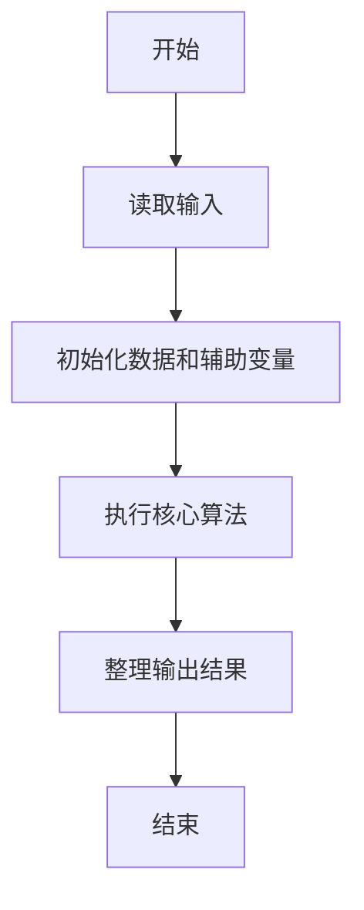
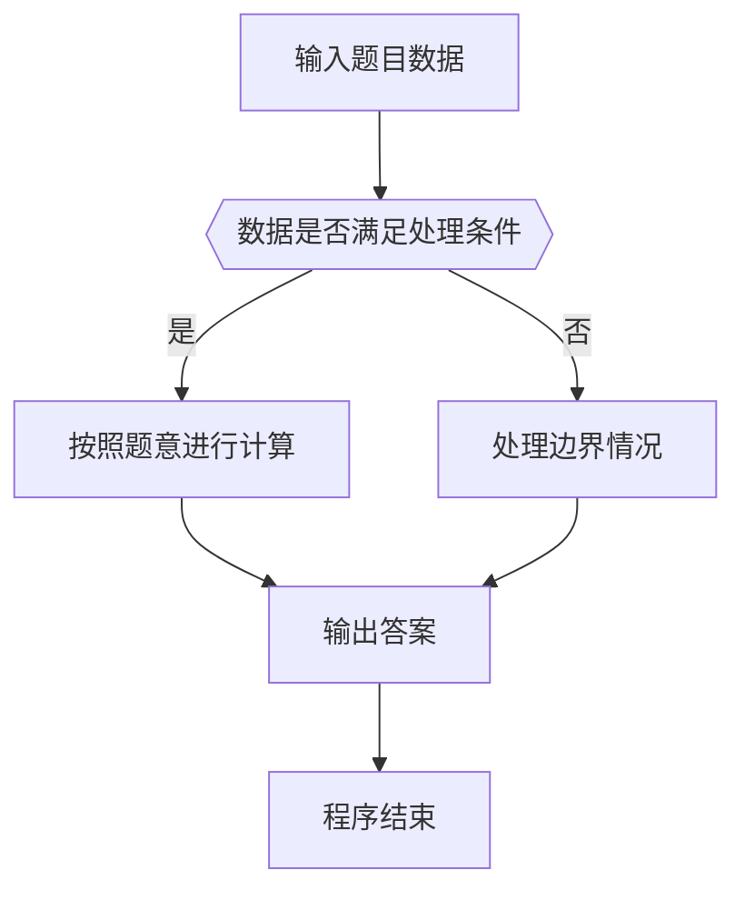

# 1094 谷歌的招聘

- **分值：** 20分

### 题目描述

2004 年 7 月，谷歌在硅谷的 101 号公路边竖立了一块巨大的广告牌（如下图）用于招聘。内容超级简单，就是一个以 .com 结尾的网址，而前面的网址是一个 10 位素数，这个素数是自然常数 e 中最早出现的 10 位连续数字。能找出这个素数的人，就可以通过访问谷歌的这个网站进入招聘流程的下一步。


自然常数 e 是一个著名的超越数，前面若干位写出来是这样的：e = 2.71828182845904523536028747135266249775724709369995957496696762772407663035354759457138217852516642**7427466391**932003059921... 其中粗体标出的 10 位数就是答案。

本题要求你编程解决一个更通用的问题：从任一给定的长度为 L 的数字中，找出最早出现的 K 位连续数字所组成的素数。

### 输入格式：

输入在第一行给出 2 个正整数，分别是 L（不超过 1000 的正整数，为数字长度）和 K（小于 10 的正整数）。接下来一行给出一个长度为 L 的正整数 N。

### 输出格式：

在一行中输出 N 中最早出现的 K 位连续数字所组成的素数。如果这样的素数不存在，则输出 `404`。注意，原始数字中的前导零也计算在位数之内。例如在 200236 中找 4 位素数，0023 算是解；但第一位 2 不能被当成 0002 输出，因为在原始数字中不存在这个 2 的前导零。

### 输入样例 1：
```
20 5
23654987725541023819
```

### 输出样例 1：
```
49877
```

### 输入样例 2：
```
10 3
2468001680
```

### 输出样例 2：
```
404
```

**鸣谢用户 大冰 补充数据！**


### 解题思路

本题的核心是：枚举每个长度为 K 的子串，将其转为整数并用素数判断。程序先读取题目输入，再按照上述规则完成数据处理，最后严格按照题目要求输出结果。实现时应优先根据题目约束选择合适的数据类型和数据结构，避免溢出或不必要的重复计算。

时间复杂度为 O(nK√v)；空间复杂度取决于输入规模，主要用于保存题目数据和中间结果。

### 代码流程说明

1. 读取 1094 谷歌的招聘 所需的输入数据。
2. 初始化计数器、数组或其他辅助变量。
3. 枚举每个长度为 K 的子串，将其转为整数并用素数判断。
4. 按题目规定的格式输出计算结果。

### 代码实现

```java
import java.io.*;
import java.util.*;

public class Main {
    static class FastScanner {
        private final InputStream in; private final byte[] buffer = new byte[1 << 16]; private int ptr, len;
        FastScanner(InputStream in) { this.in = in; }
        private int read() throws IOException { if (ptr >= len) { len = in.read(buffer); ptr = 0; if (len < 0) return -1; } return buffer[ptr++]; }
        String next() throws IOException { StringBuilder b = new StringBuilder(); int c; do c = read(); while (c <= 32 && c >= 0); while (c > 32) { b.append((char)c); c = read(); } return b.toString(); }
        char[] nextChars() throws IOException { return next().toCharArray(); }
        int nextInt() throws IOException { return Integer.parseInt(next()); }
        long nextLong() throws IOException { return Long.parseLong(next()); }
        double nextDouble() throws IOException { return Double.parseDouble(next()); }
        void skip() throws IOException { next(); }
    }
    static int strlen(char[] s) { int n = 0; while (n < s.length && s[n] != 0) n++; return n; }
    static int strcmp(char[] a, char[] b) { return new String(a, 0, strlen(a)).compareTo(new String(b, 0, strlen(b))); }
    static int strncmp(char[] a, char[] b) { return strcmp(a, b); }
    static void printf(String format, Object... args) { Object[] x = new Object[args.length]; for (int i=0;i<args.length;i++) x[i] = args[i] instanceof char[] ? new String((char[])args[i], 0, strlen((char[])args[i])) : args[i]; System.out.printf(format.replace("%lld", "%d"), x); }
    static void puts(Object x) { System.out.println(x instanceof char[] ? new String((char[])x, 0, strlen((char[])x)) : x); }
    static void putchar(char c) { System.out.print(c); }
    static void putchar(int c) { System.out.print((char)c); }
    static final int EOF = -1;
    static int getchar() { return -1; }
    static int isupper(char c) { return Character.isUpperCase(c) ? 1 : 0; }
    static char tolower(int c) { return Character.toLowerCase((char)c); }
    static int strchr(char[] s, char c) { for (int i=0;i<strlen(s);i++) if (s[i]==c) return i; return -1; }
/*
 * 题目：1094 谷歌的招聘
 * 实现原理：枚举每个长度为 K 的子串，将其转为整数并用素数判断。
 * 复杂度：O(nK√v)
 * 实现步骤：
 * 1. 读取 1094 谷歌的招聘 所需的输入数据。
 * 2. 初始化计数器、数组或其他辅助变量。
 * 3. 枚举每个长度为 K 的子串，将其转为整数并用素数判断。
 * 4. 按题目规定的格式输出计算结果。
 */

static int prime(long x) {
    if (x < 2) return 0;
    for (long i = 2; i * i <= x; i ++) if (x % i == 0) return 0;
    return 1;
}
static FastScanner fs = new FastScanner(System.in);

    public static void main(String[] args) throws Exception {
    int l; int k;
    char[] s = new char[1005]; char[] t = new char[15];
    l = fs.nextInt(); k = fs.nextInt(); s = fs.nextChars();
    for (int i = 0; i + k <= l; i ++) {
        memcpy(t, s + i, k);
        t[k] = 0;
        long x = 0;
        x = Long.parseLong(new String(t));
        if (prime(x) != 0) {
            puts(t);
            return 0;
        }
    }
    puts("404");

}
}
```

### 代码流程图



### 解题流程图



### 常见易错点

- 注意输入数据的范围，选择足够大的整数类型，并正确处理边界值。
- 循环、数组下标和字符串结束位置要严格对应题目定义，避免越界。
- 输出格式必须与题目要求完全一致，包括空格、换行、大小写和特殊符号。
- 如果存在排序、去重、进位、约分或四舍五入等操作，应在输出前统一完成。
