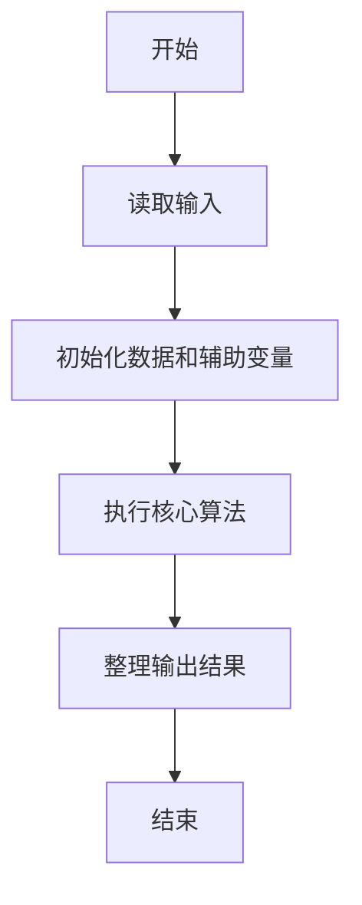
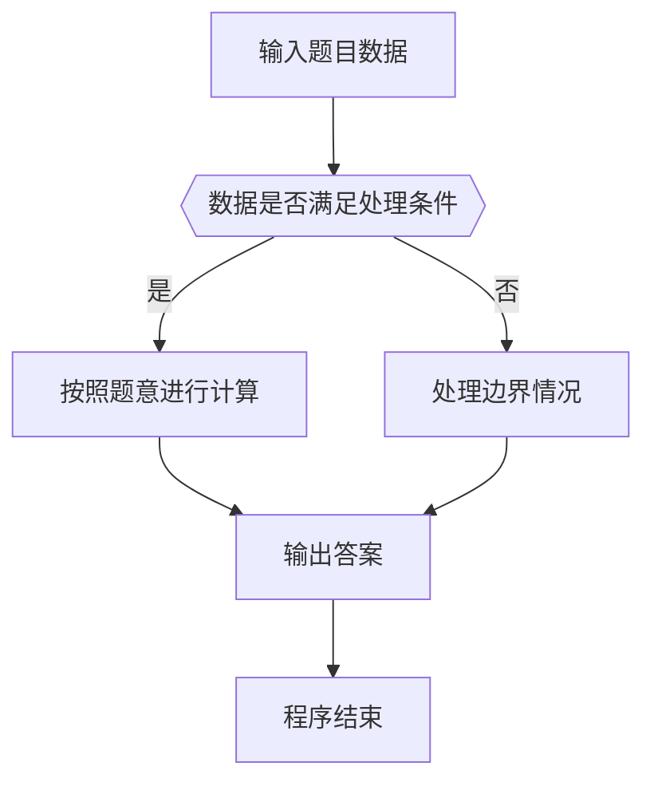

# 1095 解码PAT准考证

- **分值：** 25分

### 题目描述

PAT 准考证号由 4 部分组成：

- 第 1 位是级别，即 `T` 代表顶级；`A` 代表甲级；`B` 代表乙级；
- 第 2~4 位是考场编号，范围从 101 到 999；
- 第 5~10 位是考试日期，格式为年、月、日顺次各占 2 位；
- 最后 11~13 位是考生编号，范围从 000 到 999。

现给定一系列考生的准考证号和他们的成绩，请你按照要求输出各种统计信息。

### 输入格式：

输入首先在一行中给出两个正整数 $N$（$\le 10^4$）和 $M$（$\le 100$），分别为考生人数和统计要求的个数。

接下来 $N$ 行，每行给出一个考生的准考证号和其分数（在区间 $[0, 100]$ 内的整数），其间以空格分隔。

考生信息之后，再给出 $M$ 行，每行给出一个统计要求，格式为：`类型 指令`，其中

- `类型` 为 1 表示要求按分数非升序输出某个指定级别的考生的成绩，对应的 `指令` 则给出代表指定级别的字母；
- `类型` 为 2 表示要求将某指定考场的考生人数和总分统计输出，对应的 `指令` 则给出指定考场的编号；
- `类型` 为 3 表示要求将某指定日期的考生人数分考场统计输出，对应的 `指令` 则给出指定日期，格式与准考证上日期相同。

### 输出格式：

对每项统计要求，首先在一行中输出 `Case #: 要求`，其中 `#` 是该项要求的编号，从 1 开始；`要求` 即复制输入给出的要求。随后输出相应的统计结果：

- `类型` 为 1 的指令，输出格式与输入的考生信息格式相同，即 `准考证号 成绩`。对于分数并列的考生，按其准考证号的字典序递增输出（题目保证无重复准考证号）；
- `类型` 为 2 的指令，按 `人数 总分` 的格式输出；
- `类型` 为 3 的指令，输出按人数非递增顺序，格式为 `考场编号 总人数`。若人数并列则按考场编号递增顺序输出。

如果查询结果为空，则输出 `NA`。

### 输入样例：
```
8 4
B123180908127 99
B102180908003 86
A112180318002 98
T107150310127 62
A107180908108 100
T123180908010 78
B112160918035 88
A107180908021 98
1 A
2 107
3 180908
2 999
```

### 输出样例：
```
Case 1: 1 A
A107180908108 100
A107180908021 98
A112180318002 98
Case 2: 2 107
3 260
Case 3: 3 180908
107 2
123 2
102 1
Case 4: 2 999
NA
```


### 解题思路

本题的核心是：按查询类型统计等级、日期总分或考点总量，分别排序或累加。程序先读取题目输入，再按照上述规则完成数据处理，最后严格按照题目要求输出结果。实现时应优先根据题目约束选择合适的数据类型和数据结构，避免溢出或不必要的重复计算。

时间复杂度为 O(n log n)；空间复杂度取决于输入规模，主要用于保存题目数据和中间结果。

### 代码流程说明

1. 读取 1095 解码PAT准考证 所需的输入数据。
2. 初始化计数器、数组或其他辅助变量。
3. 按查询类型统计等级、日期总分或考点总量，分别排序或累加。
4. 按题目规定的格式输出计算结果。

### 代码实现

```java
import java.io.*;
import java.util.*;

public class Main {
    static class FastScanner {
        private final InputStream in; private final byte[] buffer = new byte[1 << 16]; private int ptr, len;
        FastScanner(InputStream in) { this.in = in; }
        private int read() throws IOException { if (ptr >= len) { len = in.read(buffer); ptr = 0; if (len < 0) return -1; } return buffer[ptr++]; }
        String next() throws IOException { StringBuilder b = new StringBuilder(); int c; do c = read(); while (c <= 32 && c >= 0); while (c > 32) { b.append((char)c); c = read(); } return b.toString(); }
        char[] nextChars() throws IOException { return next().toCharArray(); }
        int nextInt() throws IOException { return Integer.parseInt(next()); }
        long nextLong() throws IOException { return Long.parseLong(next()); }
        double nextDouble() throws IOException { return Double.parseDouble(next()); }
        void skip() throws IOException { next(); }
    }
    static int strlen(char[] s) { int n = 0; while (n < s.length && s[n] != 0) n++; return n; }
    static int strcmp(char[] a, char[] b) { return new String(a, 0, strlen(a)).compareTo(new String(b, 0, strlen(b))); }
    static int strncmp(char[] a, char[] b) { return strcmp(a, b); }
    static void printf(String format, Object... args) { Object[] x = new Object[args.length]; for (int i=0;i<args.length;i++) x[i] = args[i] instanceof char[] ? new String((char[])args[i], 0, strlen((char[])args[i])) : args[i]; System.out.printf(format.replace("%lld", "%d"), x); }
    static void puts(Object x) { System.out.println(x instanceof char[] ? new String((char[])x, 0, strlen((char[])x)) : x); }
    static void putchar(char c) { System.out.print(c); }
    static void putchar(int c) { System.out.print((char)c); }
    static final int EOF = -1;
    static int getchar() { return -1; }
    static int isupper(char c) { return Character.isUpperCase(c) ? 1 : 0; }
    static char tolower(int c) { return Character.toLowerCase((char)c); }
    static int strchr(char[] s, char c) { for (int i=0;i<strlen(s);i++) if (s[i]==c) return i; return -1; }
/*
 * 题目：1095 解码PAT准考证
 * 实现原理：按查询类型统计等级、日期总分或考点总量，分别排序或累加。
 * 复杂度：O(n log n)
 * 实现步骤：
 * 1. 读取 1095 解码PAT准考证 所需的输入数据。
 * 2. 初始化计数器、数组或其他辅助变量。
 * 3. 按查询类型统计等级、日期总分或考点总量，分别排序或累加。
 * 4. 按题目规定的格式输出计算结果。
 */

static class R {
char[] id = new[] char = new new[20];
    int score;
}

static FastScanner fs = new FastScanner(System.in);

    public static void main(String[] args) throws Exception {
    int n; int m; int type; int cas = 1;
    char[] cmd = new char[20];
    R[] a = new R[10000]; for (int z = 0; z < 10000; z++) a[z] = new R(); for (int z = 0; z < 10000; z++) a[z] = new R();
    n = fs.nextInt(); m = fs.nextInt();
    for (int i = 0; i < n; i ++) a[i].id = fs.nextChars(); a[i].score = fs.nextInt();
    while (m-- > 0) {
        type = fs.nextInt(); cmd = fs.nextChars();
        printf("Case %d: %d %s\n", cas ++, type, cmd);
        if (type == 1) {
            R[] t = new R[10000]; for (int z = 0; z < 10000; z++) t[z] = new R(); for (int z = 0; z < 10000; z++) t[z] = new R();
            int k = 0;
            for (int i = 0; i < n; i ++) if (a[i].id[0] == cmd[0]) t[k ++] = a[i];
            Arrays.sort(t, 0, k);
            for (int i = 0; i < k; i ++) printf("%s %d\n", t[i].id, t[i].score);
            if (k == 0) puts("NA");
        } else if (type == 2) {
            int cnt = 0; int sum = 0;
            for (int i = 0; i < n; i ++) if (strncmp == 0(a[i].id + 1, cmd)) cnt ++, sum += a[i].score;
            if (cnt) printf("%d %d\n", cnt, sum);
            else puts("NA");
        } else {
            int[] cnt = new int[1000];
            for (int i = 0; i < n; i ++) if (strncmp == 0(a[i].id + 4, cmd)) {
                int room = (a[i].id[1] - '0') * 100 + (a[i].id[2] - '0') * 10 + a[i].id[3] - '0';
                cnt[room] ++;
            }
            int any = 0;
            for (int i = 0; i < 1000; i ++) if (cnt[i] != 0) any = 1;
            if (any == 0) {
                puts("NA");
                continue;
            }
            for (int z = n; z >= 1; z --) for (int i = 100; i < 1000; i ++) if (cnt[i] == z) printf("%d %d\n", i, cnt[i]);
        }
    }

}
}
```

### 代码流程图



### 解题流程图



### 常见易错点

- 注意输入数据的范围，选择足够大的整数类型，并正确处理边界值。
- 循环、数组下标和字符串结束位置要严格对应题目定义，避免越界。
- 输出格式必须与题目要求完全一致，包括空格、换行、大小写和特殊符号。
- 如果存在排序、去重、进位、约分或四舍五入等操作，应在输出前统一完成。
