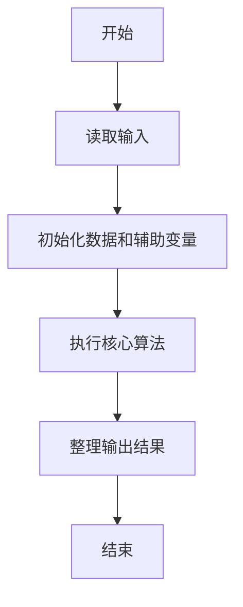
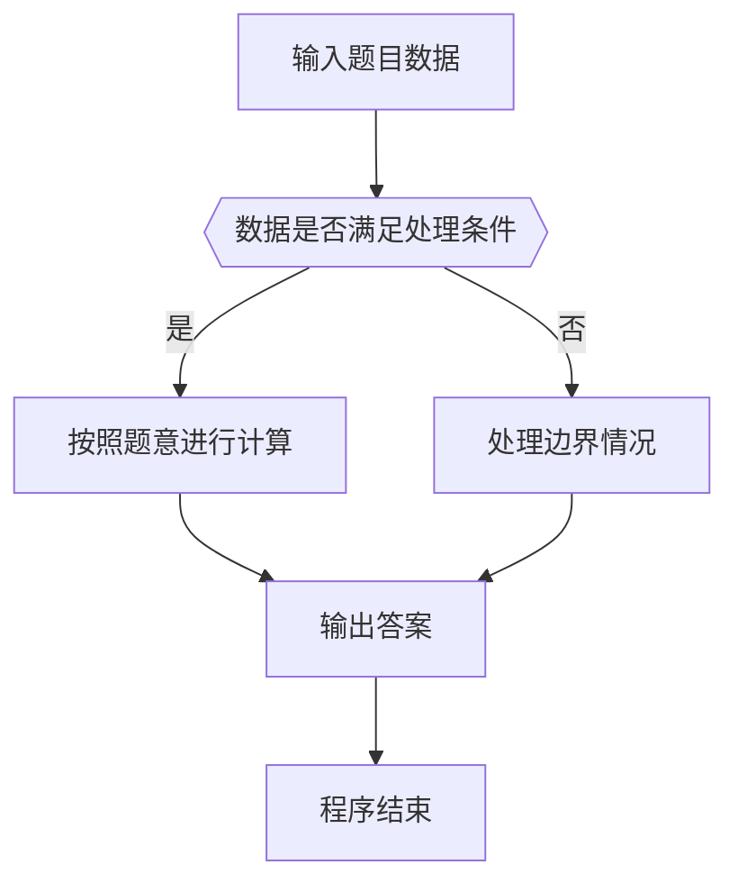

# 1097 矩阵行平移

- **分值：** 20分

### 题目描述

给定一个 $n\times n$ 的整数矩阵。对任一给定的正整数 $k<n$，我们将矩阵的奇数行的元素整体向右依次平移 1、……、$k$、1、……、$k$、…… 个位置，平移空出的位置用整数 $x$ 补。你需要计算出结果矩阵的每一列元素的和。

### 输入格式：

输入第一行给出 3 个正整数：$n$（$<100$）、$k$（$<n$）、$x$（$<100$），分别如题面所述。

接下来 $n$ 行，每行给出 $n$ 个不超过 100 的正整数，为矩阵元素的值。数字间以空格分隔。

### 输出格式：

在一行中输出平移后第 1 到 $n$ 列元素的和。数字间以 1 个空格分隔，行首尾不得有多余空格。

### 输入样例：
```
7 2 99
11 87 23 67 20 75 89
37 94 27 91 63 50 11
44 38 50 26 40 26 24
73 85 63 28 62 18 68
15 83 27 97 88 25 43
23 78 98 20 30 81 99
77 36 48 59 25 34 22
```

### 输出样例：
```
529 481 479 263 417 342 343
```

**样例解读**

需要平移的是第 1、3、5、7 行。给定 $k=2$，应该将这三列顺次整体向右平移 1、2、1、2 位（如果有更多行，就应该按照 1、2、1、2、1、2 …… 这个规律顺次向右平移），左端的空位用 99 来填充。平移后的矩阵变成：
```
99 11 87 23 67 20 75
37 94 27 91 63 50 11
99 99 44 38 50 26 40
73 85 63 28 62 18 68
99 15 83 27 97 88 25
23 78 98 20 30 81 99
99 99 77 36 48 59 25
```


### 解题思路

本题的核心是：按行号判断奇偶方向，计算平移后的列下标并累加元素。程序先读取题目输入，再按照上述规则完成数据处理，最后严格按照题目要求输出结果。实现时应优先根据题目约束选择合适的数据类型和数据结构，避免溢出或不必要的重复计算。

时间复杂度为 O(RC)；空间复杂度取决于输入规模，主要用于保存题目数据和中间结果。

### 代码流程说明

1. 读取 1097 矩阵行平移 所需的输入数据。
2. 初始化计数器、数组或其他辅助变量。
3. 按行号判断奇偶方向，计算平移后的列下标并累加元素。
4. 按题目规定的格式输出计算结果。

### 代码实现

```java
import java.io.*;
import java.util.*;

public class Main {
    static class FastScanner {
        private final InputStream in; private final byte[] buffer = new byte[1 << 16]; private int ptr, len;
        FastScanner(InputStream in) { this.in = in; }
        private int read() throws IOException { if (ptr >= len) { len = in.read(buffer); ptr = 0; if (len < 0) return -1; } return buffer[ptr++]; }
        String next() throws IOException { StringBuilder b = new StringBuilder(); int c; do c = read(); while (c <= 32 && c >= 0); while (c > 32) { b.append((char)c); c = read(); } return b.toString(); }
        char[] nextChars() throws IOException { return next().toCharArray(); }
        int nextInt() throws IOException { return Integer.parseInt(next()); }
        long nextLong() throws IOException { return Long.parseLong(next()); }
        double nextDouble() throws IOException { return Double.parseDouble(next()); }
        void skip() throws IOException { next(); }
    }
    static int strlen(char[] s) { int n = 0; while (n < s.length && s[n] != 0) n++; return n; }
    static int strcmp(char[] a, char[] b) { return new String(a, 0, strlen(a)).compareTo(new String(b, 0, strlen(b))); }
    static int strncmp(char[] a, char[] b) { return strcmp(a, b); }
    static void printf(String format, Object... args) { Object[] x = new Object[args.length]; for (int i=0;i<args.length;i++) x[i] = args[i] instanceof char[] ? new String((char[])args[i], 0, strlen((char[])args[i])) : args[i]; System.out.printf(format.replace("%lld", "%d"), x); }
    static void puts(Object x) { System.out.println(x instanceof char[] ? new String((char[])x, 0, strlen((char[])x)) : x); }
    static void putchar(char c) { System.out.print(c); }
    static void putchar(int c) { System.out.print((char)c); }
    static final int EOF = -1;
    static int getchar() { return -1; }
    static int isupper(char c) { return Character.isUpperCase(c) ? 1 : 0; }
    static char tolower(int c) { return Character.toLowerCase((char)c); }
    static int strchr(char[] s, char c) { for (int i=0;i<strlen(s);i++) if (s[i]==c) return i; return -1; }
/*
 * 题目：1097 矩阵行平移
 * 实现原理：按行号判断奇偶方向，计算平移后的列下标并累加元素。
 * 复杂度：O(RC)
 * 实现步骤：
 * 1. 读取 1097 矩阵行平移 所需的输入数据。
 * 2. 初始化计数器、数组或其他辅助变量。
 * 3. 按行号判断奇偶方向，计算平移后的列下标并累加元素。
 * 4. 按题目规定的格式输出计算结果。
 */

static FastScanner fs = new FastScanner(System.in);

    public static void main(String[] args) throws Exception {
    int n, k, x, a[100][100], sum[100] ;
    n = fs.nextInt(); k = fs.nextInt(); x = fs.nextInt();
    for (int i = 0; i < n; i ++) for (int j = 0; j < n; j ++) a[i][j] = fs.nextInt();
    for (int i = 0; i < n; i ++) for (int j = 0; j < n; j ++) {
        int shift = i % 2 == 0 ? i / 2 % k + 1 : 0;
        if (i % 2 == 0 && j < shift) sum[j] += x;
        else if (i % 2 == 0) sum[j] += a[i][j - shift];
        else sum[j] += a[i][j];
    }
    for (int i = 0; i < n; i ++) printf("%d%c", sum[i], i + 1 == n ? '\n' : ' ');

}
}
```

### 代码流程图



### 解题流程图



### 常见易错点

- 注意输入数据的范围，选择足够大的整数类型，并正确处理边界值。
- 循环、数组下标和字符串结束位置要严格对应题目定义，避免越界。
- 输出格式必须与题目要求完全一致，包括空格、换行、大小写和特殊符号。
- 如果存在排序、去重、进位、约分或四舍五入等操作，应在输出前统一完成。
