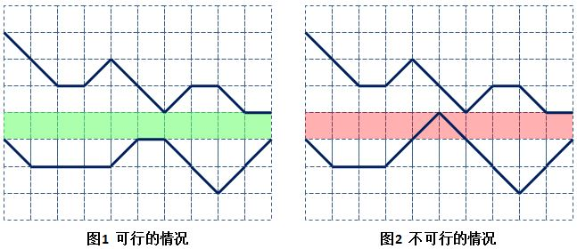
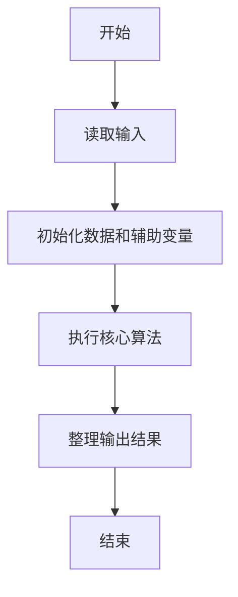
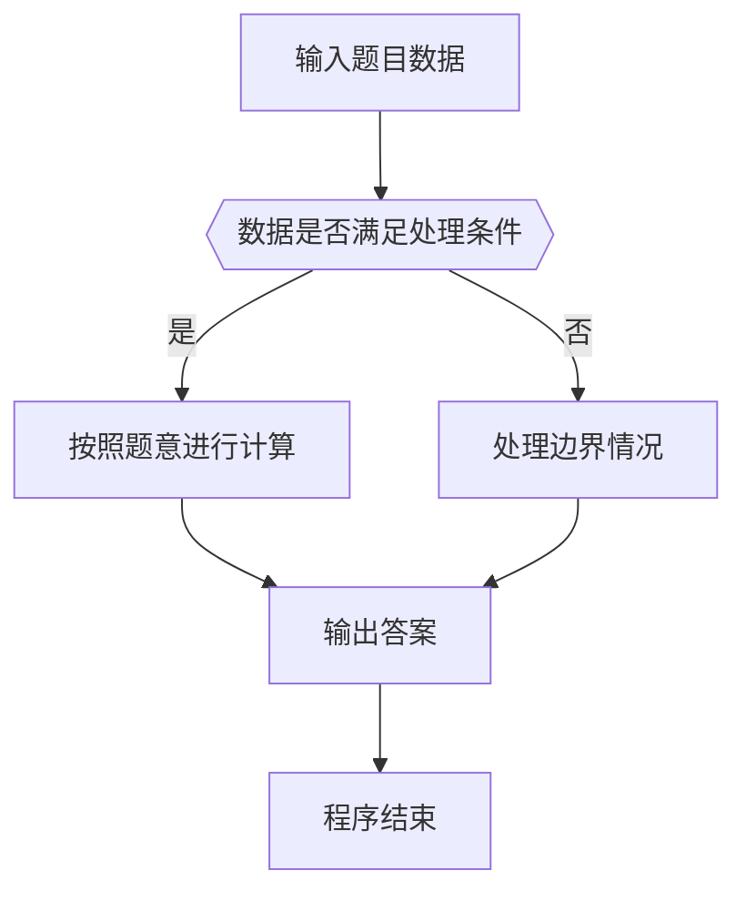

# 1098 岩洞施工

- **分值：** 20分

### 题目描述

要将一条直径至少为 1 个单位的长管道水平送入地形复杂的岩洞中，究竟是否可能？下面的两幅图分别给出了岩洞的剖面图，深蓝色的折线勾勒出岩洞顶部和底部的轮廓。图 1 是有可能的，绿色部分显示直径为 1 的管道可以送入。图 2 就不可能，除非把顶部或底部的突出部分削掉 1 个单位的高度。



本题就请你编写程序，判断给定的岩洞中是否可以施工。

### 输入格式：

输入在第一行给出一个不超过 100 的正整数 $N$，即横向采样的点数。随后两行数据，从左到右顺次给出采样点的纵坐标：第 1 行是岩洞顶部的采样点，第 2 行是岩洞底部的采样点。这里假设坐标原点在左下角，每个纵坐标为不超过 1000 的非负整数。同行数字间以空格分隔。

题目保证输入数据是合理的，即岩洞底部的轮廓线不会与顶部轮廓线交叉。

### 输出格式：

如果可以直接施工，则在一行中输出 `Yes` 和可以送入的管道的最大直径；如果不行，则输出 `No` 和至少需要削掉的高度。答案和数字间以 1 个空格分隔。

### 输入样例 1：
```
11
7 6 5 5 6 5 4 5 5 4 4
3 2 2 2 2 3 3 2 1 2 3
```

### 输出样例 1：
```
Yes 1
```

### 输入样例 2：
```
11
7 6 5 5 6 5 4 5 5 4 4
3 2 2 2 3 4 3 2 1 2 3
```

### 输出样例 2：
```
No 1
```


### 解题思路

本题的核心是：逐位计算数字各位置的最大值与最小值，输出最高位和最低位。程序先读取题目输入，再按照上述规则完成数据处理，最后严格按照题目要求输出结果。实现时应优先根据题目约束选择合适的数据类型和数据结构，避免溢出或不必要的重复计算。

时间复杂度为 O(L)；空间复杂度取决于输入规模，主要用于保存题目数据和中间结果。

### 代码流程说明

1. 读取 1098 岩洞施工 所需的输入数据。
2. 初始化计数器、数组或其他辅助变量。
3. 逐位计算数字各位置的最大值与最小值，输出最高位和最低位。
4. 按题目规定的格式输出计算结果。

### 代码实现

```java
import java.io.*;
import java.util.*;

public class Main {
    static class FastScanner {
        private final InputStream in; private final byte[] buffer = new byte[1 << 16]; private int ptr, len;
        FastScanner(InputStream in) { this.in = in; }
        private int read() throws IOException { if (ptr >= len) { len = in.read(buffer); ptr = 0; if (len < 0) return -1; } return buffer[ptr++]; }
        String next() throws IOException { StringBuilder b = new StringBuilder(); int c; do c = read(); while (c <= 32 && c >= 0); while (c > 32) { b.append((char)c); c = read(); } return b.toString(); }
        char[] nextChars() throws IOException { return next().toCharArray(); }
        int nextInt() throws IOException { return Integer.parseInt(next()); }
        long nextLong() throws IOException { return Long.parseLong(next()); }
        double nextDouble() throws IOException { return Double.parseDouble(next()); }
        void skip() throws IOException { next(); }
    }
    static int strlen(char[] s) { int n = 0; while (n < s.length && s[n] != 0) n++; return n; }
    static int strcmp(char[] a, char[] b) { return new String(a, 0, strlen(a)).compareTo(new String(b, 0, strlen(b))); }
    static int strncmp(char[] a, char[] b) { return strcmp(a, b); }
    static void printf(String format, Object... args) { Object[] x = new Object[args.length]; for (int i=0;i<args.length;i++) x[i] = args[i] instanceof char[] ? new String((char[])args[i], 0, strlen((char[])args[i])) : args[i]; System.out.printf(format.replace("%lld", "%d"), x); }
    static void puts(Object x) { System.out.println(x instanceof char[] ? new String((char[])x, 0, strlen((char[])x)) : x); }
    static void putchar(char c) { System.out.print(c); }
    static void putchar(int c) { System.out.print((char)c); }
    static final int EOF = -1;
    static int getchar() { return -1; }
    static int isupper(char c) { return Character.isUpperCase(c) ? 1 : 0; }
    static char tolower(int c) { return Character.toLowerCase((char)c); }
    static int strchr(char[] s, char c) { for (int i=0;i<strlen(s);i++) if (s[i]==c) return i; return -1; }
/*
 * 题目：1098 岩洞的钻石
 * 实现原理：逐位计算数字各位置的最大值与最小值，输出最高位和最低位。
 * 复杂度：O(L)
 * 实现步骤：
 * 1. 读取 1098 岩洞施工 所需的输入数据。
 * 2. 初始化计数器、数组或其他辅助变量。
 * 3. 逐位计算数字各位置的最大值与最小值，输出最高位和最低位。
 * 4. 按题目规定的格式输出计算结果。
 */

static FastScanner fs = new FastScanner(System.in);

    public static void main(String[] args) throws Exception {
    int n; int x; int top = 100000; int bottom = 0;
    n = fs.nextInt();
    for (int i = 0; i < n; i ++) {
        x = fs.nextInt();
        if (x < top) top = x;
    }
    for (int i = 0; i < n; i ++) {
        x = fs.nextInt();
        if (x > bottom) bottom = x;
    }
    int gap = top - bottom;
    if (gap >= 1) printf("Yes %d\n", gap);
    else printf("No %d\n", 1 - gap);

}
}
```

### 代码流程图



### 解题流程图



### 常见易错点

- 注意输入数据的范围，选择足够大的整数类型，并正确处理边界值。
- 循环、数组下标和字符串结束位置要严格对应题目定义，避免越界。
- 输出格式必须与题目要求完全一致，包括空格、换行、大小写和特殊符号。
- 如果存在排序、去重、进位、约分或四舍五入等操作，应在输出前统一完成。
