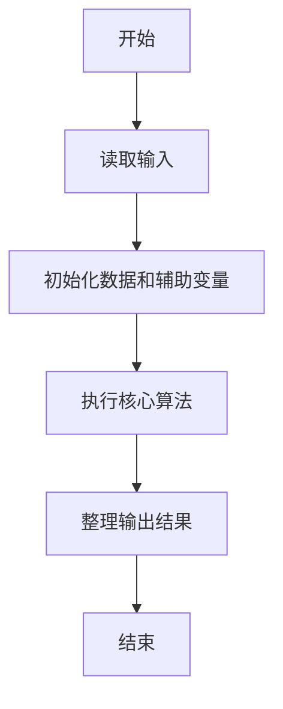
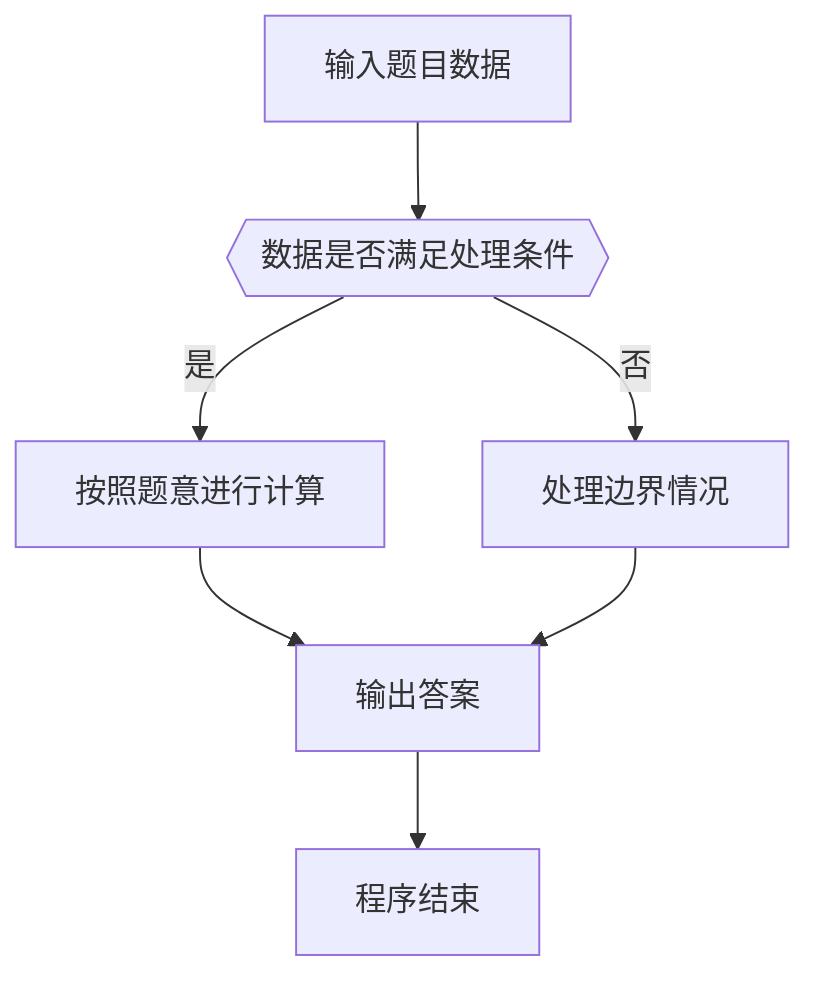

# 1103 缘分数

- **分值：** 20分

### 题目描述

所谓**缘分数**是指这样一对正整数 $a$ 和 $b$，其中 $a$ 和它的小弟 $a-1$ 的立方差正好是另一个整数 $c$ 的平方，而 $c$ 正好是 $b$ 和它的小弟 $b-1$ 的平方和。例如 $8^{3} - 7^{3} = 169 = 13^{2}$，而 $13 = 3^{2} + 2^{2}$，于是 8 和 3 就是一对缘分数。

给定 $a$ 所在的区间 $[m,n]$，是否存在缘分数？

### 输入格式：

输入给出区间的两个端点 $0<m<n\le 25000$，其间以空格分隔。

### 输出格式：

按照 $a$ 从小到大的顺序，每行输出一对缘分数，数字间以空格分隔。如果无解，则输出 `No Solution`。

### 输入样例 1：
```
8 200
```

### 输出样例 1：
```
8 3
105 10
```

### 输入样例 2：
```
9 100
```

### 输出样例 2：
```
No Solution
```


### 解题思路

本题的核心是：枚举区间内的 a，计算 a³-(a-1)³；若结果为平方数，再检查其平方根能否表示为两个平方数之和。程序先读取题目输入，再按照上述规则完成数据处理，最后严格按照题目要求输出结果。实现时应优先根据题目约束选择合适的数据类型和数据结构，避免溢出或不必要的重复计算。

时间复杂度为 O((n-m)√n)；空间复杂度取决于输入规模，主要用于保存题目数据和中间结果。

### 代码流程说明

1. 读取 1103 缘分数 所需的输入数据。
2. 初始化计数器、数组或其他辅助变量。
3. 枚举区间内的 a，计算 a³-(a-1)³；若结果为平方数，再检查其平方根能否表示为两个平方数之和。
4. 按题目规定的格式输出计算结果。

### 代码实现

```java
import java.io.*;
import java.util.*;

public class Main {
    static class FastScanner {
        private final InputStream in; private final byte[] buffer = new byte[1 << 16]; private int ptr, len;
        FastScanner(InputStream in) { this.in = in; }
        private int read() throws IOException { if (ptr >= len) { len = in.read(buffer); ptr = 0; if (len < 0) return -1; } return buffer[ptr++]; }
        String next() throws IOException { StringBuilder b = new StringBuilder(); int c; do c = read(); while (c <= 32 && c >= 0); while (c > 32) { b.append((char)c); c = read(); } return b.toString(); }
        char[] nextChars() throws IOException { return next().toCharArray(); }
        int nextInt() throws IOException { return Integer.parseInt(next()); }
        long nextLong() throws IOException { return Long.parseLong(next()); }
        double nextDouble() throws IOException { return Double.parseDouble(next()); }
        void skip() throws IOException { next(); }
    }
    static int strlen(char[] s) { int n = 0; while (n < s.length && s[n] != 0) n++; return n; }
    static int strcmp(char[] a, char[] b) { return new String(a, 0, strlen(a)).compareTo(new String(b, 0, strlen(b))); }
    static int strncmp(char[] a, char[] b) { return strcmp(a, b); }
    static void printf(String format, Object... args) { Object[] x = new Object[args.length]; for (int i=0;i<args.length;i++) x[i] = args[i] instanceof char[] ? new String((char[])args[i], 0, strlen((char[])args[i])) : args[i]; System.out.printf(format.replace("%lld", "%d"), x); }
    static void puts(Object x) { System.out.println(x instanceof char[] ? new String((char[])x, 0, strlen((char[])x)) : x); }
    static void putchar(char c) { System.out.print(c); }
    static void putchar(int c) { System.out.print((char)c); }
    static final int EOF = -1;
    static int getchar() { return -1; }
    static int isupper(char c) { return Character.isUpperCase(c) ? 1 : 0; }
    static char tolower(int c) { return Character.toLowerCase((char)c); }
    static int strchr(char[] s, char c) { for (int i=0;i<strlen(s);i++) if (s[i]==c) return i; return -1; }
/*
 * 题目：1103 数素数
 * 实现原理：计算 k³-k² 的差值并判断其是否为两个平方数之和。
 * 复杂度：O(k²)
 * 实现步骤：
 * 1. 读取 1103 缘分数 所需的输入数据。
 * 2. 初始化计数器、数组或其他辅助变量。
 * 3. 枚举区间内的 a，计算 a³-(a-1)³；若结果为平方数，再检查其平方根能否表示为两个平方数之和。
 * 4. 按题目规定的格式输出计算结果。
 */

static FastScanner fs = new FastScanner(System.in);

    public static void main(String[] args) throws Exception {
    int m; int n; int found = 0;
    m = fs.nextInt(); n = fs.nextInt();
    for (int a = m; a <= n; a ++) {
        long d = (long) a * a * a - (long)(a - 1) * (a - 1) * (a - 1); long c = sqrt((double) d);
        if (c * c != d) continue;
        for (int b = 1; b * b < c; b ++) for (int q = b + 1; q * q < c; q ++) if (b * b + q * q == c) {
            printf("%d %d\n", a, q);
            found = 1;
            goto next;
        }
        next : ;
    }
    if (found == 0) puts("No Solution");

}
}
```

### 代码流程图



### 解题流程图



### 常见易错点

- 注意输入数据的范围，选择足够大的整数类型，并正确处理边界值。
- 循环、数组下标和字符串结束位置要严格对应题目定义，避免越界。
- 输出格式必须与题目要求完全一致，包括空格、换行、大小写和特殊符号。
- 如果存在排序、去重、进位、约分或四舍五入等操作，应在输出前统一完成。
