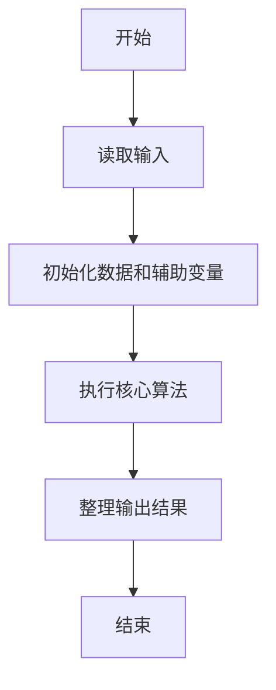
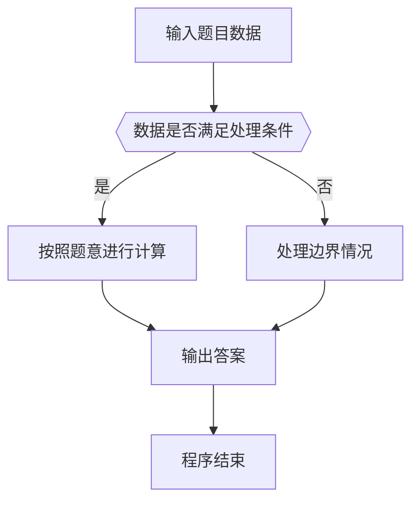

# 1105 链表合并

- **分值：** 25分

### 题目描述

给定两个单链表 $L_1 = a_1 \to a_2\to \cdots \to a_{n-1}\to a_n$ 和 $L_2 = b_1 \to b_2\to \cdots \to b_{m-1}\to b_m$。如果 $n\ge 2m$，你的任务是将比较短的那个链表逆序，然后将之并入比较长的那个链表，得到一个形如 $a_1 \to a_2 \to b_{m} \to a_3 \to a_4 \to b_{m-1}\cdots $ 的结果。例如给定两个链表分别为 6→7 和 1→2→3→4→5，你应该输出 1→2→7→3→4→6→5。

### 输入格式：

输入首先在第一行中给出两个链表 $L_1$ 和 $L_2$ 的头结点的地址，以及正整数
$N$ ($\le 10^{5}$)，即给定的结点总数。一个结点的地址是一个 5 位数的非负整数，空地址 NULL 用 `-1` 表示。

随后 $N$ 行，每行按以下格式给出一个结点的信息：

```
Address Data Next
```

其中 `Address` 是结点的地址，`Data` 是不超过 $10^{5}$ 的正整数，`Next` 是下一个结点的地址。题目保证没有空链表，并且较长的链表至少是较短链表的两倍长。

### 输出格式：

按顺序输出结果链表，每个结点占一行，格式与输入相同。

### 输入样例：
```
00100 01000 7
02233 2 34891
00100 6 00001
34891 3 10086
01000 1 02233
00033 5 -1
10086 4 00033
00001 7 -1
```

### 输出样例：
```
01000 1 02233
02233 2 00001
00001 7 34891
34891 3 10086
10086 4 00100
00100 6 00033
00033 5 -1
```


### 解题思路

本题的核心是：分别读取两个有序链表，使用双指针按升序合并并输出。程序先读取题目输入，再按照上述规则完成数据处理，最后严格按照题目要求输出结果。实现时应优先根据题目约束选择合适的数据类型和数据结构，避免溢出或不必要的重复计算。

时间复杂度为 O(n+m)；空间复杂度取决于输入规模，主要用于保存题目数据和中间结果。

### 代码流程说明

1. 读取 1105 链表合并 所需的输入数据。
2. 初始化计数器、数组或其他辅助变量。
3. 分别读取两个有序链表，使用双指针按升序合并并输出。
4. 按题目规定的格式输出计算结果。

### 代码实现

```java
import java.io.*;
import java.util.*;

public class Main {
    static class FastScanner {
        private final InputStream in; private final byte[] buffer = new byte[1 << 16]; private int ptr, len;
        FastScanner(InputStream in) { this.in = in; }
        private int read() throws IOException { if (ptr >= len) { len = in.read(buffer); ptr = 0; if (len < 0) return -1; } return buffer[ptr++]; }
        String next() throws IOException { StringBuilder b = new StringBuilder(); int c; do c = read(); while (c <= 32 && c >= 0); while (c > 32) { b.append((char)c); c = read(); } return b.toString(); }
        char[] nextChars() throws IOException { return next().toCharArray(); }
        int nextInt() throws IOException { return Integer.parseInt(next()); }
        long nextLong() throws IOException { return Long.parseLong(next()); }
        double nextDouble() throws IOException { return Double.parseDouble(next()); }
        void skip() throws IOException { next(); }
    }
    static int strlen(char[] s) { int n = 0; while (n < s.length && s[n] != 0) n++; return n; }
    static int strcmp(char[] a, char[] b) { return new String(a, 0, strlen(a)).compareTo(new String(b, 0, strlen(b))); }
    static int strncmp(char[] a, char[] b) { return strcmp(a, b); }
    static void printf(String format, Object... args) { Object[] x = new Object[args.length]; for (int i=0;i<args.length;i++) x[i] = args[i] instanceof char[] ? new String((char[])args[i], 0, strlen((char[])args[i])) : args[i]; System.out.printf(format.replace("%lld", "%d"), x); }
    static void puts(Object x) { System.out.println(x instanceof char[] ? new String((char[])x, 0, strlen((char[])x)) : x); }
    static void putchar(char c) { System.out.print(c); }
    static void putchar(int c) { System.out.print((char)c); }
    static final int EOF = -1;
    static int getchar() { return -1; }
    static int isupper(char c) { return Character.isUpperCase(c) ? 1 : 0; }
    static char tolower(int c) { return Character.toLowerCase((char)c); }
    static int strchr(char[] s, char c) { for (int i=0;i<strlen(s);i++) if (s[i]==c) return i; return -1; }
/*
 * 题目：1105 链表合并
 * 实现原理：分别读取两个有序链表，使用双指针按升序合并并输出。
 * 复杂度：O(n+m)
 * 实现步骤：
 * 1. 读取 1105 链表合并 所需的输入数据。
 * 2. 初始化计数器、数组或其他辅助变量。
 * 3. 分别读取两个有序链表，使用双指针按升序合并并输出。
 * 4. 按题目规定的格式输出计算结果。
 */

static class Node {
int data; int next;
}
static FastScanner fs = new FastScanner(System.in);

    public static void main(String[] args) throws Exception {
    int h1; int h2; int n; int ad; int data; int next;
    Node[] a = new Node[100000]; for (int z = 0; z < 100000; z++) a[z] = new Node(); for (int z = 0; z < 100000; z++) a[z] = new Node();
    h1 = fs.nextInt(); h2 = fs.nextInt(); n = fs.nextInt();
    for (int i = 0; i < n; i ++) {
        ad = fs.nextInt(); data = fs.nextInt(); next = fs.nextInt();
        a[ad].data = data;
        a[ad].next = next;
    }
    int[] x = new int[100000]; int[] y = new int[100000]; int nx = 0; int ny = 0;
    for (ad = h1; ad != - 1; ad = a[ad].next) x[nx ++] = ad;
    for (ad = h2; ad != - 1; ad = a[ad].next) y[ny ++] = ad;
    int[] px = x, * py = y;
    if (nx < ny) {
        px = y;
        py = x;
        int z = nx;
        nx = ny;
        ny = z;
    }
    int[] out = new int[200000]; int k = 0; int j = ny - 1;
    for (int i = 0; i < nx; i ++) {
        out[k ++] = px[i];
        if (i % 2 == 1 && j >= 0) out[k ++] = py[j --];
    }
    for (int i = 0; i < k; i ++) {
        printf("%05d %d ", out[i], a[out[i]].data);
        if (i + 1 < k) printf("%05d\n", out[i + 1]);
        else puts("-1");
    }

}
}
```

### 代码流程图



### 解题流程图



### 常见易错点

- 注意输入数据的范围，选择足够大的整数类型，并正确处理边界值。
- 循环、数组下标和字符串结束位置要严格对应题目定义，避免越界。
- 输出格式必须与题目要求完全一致，包括空格、换行、大小写和特殊符号。
- 如果存在排序、去重、进位、约分或四舍五入等操作，应在输出前统一完成。
