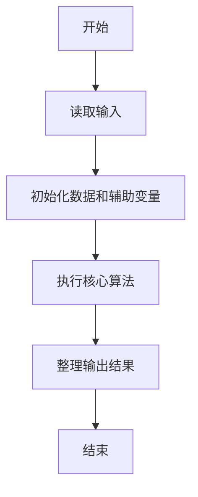
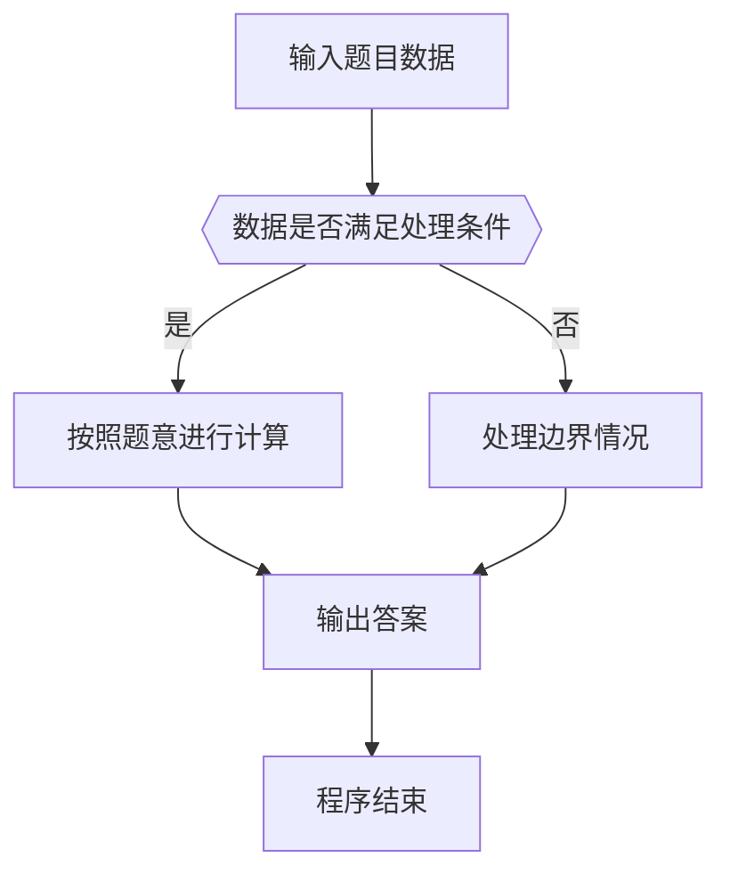

# 1107 老鼠爱大米

- **分值：** 20分

### 题目描述

翁恺老师曾经设计过一款 Java 挑战游戏，叫“老鼠爱大米”（或许因为他的外号叫“胖胖鼠”）。每个玩家用 Java 代码控制一只鼠，目标是抢吃尽可能多的大米让自己变成胖胖鼠，最胖的那只就是冠军。

因为游戏时间不能太长，我们把玩家分成 $N$ 组，每组 $M$ 只老鼠同场竞技，然后从 $N$ 个分组冠军中直接选出最胖的冠军胖胖鼠。现在就请你写个程序来得到冠军的体重。

### 输入格式：

输入在第一行中给出 2 个正整数：$N$（$\le 100$）为组数，$M$（$\le 10$）为每组玩家个数。随后 $N$ 行，每行给出一组玩家控制的 $M$ 只老鼠最后的体重，均为不超过 $10^{4}$ 的非负整数。数字间以空格分隔。

### 输出格式：

首先在第一行顺次输出各组冠军的体重，数字间以 1 个空格分隔，行首尾不得有多余空格。随后在第二行输出冠军胖胖鼠的体重。

### 输入样例：
```
3 5
62 53 88 72 81
12 31 9 0 2
91 42 39 6 48
```

### 输出样例：
```
88 31 91
91
```


### 解题思路

本题的核心是：并查集逐组扫描老鼠体重，记录每组最大值，并在所有组冠军中取最大者。程序先读取题目输入，再按照上述规则完成数据处理，最后严格按照题目要求输出结果。实现时应优先根据题目约束选择合适的数据类型和数据结构，避免溢出或不必要的重复计算。

时间复杂度为 O(NM)；空间复杂度取决于输入规模，主要用于保存题目数据和中间结果。

### 代码流程说明

1. 读取 1107 老鼠爱大米 所需的输入数据。
2. 初始化计数器、数组或其他辅助变量。
3. 并查集逐组扫描老鼠体重，记录每组最大值，并在所有组冠军中取最大者。
4. 按题目规定的格式输出计算结果。

### 代码实现

```java
import java.io.*;
import java.util.*;

public class Main {
    static class FastScanner {
        private final InputStream in; private final byte[] buffer = new byte[1 << 16]; private int ptr, len;
        FastScanner(InputStream in) { this.in = in; }
        private int read() throws IOException { if (ptr >= len) { len = in.read(buffer); ptr = 0; if (len < 0) return -1; } return buffer[ptr++]; }
        String next() throws IOException { StringBuilder b = new StringBuilder(); int c; do c = read(); while (c <= 32 && c >= 0); while (c > 32) { b.append((char)c); c = read(); } return b.toString(); }
        char[] nextChars() throws IOException { return next().toCharArray(); }
        int nextInt() throws IOException { return Integer.parseInt(next()); }
        long nextLong() throws IOException { return Long.parseLong(next()); }
        double nextDouble() throws IOException { return Double.parseDouble(next()); }
        void skip() throws IOException { next(); }
    }
    static int strlen(char[] s) { int n = 0; while (n < s.length && s[n] != 0) n++; return n; }
    static int strcmp(char[] a, char[] b) { return new String(a, 0, strlen(a)).compareTo(new String(b, 0, strlen(b))); }
    static int strncmp(char[] a, char[] b) { return strcmp(a, b); }
    static void printf(String format, Object... args) { Object[] x = new Object[args.length]; for (int i=0;i<args.length;i++) x[i] = args[i] instanceof char[] ? new String((char[])args[i], 0, strlen((char[])args[i])) : args[i]; System.out.printf(format.replace("%lld", "%d"), x); }
    static void puts(Object x) { System.out.println(x instanceof char[] ? new String((char[])x, 0, strlen((char[])x)) : x); }
    static void putchar(char c) { System.out.print(c); }
    static void putchar(int c) { System.out.print((char)c); }
    static final int EOF = -1;
    static int getchar() { return -1; }
    static int isupper(char c) { return Character.isUpperCase(c) ? 1 : 0; }
    static char tolower(int c) { return Character.toLowerCase((char)c); }
    static int strchr(char[] s, char c) { for (int i=0;i<strlen(s);i++) if (s[i]==c) return i; return -1; }
/*
 * 题目：1107 社会集群
 * 实现原理：并查集合并有共同爱好的用户，统计每个连通分量的大小。
 * 复杂度：O(n α(n))
 * 实现步骤：
 * 1. 读取 1107 老鼠爱大米 所需的输入数据。
 * 2. 初始化计数器、数组或其他辅助变量。
 * 3. 并查集逐组扫描老鼠体重，记录每组最大值，并在所有组冠军中取最大者。
 * 4. 按题目规定的格式输出计算结果。
 */

static FastScanner fs = new FastScanner(System.in);

    public static void main(String[] args) throws Exception {
    int n; int m; int x; int overall = 0;
    n = fs.nextInt(); m = fs.nextInt();
    for (int i = 0; i < n; i ++) {
        int mx = 0;
        for (int j = 0; j < m; j ++) {
            x = fs.nextInt();
            if (x > mx) mx = x;
        }
        if (i) putchar(' ');
        printf("%d", mx);
        if (mx > overall) overall = mx;
    }
    printf("\n%d\n", overall);

}
}
```

### 代码流程图



### 解题流程图



### 常见易错点

- 注意输入数据的范围，选择足够大的整数类型，并正确处理边界值。
- 循环、数组下标和字符串结束位置要严格对应题目定义，避免越界。
- 输出格式必须与题目要求完全一致，包括空格、换行、大小写和特殊符号。
- 如果存在排序、去重、进位、约分或四舍五入等操作，应在输出前统一完成。
