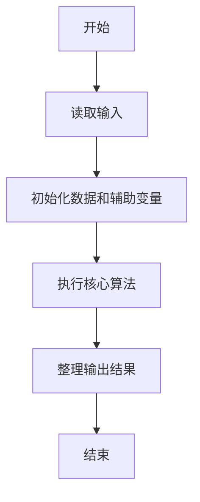
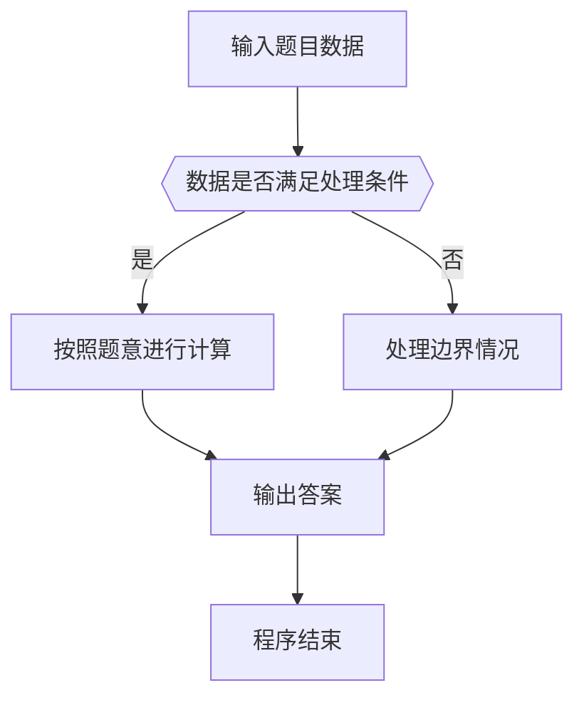

# 1109 擅长C

- **分值：** 20分

### 题目描述

当你被面试官要求用 C 写一个“Hello World”时，有本事像下图显示的那样写一个出来吗？


### 输入格式：

输入首先给出 26 个英文大写字母 A-Z，每个字母用一个 $7\times 5$ 的、由 `C` 和 `.` 组成的矩阵构成。最后在一行中给出一个句子，以回车结束。句子是由若干个单词（每个包含不超过 10 个连续的大写英文字母）组成的，单词间以任何非大写英文字母分隔。

题目保证至少给出一个单词。

### 输出格式：

对每个单词，将其每个字母用矩阵形式在一行中输出，字母间有一列空格分隔。单词的首尾不得有多余空格。

相邻的两个单词间必须有一空行分隔。输出的首尾不得有多余空行。

### 输入样例：
```
..C..
.C.C.
C...C
CCCCC
C...C
C...C
C...C
CCCC.
C...C
C...C
CCCC.
C...C
C...C
CCCC.
.CCC.
C...C
C....
C....
C....
C...C
.CCC.
CCCC.
C...C
C...C
C...C
C...C
C...C
CCCC.
CCCCC
C....
C....
CCCC.
C....
C....
CCCCC
CCCCC
C....
C....
CCCC.
C....
C....
C....
CCCC.
C...C
C....
C.CCC
C...C
C...C
CCCC.
C...C
C...C
C...C
CCCCC
C...C
C...C
C...C
CCCCC
..C..
..C..
..C..
..C..
..C..
CCCCC
CCCCC
....C
....C
....C
....C
C...C
.CCC.
C...C
C..C.
C.C..
CC...
C.C..
C..C.
C...C
C....
C....
C....
C....
C....
C....
CCCCC
C...C
C...C
CC.CC
C.C.C
C...C
C...C
C...C
C...C
C...C
CC..C
C.C.C
C..CC
C...C
C...C
.CCC.
C...C
C...C
C...C
C...C
C...C
.CCC.
CCCC.
C...C
C...C
CCCC.
C....
C....
C....
.CCC.
C...C
C...C
C...C
C.C.C
C..CC
.CCC.
CCCC.
C...C
CCCC.
CC...
C.C..
C..C.
C...C
.CCC.
C...C
C....
.CCC.
....C
C...C
.CCC.
CCCCC
..C..
..C..
..C..
..C..
..C..
..C..
C...C
C...C
C...C
C...C
C...C
C...C
.CCC.
C...C
C...C
C...C
C...C
C...C
.C.C.
..C..
C...C
C...C
C...C
C.C.C
CC.CC
C...C
C...C
C...C
C...C
.C.C.
..C..
.C.C.
C...C
C...C
C...C
C...C
.C.C.
..C..
..C..
..C..
..C..
CCCCC
....C
...C.
..C..
.C...
C....
CCCCC
HELLO~WORLD!
```

### 输出样例：
```
C...C CCCCC C.... C.... .CCC.
C...C C.... C.... C.... C...C
C...C C.... C.... C.... C...C
CCCCC CCCC. C.... C.... C...C
C...C C.... C.... C.... C...C
C...C C.... C.... C.... C...C
C...C CCCCC CCCCC CCCCC .CCC.

C...C .CCC. CCCC. C.... CCCC.
C...C C...C C...C C.... C...C
C...C C...C CCCC. C.... C...C
C.C.C C...C CC... C.... C...C
CC.CC C...C C.C.. C.... C...C
C...C C...C C..C. C.... C...C
C...C .CCC. C...C CCCCC CCCC.
```


### 解题思路

本题的核心是：解析句子中的单词，提取大写字母并映射到七段字形输出。程序先读取题目输入，再按照上述规则完成数据处理，最后严格按照题目要求输出结果。实现时应优先根据题目约束选择合适的数据类型和数据结构，避免溢出或不必要的重复计算。

时间复杂度为 O(L)；空间复杂度取决于输入规模，主要用于保存题目数据和中间结果。

### 代码流程说明

1. 读取 1109 擅长C 所需的输入数据。
2. 初始化计数器、数组或其他辅助变量。
3. 解析句子中的单词，提取大写字母并映射到七段字形输出。
4. 按题目规定的格式输出计算结果。

### 代码实现

```java
import java.io.*;
import java.util.*;

public class Main {
    static class FastScanner {
        private final InputStream in; private final byte[] buffer = new byte[1 << 16]; private int ptr, len;
        FastScanner(InputStream in) { this.in = in; }
        private int read() throws IOException { if (ptr >= len) { len = in.read(buffer); ptr = 0; if (len < 0) return -1; } return buffer[ptr++]; }
        String next() throws IOException { StringBuilder b = new StringBuilder(); int c; do c = read(); while (c <= 32 && c >= 0); while (c > 32) { b.append((char)c); c = read(); } return b.toString(); }
        char[] nextChars() throws IOException { return next().toCharArray(); }
        int nextInt() throws IOException { return Integer.parseInt(next()); }
        long nextLong() throws IOException { return Long.parseLong(next()); }
        double nextDouble() throws IOException { return Double.parseDouble(next()); }
        void skip() throws IOException { next(); }
    }
    static int strlen(char[] s) { int n = 0; while (n < s.length && s[n] != 0) n++; return n; }
    static int strcmp(char[] a, char[] b) { return new String(a, 0, strlen(a)).compareTo(new String(b, 0, strlen(b))); }
    static int strncmp(char[] a, char[] b) { return strcmp(a, b); }
    static void printf(String format, Object... args) { Object[] x = new Object[args.length]; for (int i=0;i<args.length;i++) x[i] = args[i] instanceof char[] ? new String((char[])args[i], 0, strlen((char[])args[i])) : args[i]; System.out.printf(format.replace("%lld", "%d"), x); }
    static void puts(Object x) { System.out.println(x instanceof char[] ? new String((char[])x, 0, strlen((char[])x)) : x); }
    static void putchar(char c) { System.out.print(c); }
    static void putchar(int c) { System.out.print((char)c); }
    static final int EOF = -1;
    static int getchar() { return -1; }
    static int isupper(char c) { return Character.isUpperCase(c) ? 1 : 0; }
    static char tolower(int c) { return Character.toLowerCase((char)c); }
    static int strchr(char[] s, char c) { for (int i=0;i<strlen(s);i++) if (s[i]==c) return i; return -1; }
/*
 * 题目：1109 说话人
 * 实现原理：解析句子中的单词，提取大写字母并映射到七段字形输出。
 * 复杂度：O(L)
 * 实现步骤：
 * 1. 读取 1109 擅长C 所需的输入数据。
 * 2. 初始化计数器、数组或其他辅助变量。
 * 3. 解析句子中的单词，提取大写字母并映射到七段字形输出。
 * 4. 按题目规定的格式输出计算结果。
 */

static FastScanner fs = new FastScanner(System.in);

    public static void main(String[] args) throws Exception {
    char g[26][7][6], line[1005];
    for (int i = 0; i < 26; i ++) for (int r = 0; r < 7; r ++) g[i][r] = fs.nextChars();
    getchar();
    /* line input handled by token scanner */
    int st = 0;
    while (line[st]) {
        while (line[st] != 0 && isupper == 0((char) line[st])) st ++;
        int ed = st;
        while (line[ed] != 0 && isupper((char) line[ed])) ed ++;
        if (ed > st) {
            if (st > 0) putchar('\n');
            for (int r = 0; r < 7; r ++) {
                for (int p = st; p < ed; p ++) {
                    if (p > st) putchar(' ');
                    fputs(g[line[p] - 'A'][r], stdout);
                }
                putchar('\n');
            }
        }
        st = ed;
    }

}
}
```

### 代码流程图



### 解题流程图



### 常见易错点

- 注意输入数据的范围，选择足够大的整数类型，并正确处理边界值。
- 循环、数组下标和字符串结束位置要严格对应题目定义，避免越界。
- 输出格式必须与题目要求完全一致，包括空格、换行、大小写和特殊符号。
- 如果存在排序、去重、进位、约分或四舍五入等操作，应在输出前统一完成。
