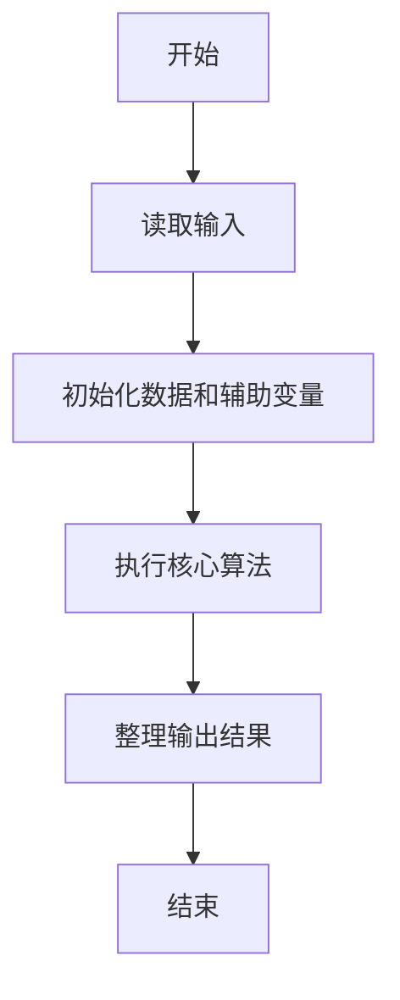
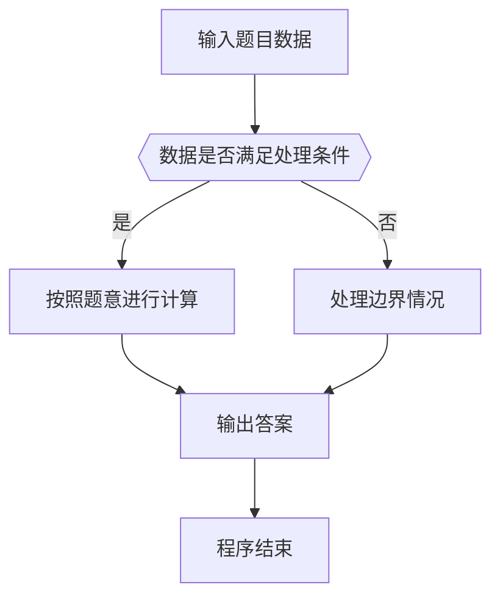

# 1110 区块反转

- **分值：** 25分

### 题目描述

给定一个单链表 $L$，我们将每 $K$ 个结点看成一个**区块**（链表最后若不足 $K$ 个结点，也看成一个区块），请编写程序将 $L$ 中所有区块的链接反转。例如：给定 $L$ 为 1→2→3→4→5→6→7→8，$K$ 为 3，则输出应该为 7→8→4→5→6→1→2→3。

### 输入格式：

每个输入包含 1 个测试用例。每个测试用例第 1 行给出第 1 个结点的地址、结点总个数正整数 $N$ ($\le 10^{5}$)、以及正整数 $K$ ($\le N$)，即区块的大小。结点的地址是 5 位非负整数，NULL 地址用 $-1$ 表示。

接下来有 $N$ 行，每行格式为：
```
Address Data Next
```

其中 `Address` 是结点地址，`Data` 是该结点保存的整数数据，`Next` 是下一结点的地址。

### 输出格式：

对每个测试用例，顺序输出反转后的链表，其上每个结点占一行，格式与输入相同。

### 输入样例：
```
00100 8 3
71120 7 88666
00000 4 99999
00100 1 12309
68237 6 71120
33218 3 00000
99999 5 68237
88666 8 -1
12309 2 33218
```

### 输出样例：
```
71120 7 88666
88666 8 00000
00000 4 99999
99999 5 68237
68237 6 00100
00100 1 12309
12309 2 33218
33218 3 -1
```


### 解题思路

本题的核心是：每 K 个节点作为一组原地反转，剩余不足 K 个的节点保持不变。程序先读取题目输入，再按照上述规则完成数据处理，最后严格按照题目要求输出结果。实现时应优先根据题目约束选择合适的数据类型和数据结构，避免溢出或不必要的重复计算。

时间复杂度为 O(n)；空间复杂度取决于输入规模，主要用于保存题目数据和中间结果。

### 代码流程说明

1. 读取 1110 区块反转 所需的输入数据。
2. 初始化计数器、数组或其他辅助变量。
3. 每 K 个节点作为一组原地反转，剩余不足 K 个的节点保持不变。
4. 按题目规定的格式输出计算结果。

### 代码实现

```java
import java.io.*;
import java.util.*;

public class Main {
    static class FastScanner {
        private final InputStream in; private final byte[] buffer = new byte[1 << 16]; private int ptr, len;
        FastScanner(InputStream in) { this.in = in; }
        private int read() throws IOException { if (ptr >= len) { len = in.read(buffer); ptr = 0; if (len < 0) return -1; } return buffer[ptr++]; }
        String next() throws IOException { StringBuilder b = new StringBuilder(); int c; do c = read(); while (c <= 32 && c >= 0); while (c > 32) { b.append((char)c); c = read(); } return b.toString(); }
        char[] nextChars() throws IOException { return next().toCharArray(); }
        int nextInt() throws IOException { return Integer.parseInt(next()); }
        long nextLong() throws IOException { return Long.parseLong(next()); }
        double nextDouble() throws IOException { return Double.parseDouble(next()); }
        void skip() throws IOException { next(); }
    }
    static int strlen(char[] s) { int n = 0; while (n < s.length && s[n] != 0) n++; return n; }
    static int strcmp(char[] a, char[] b) { return new String(a, 0, strlen(a)).compareTo(new String(b, 0, strlen(b))); }
    static int strncmp(char[] a, char[] b) { return strcmp(a, b); }
    static void printf(String format, Object... args) { Object[] x = new Object[args.length]; for (int i=0;i<args.length;i++) x[i] = args[i] instanceof char[] ? new String((char[])args[i], 0, strlen((char[])args[i])) : args[i]; System.out.printf(format.replace("%lld", "%d"), x); }
    static void puts(Object x) { System.out.println(x instanceof char[] ? new String((char[])x, 0, strlen((char[])x)) : x); }
    static void putchar(char c) { System.out.print(c); }
    static void putchar(int c) { System.out.print((char)c); }
    static final int EOF = -1;
    static int getchar() { return -1; }
    static int isupper(char c) { return Character.isUpperCase(c) ? 1 : 0; }
    static char tolower(int c) { return Character.toLowerCase((char)c); }
    static int strchr(char[] s, char c) { for (int i=0;i<strlen(s);i++) if (s[i]==c) return i; return -1; }
/*
 * 题目：1110 区块反转
 * 实现原理：每 K 个节点作为一组原地反转，剩余不足 K 个的节点保持不变。
 * 复杂度：O(n)
 * 实现步骤：
 * 1. 读取 1110 区块反转 所需的输入数据。
 * 2. 初始化计数器、数组或其他辅助变量。
 * 3. 每 K 个节点作为一组原地反转，剩余不足 K 个的节点保持不变。
 * 4. 按题目规定的格式输出计算结果。
 */

static class Node {
int data; int next;
}
static FastScanner fs = new FastScanner(System.in);

    public static void main(String[] args) throws Exception {
    int head; int n; int k; int ad; int data; int next;
    Node[] a = new Node[100000]; for (int z = 0; z < 100000; z++) a[z] = new Node(); for (int z = 0; z < 100000; z++) a[z] = new Node();
    head = fs.nextInt(); n = fs.nextInt(); k = fs.nextInt();
    for (int i = 0; i < n; i ++) {
        ad = fs.nextInt(); data = fs.nextInt(); next = fs.nextInt();
        a[ad].data = data;
        a[ad].next = next;
    }
    int[] v = new int[100000]; int c = 0;
    for (int x = head; x != - 1; x = a[x].next) v[c ++] = x;
    int[] order = new int[100000]; int used = 0;
    int end = c; int block = c % k ? c % k : k;
    while (end > 0) {
        int start = end - block;
        for (int i = start; i < end; i ++) order[used ++] = v[i];
        end = start;
        block = k;
    }
    for (int i = 0; i < used; i ++) v[i] = order[i];
    for (int i = 0; i < c; i ++) {
        printf("%05d %d ", v[i], a[v[i]].data);
        if (i + 1 < c) printf("%05d\n", v[i + 1]);
        else puts("-1");
    }

}
}
```

### 代码流程图



### 解题流程图



### 常见易错点

- 注意输入数据的范围，选择足够大的整数类型，并正确处理边界值。
- 循环、数组下标和字符串结束位置要严格对应题目定义，避免越界。
- 输出格式必须与题目要求完全一致，包括空格、换行、大小写和特殊符号。
- 如果存在排序、去重、进位、约分或四舍五入等操作，应在输出前统一完成。
