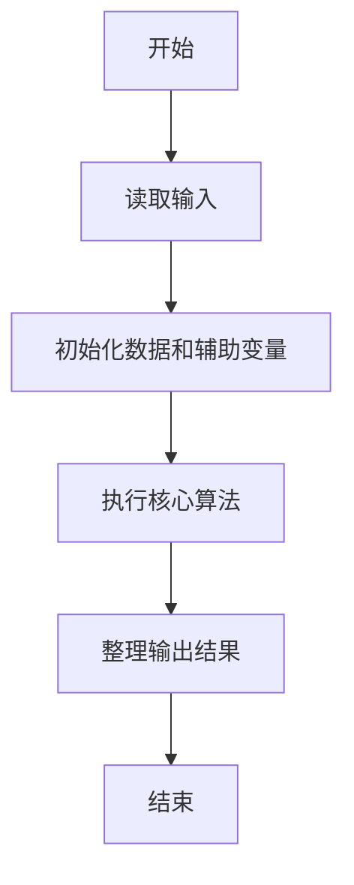
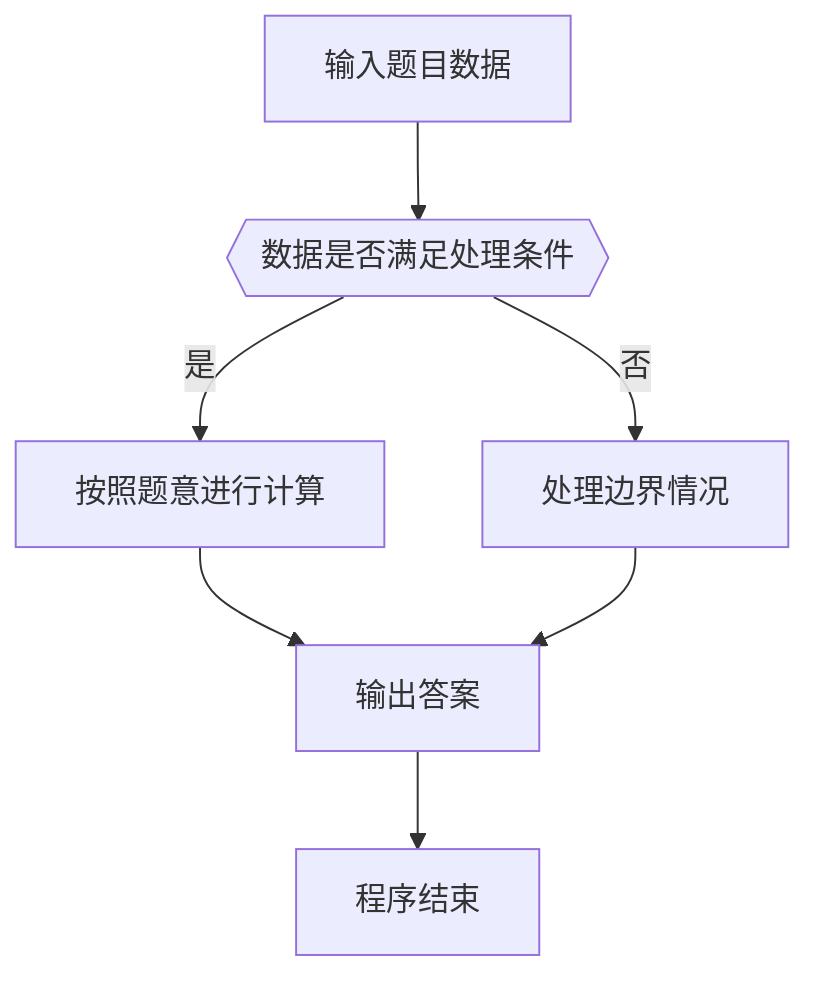

# 1111 对称日

- **分值：** 15分

### 题目描述


央视新闻发了一条微博，指出 2020 年有个罕见的“对称日”，即 2020 年 2 月 2 日，按照 `年年年年月月日日` 格式组成的字符串 20200202 是完全对称的。

给定任意一个日期，本题就请你写程序判断一下，这是不是一个对称日？

### 输入格式：

输入首先在第一行给出正整数 $N$（$1 < N \le 10$）。随后 $N$ 行，每行给出一个日期，却是按英文习惯的格式：`Month Day, Year`。其中 `Month` 是月份的缩写，对应如下：

- 一月：Jan
- 二月：Feb
- 三月：Mar
- 四月：Apr
- 五月：May
- 六月：Jun
- 七月：Jul
- 八月：Aug
- 九月：Sep
- 十月：Oct
- 十一月：Nov
- 十二月：Dec

`Day` 是月份中的日期，为 [1, 31] 区间内的整数；`Year` 是年份，为 [1, 9999] 区间内的整数。

### 输出格式：

对每一个给定的日期，在一行中先输出 `Y` 如果这是一个对称日，否则输出 `N`；随后空一格，输出日期对应的 `年年年年月月日日` 格式组成的字符串。

### 输入样例：
```
5
Feb 2, 2020
Mar 7, 2020
Oct 10, 101
Nov 21, 1211
Dec 29, 1229
```

### 输出样例：
```
Y 20200202
N 20200307
Y 01011010
Y 12111121
N 12291229
```


### 解题思路

本题的核心是：将日期转换为 YYYYMMDD 字符串，检查字符串两端字符是否对称。程序先读取题目输入，再按照上述规则完成数据处理，最后严格按照题目要求输出结果。实现时应优先根据题目约束选择合适的数据类型和数据结构，避免溢出或不必要的重复计算。

时间复杂度为 O(1)；空间复杂度取决于输入规模，主要用于保存题目数据和中间结果。

### 代码流程说明

1. 读取 1111 对称日 所需的输入数据。
2. 初始化计数器、数组或其他辅助变量。
3. 将日期转换为 YYYYMMDD 字符串，检查字符串两端字符是否对称。
4. 按题目规定的格式输出计算结果。

### 代码实现

```java
import java.io.*;
import java.util.*;

public class Main {
    static class FastScanner {
        private final InputStream in; private final byte[] buffer = new byte[1 << 16]; private int ptr, len;
        FastScanner(InputStream in) { this.in = in; }
        private int read() throws IOException { if (ptr >= len) { len = in.read(buffer); ptr = 0; if (len < 0) return -1; } return buffer[ptr++]; }
        String next() throws IOException { StringBuilder b = new StringBuilder(); int c; do c = read(); while (c <= 32 && c >= 0); while (c > 32) { b.append((char)c); c = read(); } return b.toString(); }
        char[] nextChars() throws IOException { return next().toCharArray(); }
        int nextInt() throws IOException { return Integer.parseInt(next()); }
        long nextLong() throws IOException { return Long.parseLong(next()); }
        double nextDouble() throws IOException { return Double.parseDouble(next()); }
        void skip() throws IOException { next(); }
    }
    static int strlen(char[] s) { int n = 0; while (n < s.length && s[n] != 0) n++; return n; }
    static int strcmp(char[] a, char[] b) { return new String(a, 0, strlen(a)).compareTo(new String(b, 0, strlen(b))); }
    static int strncmp(char[] a, char[] b) { return strcmp(a, b); }
    static void printf(String format, Object... args) { Object[] x = new Object[args.length]; for (int i=0;i<args.length;i++) x[i] = args[i] instanceof char[] ? new String((char[])args[i], 0, strlen((char[])args[i])) : args[i]; System.out.printf(format.replace("%lld", "%d"), x); }
    static void puts(Object x) { System.out.println(x instanceof char[] ? new String((char[])x, 0, strlen((char[])x)) : x); }
    static void putchar(char c) { System.out.print(c); }
    static void putchar(int c) { System.out.print((char)c); }
    static final int EOF = -1;
    static int getchar() { return -1; }
    static int isupper(char c) { return Character.isUpperCase(c) ? 1 : 0; }
    static char tolower(int c) { return Character.toLowerCase((char)c); }
    static int strchr(char[] s, char c) { for (int i=0;i<strlen(s);i++) if (s[i]==c) return i; return -1; }
/*
 * 题目：1111 数字黑洞
 * 实现原理：将日期数字转为字符串，反复判断是否为回文并按规则扩展日期。
 * 复杂度：O(kL)
 * 实现步骤：
 * 1. 读取 1111 对称日 所需的输入数据。
 * 2. 初始化计数器、数组或其他辅助变量。
 * 3. 将日期转换为 YYYYMMDD 字符串，检查字符串两端字符是否对称。
 * 4. 按题目规定的格式输出计算结果。
 */

static FastScanner fs = new FastScanner(System.in);

    public static void main(String[] args) throws Exception {
    String[] ms = {
        "Jan", "Feb", "Mar", "Apr", "May", "Jun", "Jul", "Aug", "Sep", "Oct", "Nov", "Dec"
    };
    int n; int d; int y;
    char[] mon = new char[5]; char[] date = new char[20];
    n = fs.nextInt();
    while (n-- > 0) {
        mon = fs.nextChars(); d = fs.nextInt(); y = fs.nextInt();
        int mo = 0;
        while (strcmp(mon, ms[mo])) mo ++;
        sprintf(date, "%04d%02d%02d", y, mo + 1, d);
        int ok = 1;
        for (int i = 0, j = 7; i < j; i ++, j --) if (date[i] != date[j]) ok = 0;
        printf("%c %s\n", ok != 0 ? 'Y' : 'N', date);
    }

}
}
```

### 代码流程图



### 解题流程图



### 常见易错点

- 注意输入数据的范围，选择足够大的整数类型，并正确处理边界值。
- 循环、数组下标和字符串结束位置要严格对应题目定义，避免越界。
- 输出格式必须与题目要求完全一致，包括空格、换行、大小写和特殊符号。
- 如果存在排序、去重、进位、约分或四舍五入等操作，应在输出前统一完成。
