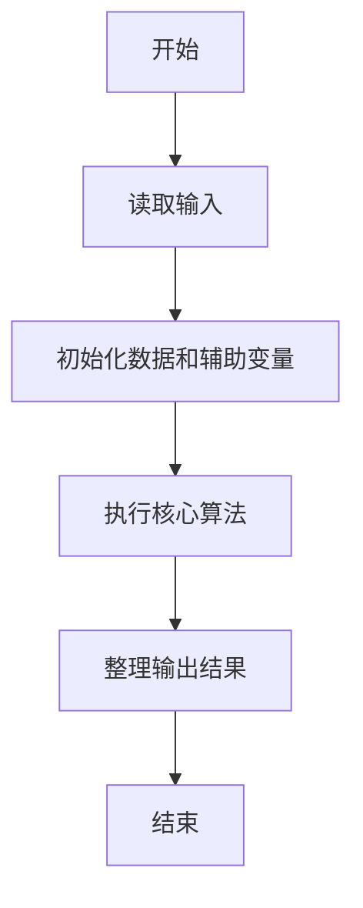
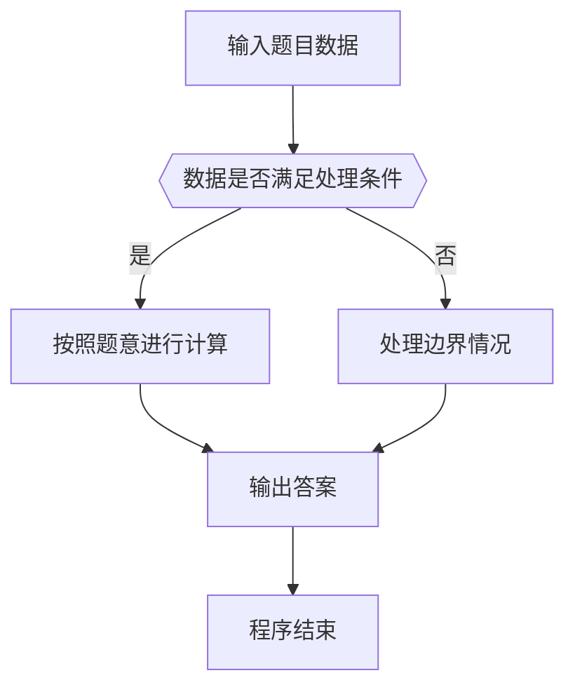

# 1112 超标区间

- **分值：** 20分

### 题目描述


上图是用某科学研究中采集的数据绘制成的折线图，其中红色横线表示正常数据的阈值（在此图中阈值是 25）。你的任务就是把超出阈值的非正常数据所在的区间找出来。例如上图中横轴 [3, 5] 区间中的 3 个数据点超标，横轴上点 9 （可以表示为区间 [9, 9]）对应的数据点也超标。

### 输入格式：

输入第一行给出两个正整数 $N$（$\le 10^4$）和 $T$（$\le 100$），分别是数据点的数量和阈值。第二行给出 $N$ 个数据点的纵坐标，均为不超过 1000 的正整数，对应的横坐标为整数 0 到 $N-1$。

### 输出格式：

按从左到右的顺序输出超标数据的区间，每个区间占一行，格式为 `[A, B]`，其中 `A` 和 `B` 为区间的左右端点。如果没有数据超标，则在一行中输出所有数据的最大值。

### 输入样例 1：
```
11 25
21 15 25 28 35 27 20 24 18 32 23
```

### 输出样例 1：
```
[3, 5]
[9, 9]
```

### 输入样例 2：
```
11 40
21 15 25 28 35 27 20 24 18 32 23
```

### 输出样例 2：
```
35
```


### 解题思路

本题的核心是：扫描数据点，合并连续超过阈值的下标区间；若没有超标区间则维护最大值。程序先读取题目输入，再按照上述规则完成数据处理，最后严格按照题目要求输出结果。实现时应优先根据题目约束选择合适的数据类型和数据结构，避免溢出或不必要的重复计算。

时间复杂度为 O(n)；空间复杂度取决于输入规模，主要用于保存题目数据和中间结果。

### 代码流程说明

1. 读取 1112 超标区间 所需的输入数据。
2. 初始化计数器、数组或其他辅助变量。
3. 扫描数据点，合并连续超过阈值的下标区间；若没有超标区间则维护最大值。
4. 按题目规定的格式输出计算结果。

### 代码实现

```java
import java.io.*;
import java.util.*;

public class Main {
    static class FastScanner {
        private final InputStream in; private final byte[] buffer = new byte[1 << 16]; private int ptr, len;
        FastScanner(InputStream in) { this.in = in; }
        private int read() throws IOException { if (ptr >= len) { len = in.read(buffer); ptr = 0; if (len < 0) return -1; } return buffer[ptr++]; }
        String next() throws IOException { StringBuilder b = new StringBuilder(); int c; do c = read(); while (c <= 32 && c >= 0); while (c > 32) { b.append((char)c); c = read(); } return b.toString(); }
        char[] nextChars() throws IOException { return next().toCharArray(); }
        int nextInt() throws IOException { return Integer.parseInt(next()); }
        long nextLong() throws IOException { return Long.parseLong(next()); }
        double nextDouble() throws IOException { return Double.parseDouble(next()); }
        void skip() throws IOException { next(); }
    }
    static int strlen(char[] s) { int n = 0; while (n < s.length && s[n] != 0) n++; return n; }
    static int strcmp(char[] a, char[] b) { return new String(a, 0, strlen(a)).compareTo(new String(b, 0, strlen(b))); }
    static int strncmp(char[] a, char[] b) { return strcmp(a, b); }
    static void printf(String format, Object... args) { Object[] x = new Object[args.length]; for (int i=0;i<args.length;i++) x[i] = args[i] instanceof char[] ? new String((char[])args[i], 0, strlen((char[])args[i])) : args[i]; System.out.printf(format.replace("%lld", "%d"), x); }
    static void puts(Object x) { System.out.println(x instanceof char[] ? new String((char[])x, 0, strlen((char[])x)) : x); }
    static void putchar(char c) { System.out.print(c); }
    static void putchar(int c) { System.out.print((char)c); }
    static final int EOF = -1;
    static int getchar() { return -1; }
    static int isupper(char c) { return Character.isUpperCase(c) ? 1 : 0; }
    static char tolower(int c) { return Character.toLowerCase((char)c); }
    static int strchr(char[] s, char c) { for (int i=0;i<strlen(s);i++) if (s[i]==c) return i; return -1; }
/*
 * 题目：1112 救命的分数
 * 实现原理：扫描所有成绩，统计处于各分数区间的学生人数。
 * 复杂度：O(n)
 * 实现步骤：
 * 1. 读取 1112 超标区间 所需的输入数据。
 * 2. 初始化计数器、数组或其他辅助变量。
 * 3. 扫描数据点，合并连续超过阈值的下标区间；若没有超标区间则维护最大值。
 * 4. 按题目规定的格式输出计算结果。
 */

static FastScanner fs = new FastScanner(System.in);

    public static void main(String[] args) throws Exception {
    int n; int t; int x; int start = - 1; int any = 0; int mx = 0;
    n = fs.nextInt(); t = fs.nextInt();
    for (int i = 0; i < n; i ++) {
        x = fs.nextInt();
        if (x > mx) mx = x;
        if (x > t) {
            if (start < 0) start = i;
        } else if (start >= 0) {
            printf("[%d, %d]\n", start, i - 1);
            any = 1;
            start = - 1;
        }
    }
    if (start >= 0) printf("[%d, %d]\n", start, n - 1), any = 1;
    if (any == 0) printf("%d\n", mx);

}
}
```

### 代码流程图



### 解题流程图



### 常见易错点

- 注意输入数据的范围，选择足够大的整数类型，并正确处理边界值。
- 循环、数组下标和字符串结束位置要严格对应题目定义，避免越界。
- 输出格式必须与题目要求完全一致，包括空格、换行、大小写和特殊符号。
- 如果存在排序、去重、进位、约分或四舍五入等操作，应在输出前统一完成。
