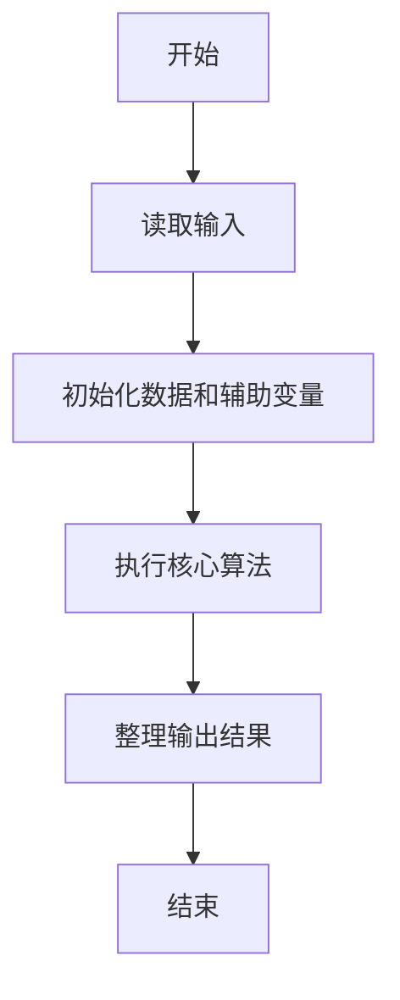
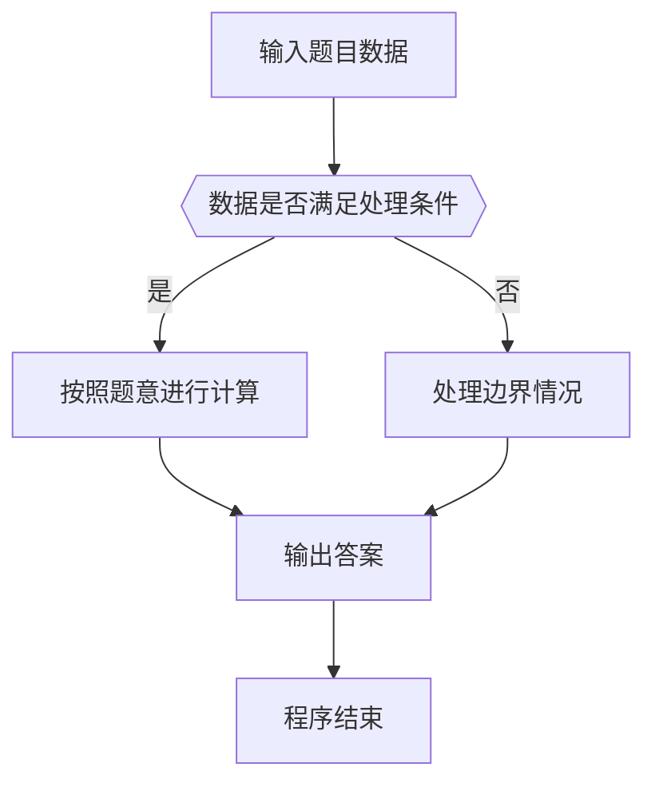

# 1114 全素日

- **分值：** 20分

### 题目描述


以上图片来自新浪微博，展示了一个非常酷的“全素日”：2019年5月23日。即不仅`20190523`本身是个素数，它的任何以末尾数字`3`结尾的子串都是素数。

本题就请你写个程序判断一个给定日期是否是“全素日”。

### 输入格式：

输入按照 `yyyymmdd` 的格式给出一个日期。题目保证日期在0001年1月1日到9999年12月31日之间。

### 输出格式：

从原始日期开始，按照子串长度递减的顺序，每行首先输出一个子串和一个空格，然后输出 `Yes`，如果该子串对应的数字是一个素数，否则输出 `No`。如果这个日期是一个全素日，则在最后一行输出 `All Prime!`。

### 输入样例 1：
```
20190523
```

### 输出样例 1：
```
20190523 Yes
0190523 Yes
190523 Yes
90523 Yes
0523 Yes
523 Yes
23 Yes
3 Yes
All Prime!
```

### 输入样例 2：
```
20191231
```

### 输出样例 2：
```
20191231 Yes
0191231 Yes
191231 Yes
91231 No
1231 Yes
231 No
31 Yes
1 No
```


### 解题思路

本题的核心是：从日期字符串的每个起点生成后缀，判断对应整数是否为素数。程序先读取题目输入，再按照上述规则完成数据处理，最后严格按照题目要求输出结果。实现时应优先根据题目约束选择合适的数据类型和数据结构，避免溢出或不必要的重复计算。

时间复杂度为 O(L√V)；空间复杂度取决于输入规模，主要用于保存题目数据和中间结果。

### 代码流程说明

1. 读取 1114 全素日 所需的输入数据。
2. 初始化计数器、数组或其他辅助变量。
3. 从日期字符串的每个起点生成后缀，判断对应整数是否为素数。
4. 按题目规定的格式输出计算结果。

### 代码实现

```java
import java.io.*;
import java.util.*;

public class Main {
    static class FastScanner {
        private final InputStream in; private final byte[] buffer = new byte[1 << 16]; private int ptr, len;
        FastScanner(InputStream in) { this.in = in; }
        private int read() throws IOException { if (ptr >= len) { len = in.read(buffer); ptr = 0; if (len < 0) return -1; } return buffer[ptr++]; }
        String next() throws IOException { StringBuilder b = new StringBuilder(); int c; do c = read(); while (c <= 32 && c >= 0); while (c > 32) { b.append((char)c); c = read(); } return b.toString(); }
        char[] nextChars() throws IOException { return next().toCharArray(); }
        int nextInt() throws IOException { return Integer.parseInt(next()); }
        long nextLong() throws IOException { return Long.parseLong(next()); }
        double nextDouble() throws IOException { return Double.parseDouble(next()); }
        void skip() throws IOException { next(); }
    }
    static int strlen(char[] s) { int n = 0; while (n < s.length && s[n] != 0) n++; return n; }
    static int strcmp(char[] a, char[] b) { return new String(a, 0, strlen(a)).compareTo(new String(b, 0, strlen(b))); }
    static int strncmp(char[] a, char[] b) { return strcmp(a, b); }
    static void printf(String format, Object... args) { Object[] x = new Object[args.length]; for (int i=0;i<args.length;i++) x[i] = args[i] instanceof char[] ? new String((char[])args[i], 0, strlen((char[])args[i])) : args[i]; System.out.printf(format.replace("%lld", "%d"), x); }
    static void puts(Object x) { System.out.println(x instanceof char[] ? new String((char[])x, 0, strlen((char[])x)) : x); }
    static void putchar(char c) { System.out.print(c); }
    static void putchar(int c) { System.out.print((char)c); }
    static final int EOF = -1;
    static int getchar() { return -1; }
    static int isupper(char c) { return Character.isUpperCase(c) ? 1 : 0; }
    static char tolower(int c) { return Character.toLowerCase((char)c); }
    static int strchr(char[] s, char c) { for (int i=0;i<strlen(s);i++) if (s[i]==c) return i; return -1; }
/*
 * 题目：1114 验证哥德巴赫猜想
 * 实现原理：枚举日期数字，按指定后缀规则判断对应数是否为素数。
 * 复杂度：O(n√v)
 * 实现步骤：
 * 1. 读取 1114 全素日 所需的输入数据。
 * 2. 初始化计数器、数组或其他辅助变量。
 * 3. 从日期字符串的每个起点生成后缀，判断对应整数是否为素数。
 * 4. 按题目规定的格式输出计算结果。
 */

static int p(long x) {
    if (x < 2) return 0;
    for (long i = 2; i * i <= x; i ++) if (x % i == 0) return 0;
    return 1;
}
static FastScanner fs = new FastScanner(System.in);

    public static void main(String[] args) throws Exception {
    char[] s = new char[20];
    s = fs.nextChars();
    int all = 1; int l = strlen(s);
    for (int i = 0; i < l; i ++) {
        long x = 0;
        for (int j = i; j < l; j ++) x = x * 10 + s[j] - '0';
        printf("%s %s\n", s + i, p(x) != 0 ? "Yes" : "No");
        if (p == 0(x) != 0) all = 0;
    }
    if (all) puts("All Prime!");

}
}
```

### 代码流程图



### 解题流程图



### 常见易错点

- 注意输入数据的范围，选择足够大的整数类型，并正确处理边界值。
- 循环、数组下标和字符串结束位置要严格对应题目定义，避免越界。
- 输出格式必须与题目要求完全一致，包括空格、换行、大小写和特殊符号。
- 如果存在排序、去重、进位、约分或四舍五入等操作，应在输出前统一完成。
