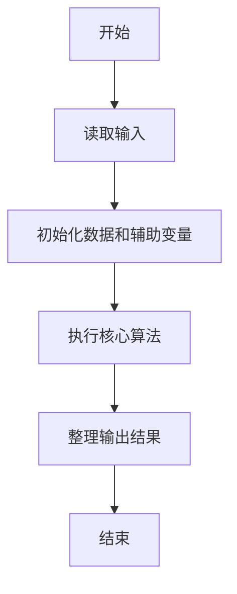
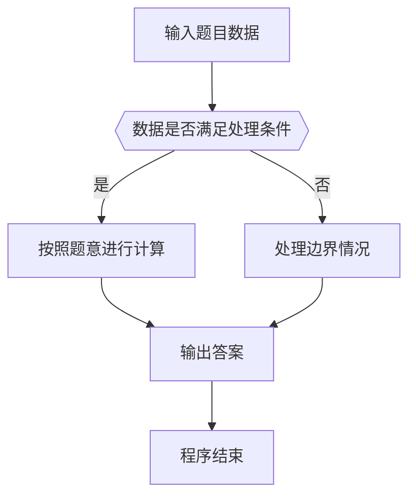

# 1115 裁判机

- **分值：** 25分

### 题目描述

有一种数字游戏的规则如下：首先由裁判给定两个不同的正整数，然后参加游戏的几个人轮流给出正整数。要求给出的数字必须是前面已经出现的某两个正整数之差，且不能等于之前的任何一个数。游戏一直持续若干轮，中间有写重复或写错的人就出局。

本题要求你实现这个游戏的裁判机，自动判断每位游戏者给出的数字是否合法，以及最后的赢家。

### 输入格式：

输入在第一行中给出 2 个初始的正整数，保证都在 $[1, 10^5]$ 范围内且不相同。

第二行依次给出参加比赛的人数 $N$（$2\le N\le 10$）和每个人都要经历的轮次数 $M$（$2\le M\le 10^3$）。

以下 $N$ 行，每行给出 $M$ 个正整数。第 $i$ 行对应第 $i$ 个人给出的数字（$i=1, \cdots , N$）。游戏顺序是从第 1 个人给出第 1 个数字开始，每人顺次在第 1 轮给出自己的第 1 个数字；然后每人顺次在第 2 轮给出自己的第 2 个数字，以此类推。

### 输出格式：

如果在第 `k` 轮，第 `i` 个人出局，就在一行中输出 `Round #k: i is out.`。出局人后面给出的数字不算；同一轮出局的人按编号增序输出。直到最后一轮结束，在一行中输出 `Winner(s): W1 W2 ... Wn`，其中 `W1 ... Wn` 是最后的赢家编号，按增序输出。数字间以 1 个空格分隔，行末不得有多余空格。如果没有赢家，则输出 `No winner.`。

### 输入样例 1：
```
101 42
4 5
59 34 67 9 7
17 9 8 50 7
25 92 43 26 37
76 51 1 41 40
```

### 输出样例 1：
```
Round #4: 1 is out.
Round #5: 3 is out.
Winner(s): 2 4
```

### 输入样例 2：
```
42 101
4 5
59 34 67 9 7
17 9 18 50 49
25 92 58 1 39
102 32 2 6 41
```

### 输出样例 2：
```
Round #1: 4 is out.
Round #3: 2 is out.
Round #4: 1 is out.
Round #5: 3 is out.
No winner.
```


### 解题思路

本题的核心是：按轮次和玩家顺序验证数字是否是此前两个数的差且未重复，淘汰不合法玩家。程序先读取题目输入，再按照上述规则完成数据处理，最后严格按照题目要求输出结果。实现时应优先根据题目约束选择合适的数据类型和数据结构，避免溢出或不必要的重复计算。

时间复杂度为 O(NM(NM))；空间复杂度取决于输入规模，主要用于保存题目数据和中间结果。

### 代码流程说明

1. 读取 1115 裁判机 所需的输入数据。
2. 初始化计数器、数组或其他辅助变量。
3. 按轮次和玩家顺序验证数字是否是此前两个数的差且未重复，淘汰不合法玩家。
4. 按题目规定的格式输出计算结果。

### 代码实现

```java
import java.io.*;
import java.util.*;

public class Main {
    static class FastScanner {
        private final InputStream in; private final byte[] buffer = new byte[1 << 16]; private int ptr, len;
        FastScanner(InputStream in) { this.in = in; }
        private int read() throws IOException { if (ptr >= len) { len = in.read(buffer); ptr = 0; if (len < 0) return -1; } return buffer[ptr++]; }
        String next() throws IOException { StringBuilder b = new StringBuilder(); int c; do c = read(); while (c <= 32 && c >= 0); while (c > 32) { b.append((char)c); c = read(); } return b.toString(); }
        char[] nextChars() throws IOException { return next().toCharArray(); }
        int nextInt() throws IOException { return Integer.parseInt(next()); }
        long nextLong() throws IOException { return Long.parseLong(next()); }
        double nextDouble() throws IOException { return Double.parseDouble(next()); }
        void skip() throws IOException { next(); }
    }
    static int strlen(char[] s) { int n = 0; while (n < s.length && s[n] != 0) n++; return n; }
    static int strcmp(char[] a, char[] b) { return new String(a, 0, strlen(a)).compareTo(new String(b, 0, strlen(b))); }
    static int strncmp(char[] a, char[] b) { return strcmp(a, b); }
    static void printf(String format, Object... args) { Object[] x = new Object[args.length]; for (int i=0;i<args.length;i++) x[i] = args[i] instanceof char[] ? new String((char[])args[i], 0, strlen((char[])args[i])) : args[i]; System.out.printf(format.replace("%lld", "%d"), x); }
    static void puts(Object x) { System.out.println(x instanceof char[] ? new String((char[])x, 0, strlen((char[])x)) : x); }
    static void putchar(char c) { System.out.print(c); }
    static void putchar(int c) { System.out.print((char)c); }
    static final int EOF = -1;
    static int getchar() { return -1; }
    static int isupper(char c) { return Character.isUpperCase(c) ? 1 : 0; }
    static char tolower(int c) { return Character.toLowerCase((char)c); }
    static int strchr(char[] s, char c) { for (int i=0;i<strlen(s);i++) if (s[i]==c) return i; return -1; }
/*
 * 题目：1115 甲乙丙
 * 实现原理：根据三人的手势差值统计胜负，分别输出胜负次数和最常用手势。
 * 复杂度：O(n)
 * 实现步骤：
 * 1. 读取 1115 裁判机 所需的输入数据。
 * 2. 初始化计数器、数组或其他辅助变量。
 * 3. 按轮次和玩家顺序验证数字是否是此前两个数的差且未重复，淘汰不合法玩家。
 * 4. 按题目规定的格式输出计算结果。
 */

static FastScanner fs = new FastScanner(System.in);

    public static void main(String[] args) throws Exception {
    int first, second, n, m, arr[10][1000], alive[10], seen[100005] , values[10005], vc = 2;
    first = fs.nextInt(); second = fs.nextInt(); n = fs.nextInt(); m = fs.nextInt();
    values[0] = first;
    values[1] = second;
    if (first >= 0 && first < 100005) seen[first] = 1;
    if (second >= 0 && second < 100005) seen[second] = 1;
    for (int i = 0; i < n; i ++) {
        alive[i] = 1;
        for (int j = 0; j < m; j ++) arr[i][j] = fs.nextInt();
    }
    for (int round = 0; round < m; round ++) for (int person = 0; person < n; person ++) if (alive[person] != 0) {
        int x = arr[person][round]; int ok = 0; int duplicate = x >= 0 && x < 100005 && seen[x];
        if (duplicate == 0) for (int i = 0; i < vc && ok == 0; i ++) for (int j = i + 1; j < vc; j ++) if (abs(values[i] - values[j]) == x) {
            ok = 1;
            break;
        }
        if (ok == 0) {
            alive[person] = 0;
            printf("Round #%d: %d is out.\n", round + 1, person + 1);
        } else {
            if (x >= 0 && x < 100005) seen[x] = 1;
            values[vc ++] = x;
        }
    }
    int winners = 0;
    for (int i = 0; i < n; i ++) if (alive[i] != 0) winners ++;
    if (winners == 0) puts("No winner.");
    else {
        printf("Winner(s):");
        for (int i = 0; i < n; i ++) if (alive[i] != 0) printf(" %d", i + 1);
        putchar('\n');
    }

}
}
```

### 代码流程图



### 解题流程图



### 常见易错点

- 注意输入数据的范围，选择足够大的整数类型，并正确处理边界值。
- 循环、数组下标和字符串结束位置要严格对应题目定义，避免越界。
- 输出格式必须与题目要求完全一致，包括空格、换行、大小写和特殊符号。
- 如果存在排序、去重、进位、约分或四舍五入等操作，应在输出前统一完成。
