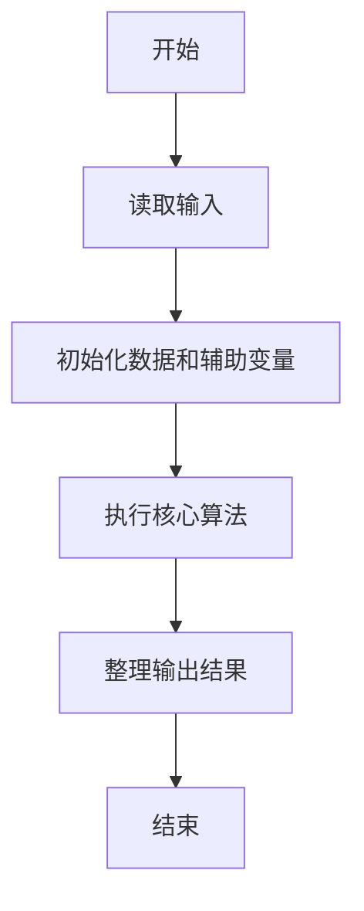
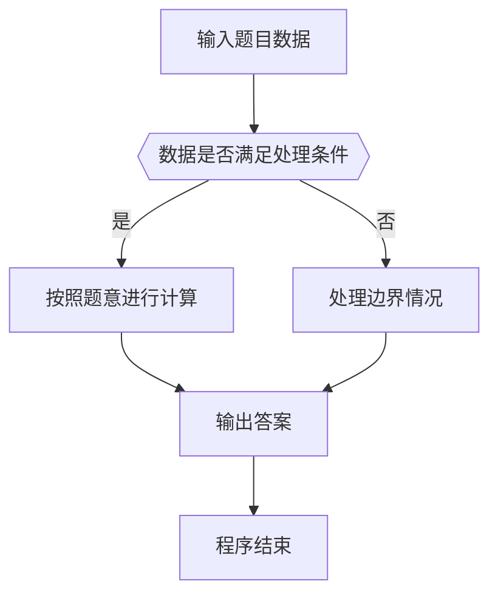

# 1116 多二了一点

- **分值：** 15分

### 题目描述

若一个正整数有 $2n$ 个数位，后 $n$ 个数位组成的数恰好比前 $n$ 个数位组成的数多 2，则称这个数字“多二了一点”。如 24、6668、233235 等都是多二了一点的数字。
给定任一正整数，请你判断它有没有多二了那么一点。

### 输入格式：
输入在第一行中给出一个正整数 $N$（$\le 10^{1000}$）。

### 输出格式：
在一行中根据情况输出下列之一：
- 如果输入的整数没有偶数个数位，输出 `Error: X digit(s)`，其中 `X` 是 $N$ 的位数；
- 如果是偶数位的数字，并且是多二了一点，输出 `Yes: X - Y = 2`，其中 `X` 是后一半数位组成的数，`Y` 是前一半数位组成的数。**注意：为了让题目简单，输入保证此时 `Y` 的个位数不大于 7。**
- 如果是偶数位的数字，但并不是多二了一点，输出 `No: X - Y != 2`，其中 `X` 是后一半数位组成的数，`Y` 是前一半数位组成的数。

### 输入样例 1：
```
233235
```
### 输出样例 1：
```
Yes: 235 - 233 = 2
```
### 输入样例 2：
```
5678912345
```
### 输出样例 2：
```
No: 12345 - 56789 != 2
```
### 输入样例 3：
```
2331235
```
### 输出样例 3：
```
Error: 7 digit(s)
```

**鸣谢彭诗扬修正数据！**


### 解题思路

本题的核心是：检查数字位数是否为偶数，将后半段与前半段组成的大整数进行比较，判断差值是否为 2。程序先读取题目输入，再按照上述规则完成数据处理，最后严格按照题目要求输出结果。实现时应优先根据题目约束选择合适的数据类型和数据结构，避免溢出或不必要的重复计算。

时间复杂度为 O(L)；空间复杂度取决于输入规模，主要用于保存题目数据和中间结果。

### 代码流程说明

1. 读取 1116 多二了一点 所需的输入数据。
2. 初始化计数器、数组或其他辅助变量。
3. 检查数字位数是否为偶数，将后半段与前半段组成的大整数进行比较，判断差值是否为 2。
4. 按题目规定的格式输出计算结果。

### 代码实现

```java
import java.io.*;
import java.util.*;

public class Main {
    static class FastScanner {
        private final InputStream in; private final byte[] buffer = new byte[1 << 16]; private int ptr, len;
        FastScanner(InputStream in) { this.in = in; }
        private int read() throws IOException { if (ptr >= len) { len = in.read(buffer); ptr = 0; if (len < 0) return -1; } return buffer[ptr++]; }
        String next() throws IOException { StringBuilder b = new StringBuilder(); int c; do c = read(); while (c <= 32 && c >= 0); while (c > 32) { b.append((char)c); c = read(); } return b.toString(); }
        char[] nextChars() throws IOException { return next().toCharArray(); }
        int nextInt() throws IOException { return Integer.parseInt(next()); }
        long nextLong() throws IOException { return Long.parseLong(next()); }
        double nextDouble() throws IOException { return Double.parseDouble(next()); }
        void skip() throws IOException { next(); }
    }
    static int strlen(char[] s) { int n = 0; while (n < s.length && s[n] != 0) n++; return n; }
    static int strcmp(char[] a, char[] b) { return new String(a, 0, strlen(a)).compareTo(new String(b, 0, strlen(b))); }
    static int strncmp(char[] a, char[] b) { return strcmp(a, b); }
    static void printf(String format, Object... args) { Object[] x = new Object[args.length]; for (int i=0;i<args.length;i++) x[i] = args[i] instanceof char[] ? new String((char[])args[i], 0, strlen((char[])args[i])) : args[i]; System.out.printf(format.replace("%lld", "%d"), x); }
    static void puts(Object x) { System.out.println(x instanceof char[] ? new String((char[])x, 0, strlen((char[])x)) : x); }
    static void putchar(char c) { System.out.print(c); }
    static void putchar(int c) { System.out.print((char)c); }
    static final int EOF = -1;
    static int getchar() { return -1; }
    static int isupper(char c) { return Character.isUpperCase(c) ? 1 : 0; }
    static char tolower(int c) { return Character.toLowerCase((char)c); }
    static int strchr(char[] s, char c) { for (int i=0;i<strlen(s);i++) if (s[i]==c) return i; return -1; }
/*
 * 题目：1116 调和数列
 * 实现原理：前半段直接输出原数字，后半段按题意加 2 后输出。
 * 复杂度：O(n)
 * 实现步骤：
 * 1. 读取 1116 多二了一点 所需的输入数据。
 * 2. 初始化计数器、数组或其他辅助变量。
 * 3. 检查数字位数是否为偶数，将后半段与前半段组成的大整数进行比较，判断差值是否为 2。
 * 4. 按题目规定的格式输出计算结果。
 */

static FastScanner fs = new FastScanner(System.in);

    public static void main(String[] args) throws Exception {
    char[] s = new char[1005]; char[] u = new char[1005];
    s = fs.nextChars();
    int n = strlen(s);
    if (n % 2 != 0) {
        printf("Error: %d digit(s)\n", n);
        return 0;
    }
    int h = n / 2;
    char[] left = new char[1005];
    memcpy(left, s, h);
    left[h] = 0;
    memcpy(u, s, h);
    u[h] = 0;
    int i = h - 1; int carry = 2;
    while (i >= 0 && carry) {
        int digit = u[i] - '0' + carry;
        u[i --] = '0' + digit % 10;
        carry = digit / 10;
    }
    int ok = 1;
    for (i = 0; i < h; i ++) if (u[i] != s[h + i]) ok = 0;
    if (ok != 0) printf("Yes: %s - %s = 2\n", s + h, left);
    else printf("No: %s - %s != 2\n", s + h, left);

}
}
```

### 代码流程图



### 解题流程图



### 常见易错点

- 注意输入数据的范围，选择足够大的整数类型，并正确处理边界值。
- 循环、数组下标和字符串结束位置要严格对应题目定义，避免越界。
- 输出格式必须与题目要求完全一致，包括空格、换行、大小写和特殊符号。
- 如果存在排序、去重、进位、约分或四舍五入等操作，应在输出前统一完成。
