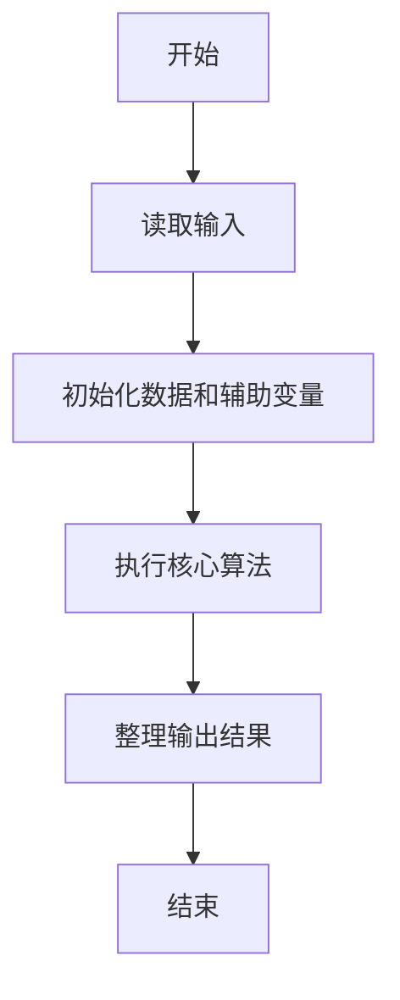
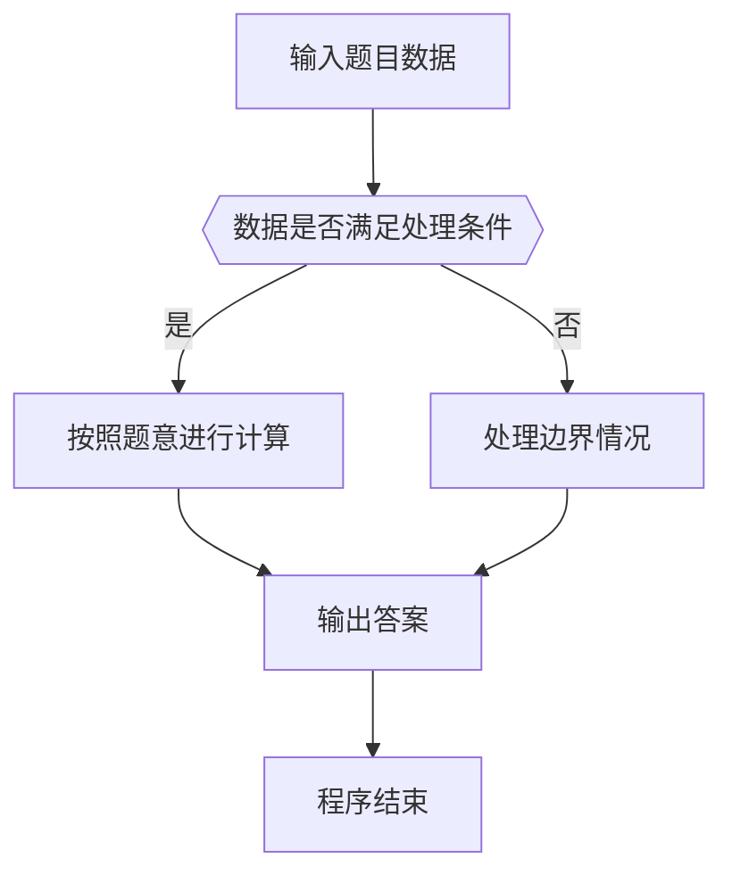

# 1117 数字之王

- **分值：** 20分

### 题目描述

给定两个正整数 $N_1 < N_2$。把从 $N_1$ 到 $N_2$ 的每个数的各位数的立方相乘，再将结果的各位数求和，得到一批新的数字，再对这批新的数字重复上述操作，直到所有数字都是 1 位数为止。这时哪个数字最多，哪个就是“数字之王”。

例如 $N_1=1$ 和 $N_2=10$ 时，第一轮操作后得到 { 1, 8, 9, 10, 8, 9, 10, 8, 18, 0 }；第二轮操作后得到 { 1, 8, 18, 0, 8, 18, 0, 8, 8, 0 }；第三轮操作后得到 { 1, 8, 8, 0, 8, 8, 0, 8, 8, 0 }。所以数字之王就是 8。

本题就请你对任意给定的 $N_1 < N_2$ 求出对应的数字之王。

### 输入格式：

输入在第一行中给出两个正整数 $0<N_1 < N_2 \le 10^{3}$，其间以空格分隔。

### 输出格式：

首先在一行中输出数字之王的出现次数，随后第二行输出数字之王。例如对输入 `1 10` 就应该在两行中先后输出 `6` 和 `8`。如果有并列的数字之王，则按递增序输出。数字间以 1 个空格分隔，行首尾不得有多余空格。

### 输入样例：
```
10 14
```

### 输出样例：
```
2
0 8
```


### 解题思路

本题的核心是：重复执行各位数字立方积再求和的变换，直到每个数进入个位稳定状态，统计 0 到 9 的出现次数。程序先读取题目输入，再按照上述规则完成数据处理，最后严格按照题目要求输出结果。实现时应优先根据题目约束选择合适的数据类型和数据结构，避免溢出或不必要的重复计算。

时间复杂度为 O((N2-N1)L)；空间复杂度取决于输入规模，主要用于保存题目数据和中间结果。

### 代码流程说明

1. 读取 1117 数字之王 所需的输入数据。
2. 初始化计数器、数组或其他辅助变量。
3. 重复执行各位数字立方积再求和的变换，直到每个数进入个位稳定状态，统计 0 到 9 的出现次数。
4. 按题目规定的格式输出计算结果。

### 代码实现

```java
import java.io.*;
import java.util.*;

public class Main {
    static class FastScanner {
        private final InputStream in; private final byte[] buffer = new byte[1 << 16]; private int ptr, len;
        FastScanner(InputStream in) { this.in = in; }
        private int read() throws IOException { if (ptr >= len) { len = in.read(buffer); ptr = 0; if (len < 0) return -1; } return buffer[ptr++]; }
        String next() throws IOException { StringBuilder b = new StringBuilder(); int c; do c = read(); while (c <= 32 && c >= 0); while (c > 32) { b.append((char)c); c = read(); } return b.toString(); }
        char[] nextChars() throws IOException { return next().toCharArray(); }
        int nextInt() throws IOException { return Integer.parseInt(next()); }
        long nextLong() throws IOException { return Long.parseLong(next()); }
        double nextDouble() throws IOException { return Double.parseDouble(next()); }
        void skip() throws IOException { next(); }
    }
    static int strlen(char[] s) { int n = 0; while (n < s.length && s[n] != 0) n++; return n; }
    static int strcmp(char[] a, char[] b) { return new String(a, 0, strlen(a)).compareTo(new String(b, 0, strlen(b))); }
    static int strncmp(char[] a, char[] b) { return strcmp(a, b); }
    static void printf(String format, Object... args) { Object[] x = new Object[args.length]; for (int i=0;i<args.length;i++) x[i] = args[i] instanceof char[] ? new String((char[])args[i], 0, strlen((char[])args[i])) : args[i]; System.out.printf(format.replace("%lld", "%d"), x); }
    static void puts(Object x) { System.out.println(x instanceof char[] ? new String((char[])x, 0, strlen((char[])x)) : x); }
    static void putchar(char c) { System.out.print(c); }
    static void putchar(int c) { System.out.print((char)c); }
    static final int EOF = -1;
    static int getchar() { return -1; }
    static int isupper(char c) { return Character.isUpperCase(c) ? 1 : 0; }
    static char tolower(int c) { return Character.toLowerCase((char)c); }
    static int strchr(char[] s, char c) { for (int i=0;i<strlen(s);i++) if (s[i]==c) return i; return -1; }
/*
 * 题目：1117 素数回文
 * 实现原理：计算数字各位立方和，再用素数判断结果；按要求重复处理并输出结论。
 * 复杂度：O(kL)
 * 实现步骤：
 * 1. 读取 1117 数字之王 所需的输入数据。
 * 2. 初始化计数器、数组或其他辅助变量。
 * 3. 重复执行各位数字立方积再求和的变换，直到每个数进入个位稳定状态，统计 0 到 9 的出现次数。
 * 4. 按题目规定的格式输出计算结果。
 */

static int f(int x) {
    int p = 1;
    if (x == 0) return 0;
    while (x != 0) {
        int d = x % 10;
        p *= d * d * d;
        x /= 10;
    }
    int s = 0;
    while (p != 0) {
        s += p % 10;
        p /= 10;
    }
    return s;
}
static FastScanner fs = new FastScanner(System.in);

    public static void main(String[] args) throws Exception {
    int a; int b; int[] c = new int[10];
    a = fs.nextInt(); b = fs.nextInt();
    for (int x = a; x <= b; x ++) {
        int y = x;
        while (f(y) != y) y = f(y);
        c[y] ++;
    }
    int mx = 0;
    for (int i = 0; i < 10; i ++) if (c[i] > mx) mx = c[i];
    printf("%d\n", mx);
    for (int i = 0, first = 1; i < 10; i ++) if (c[i] == mx) {
        if (first == 0) putchar(' ');
        printf("%d", i);
        first = 0;
    }
    putchar('\n');

}
}
```

### 代码流程图



### 解题流程图



### 常见易错点

- 注意输入数据的范围，选择足够大的整数类型，并正确处理边界值。
- 循环、数组下标和字符串结束位置要严格对应题目定义，避免越界。
- 输出格式必须与题目要求完全一致，包括空格、换行、大小写和特殊符号。
- 如果存在排序、去重、进位、约分或四舍五入等操作，应在输出前统一完成。
