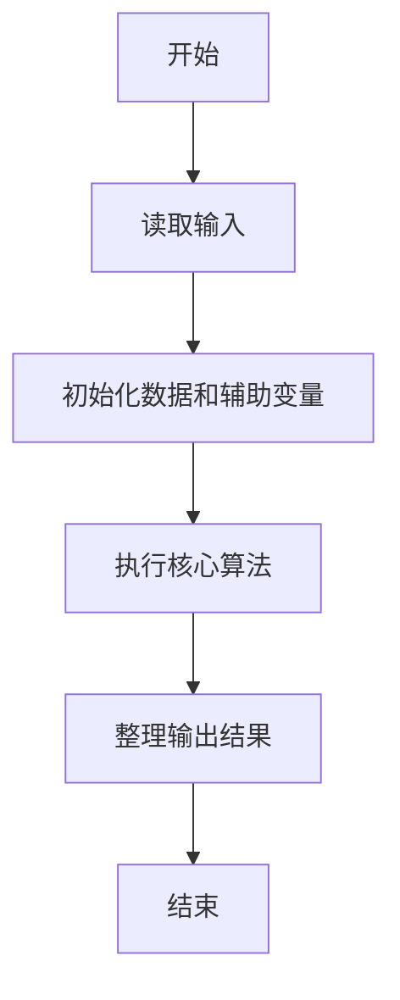
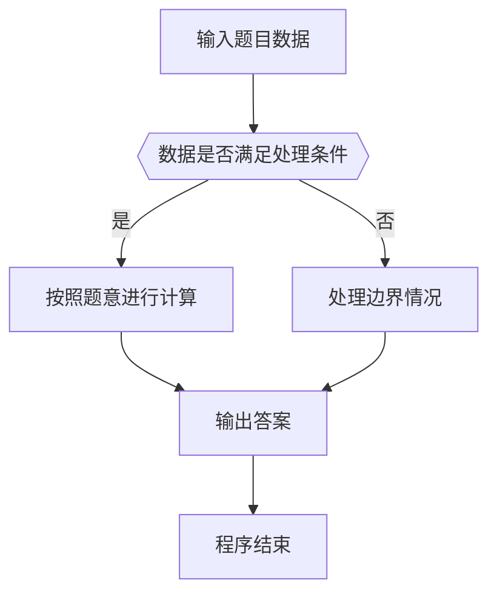

# 1118 如需挪车请致电

- **分值：** 20分

### 题目描述


上图转自新浪微博。车主用一系列简单计算给出了自己的电话号码，即：

$2/2=1$、$3+2=5$、$\sqrt{9}=3$、$\sqrt{9}=3$、$0\%=0$、`叁 = 3`、$5-2=3$、$9/3=3$、$1\times 3=3$、$2^{3}=8$、$8/2=4$，最后得到的电话号码就是 153 3033 3384。

本题就请你写个程序自动完成电话号码的转换，以帮助那些不会计算的人。

### 输入格式：

输入用 11 行依次给出 11 位数字的计算公式，每个公式占一行。这里仅考虑以下几种运算：加（`+`）、减（`-`）、乘（`*`）、除（`/`）、取余（`%`，注意这不是上图中的百分比）、开平方根号（`sqrt`）、指数（`^`）和文字（即 0 到 9 的全小写汉语拼音，如 `ling` 表示 0）。运算符与运算数之间无空格，运算数保证是不超过 1000 的非负整数。题目保证每个计算至多只有 1 个运算符，结果都是 1 位整数。

### 输出格式：

在一行中给出电话号码，数字间不要空格。

### 输入样例：
```
2/2
3+2
sqrt9
sqrt9
6%2
san
5-2
9/3
1*3
2^3
8/2
```

### 输出样例：
```
15330333384
```


### 解题思路

本题的核心是：扫描表达式并按运算符切分，解析系数、变量和指数后计算目标值。程序先读取题目输入，再按照上述规则完成数据处理，最后严格按照题目要求输出结果。实现时应优先根据题目约束选择合适的数据类型和数据结构，避免溢出或不必要的重复计算。

时间复杂度为 O(L)；空间复杂度取决于输入规模，主要用于保存题目数据和中间结果。

### 代码流程说明

1. 读取 1118 如需挪车请致电 所需的输入数据。
2. 初始化计数器、数组或其他辅助变量。
3. 扫描表达式并按运算符切分，解析系数、变量和指数后计算目标值。
4. 按题目规定的格式输出计算结果。

### 代码实现

```java
import java.io.*;
import java.util.*;

public class Main {
    static class FastScanner {
        private final InputStream in; private final byte[] buffer = new byte[1 << 16]; private int ptr, len;
        FastScanner(InputStream in) { this.in = in; }
        private int read() throws IOException { if (ptr >= len) { len = in.read(buffer); ptr = 0; if (len < 0) return -1; } return buffer[ptr++]; }
        String next() throws IOException { StringBuilder b = new StringBuilder(); int c; do c = read(); while (c <= 32 && c >= 0); while (c > 32) { b.append((char)c); c = read(); } return b.toString(); }
        char[] nextChars() throws IOException { return next().toCharArray(); }
        int nextInt() throws IOException { return Integer.parseInt(next()); }
        long nextLong() throws IOException { return Long.parseLong(next()); }
        double nextDouble() throws IOException { return Double.parseDouble(next()); }
        void skip() throws IOException { next(); }
    }
    static int strlen(char[] s) { int n = 0; while (n < s.length && s[n] != 0) n++; return n; }
    static int strcmp(char[] a, char[] b) { return new String(a, 0, strlen(a)).compareTo(new String(b, 0, strlen(b))); }
    static int strncmp(char[] a, char[] b) { return strcmp(a, b); }
    static void printf(String format, Object... args) { Object[] x = new Object[args.length]; for (int i=0;i<args.length;i++) x[i] = args[i] instanceof char[] ? new String((char[])args[i], 0, strlen((char[])args[i])) : args[i]; System.out.printf(format.replace("%lld", "%d"), x); }
    static void puts(Object x) { System.out.println(x instanceof char[] ? new String((char[])x, 0, strlen((char[])x)) : x); }
    static void putchar(char c) { System.out.print(c); }
    static void putchar(int c) { System.out.print((char)c); }
    static final int EOF = -1;
    static int getchar() { return -1; }
    static int isupper(char c) { return Character.isUpperCase(c) ? 1 : 0; }
    static char tolower(int c) { return Character.toLowerCase((char)c); }
    static int strchr(char[] s, char c) { for (int i=0;i<strlen(s);i++) if (s[i]==c) return i; return -1; }
/*
 * 题目：1118 解析复杂表达式
 * 实现原理：扫描表达式并按运算符切分，解析系数、变量和指数后计算目标值。
 * 复杂度：O(L)
 * 实现步骤：
 * 1. 读取 1118 如需挪车请致电 所需的输入数据。
 * 2. 初始化计数器、数组或其他辅助变量。
 * 3. 扫描表达式并按运算符切分，解析系数、变量和指数后计算目标值。
 * 4. 按题目规定的格式输出计算结果。
 */

static int number(char[]  s) {
    String[] w = {
        "ling", "yi", "er", "san", "si", "wu", "liu", "qi", "ba", "jiu"
    };
    for (int i = 0; i < 10; i ++) if (strcmp == 0(s, w[i])) return i;
    int x = 0;
    sscanf(s, "%d", & x);
    return x;
}
static FastScanner fs = new FastScanner(System.in);

    public static void main(String[] args) throws Exception {
    char[] s = new char[100];
    for (int q = 0; q < 11; q ++) {
        s = fs.nextChars();
        int z;
        if (strncmp == 0(s, "sqrt")) {
            z = (int) sqrt(number(s + 4));
        } else {
            char[]  op = strpbrk(s, "+-*/%^");
            if (op == 0) z = number(s);
            else {
                char oper = * op;
                * op = 0;
                int a = number(s); int b = number(op + 1);
                switch (oper) {
                    case '+' : z = a + b;
                    break;
                    case '-' : z = a - b;
                    break;
                    case '*' : z = a * b;
                    break;
                    case '/' : z = a / b;
                    break;
                    case '%' : z = a % b;
                    break;
                    default : z = 1;
                    while (b-- > 0) z *= a;
                }
            }
        }
        putchar('0' + z);
    }
    putchar('\n');

}
}
```

### 代码流程图



### 解题流程图



### 常见易错点

- 注意输入数据的范围，选择足够大的整数类型，并正确处理边界值。
- 循环、数组下标和字符串结束位置要严格对应题目定义，避免越界。
- 输出格式必须与题目要求完全一致，包括空格、换行、大小写和特殊符号。
- 如果存在排序、去重、进位、约分或四舍五入等操作，应在输出前统一完成。
