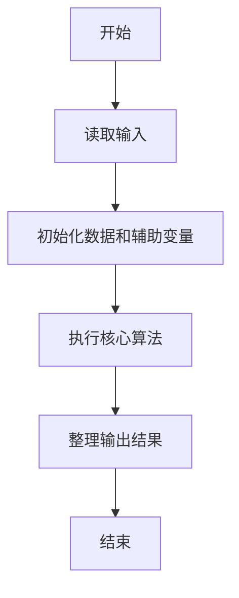
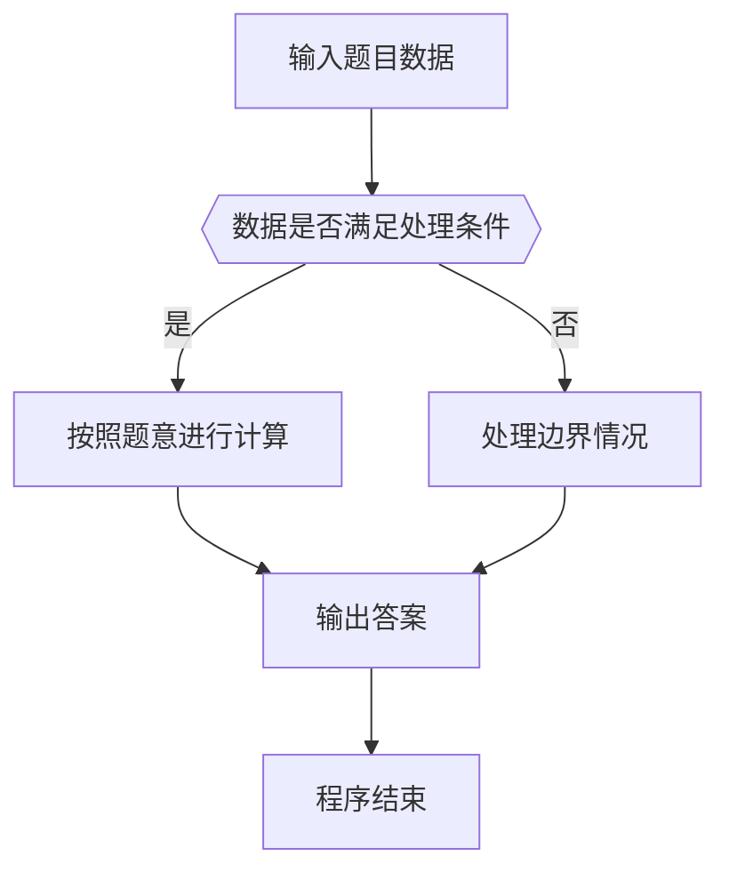

# 1121 祖传好运

- **分值：** 15分

### 题目描述

我们首先定义 0 到 9 都是**好运数**，然后从某个好运数开始，持续在其右边添加数字，形成新的数字。我们称一个大于 9 的数字 $N$ 具有**祖传好运**，如果它是由某个好运数添加了一个个位数字得到的，并且它能被自己的位数整除。

例如 123 就是一个祖传好运数。首先因为 1 是一个好运数的老祖宗，添加了 2 以后，形成的 12 能被其位数 2 （即 12 是一个 2 位数）整除，所以 12 是一个祖传好运数；在 12 后面添加了 3 以后，形成的 123 能被其位数 3 整除，所以 123 是一个祖传好运数。

本题就请你判断一个给定的正整数 $N$ 是不是具有祖传的好运。

### 输入格式：

每个输入包含 1 个测试用例。每个测试用例第 1 行给出正整数 $K$ ($\le 1000$)；第 2 行给出 $K$ 个不超过 $10^{9}$ 的待评测的正整数，注意这些数字都保证没有多余的前导零。

### 输出格式：

对每个待评测的数字，在一行中输出 `Yes` 如果它是一个祖传好运数，如果不是则输出 `No`。

### 输入样例：
```
5
123 7 43 2333 56160
```

### 输出样例：
```
Yes
Yes
No
No
Yes
```


### 解题思路

本题的核心是：逐个检查数字的所有真前缀，判断每个前缀是否能被对应长度整除。程序先读取题目输入，再按照上述规则完成数据处理，最后严格按照题目要求输出结果。实现时应优先根据题目约束选择合适的数据类型和数据结构，避免溢出或不必要的重复计算。

时间复杂度为 O(L²)；空间复杂度取决于输入规模，主要用于保存题目数据和中间结果。

### 代码流程说明

1. 读取 1121 祖传好运 所需的输入数据。
2. 初始化计数器、数组或其他辅助变量。
3. 逐个检查数字的所有真前缀，判断每个前缀是否能被对应长度整除。
4. 按题目规定的格式输出计算结果。

### 代码实现

```java
import java.io.*;
import java.util.*;

public class Main {
    static class FastScanner {
        private final InputStream in; private final byte[] buffer = new byte[1 << 16]; private int ptr, len;
        FastScanner(InputStream in) { this.in = in; }
        private int read() throws IOException { if (ptr >= len) { len = in.read(buffer); ptr = 0; if (len < 0) return -1; } return buffer[ptr++]; }
        String next() throws IOException { StringBuilder b = new StringBuilder(); int c; do c = read(); while (c <= 32 && c >= 0); while (c > 32) { b.append((char)c); c = read(); } return b.toString(); }
        char[] nextChars() throws IOException { return next().toCharArray(); }
        int nextInt() throws IOException { return Integer.parseInt(next()); }
        long nextLong() throws IOException { return Long.parseLong(next()); }
        double nextDouble() throws IOException { return Double.parseDouble(next()); }
        void skip() throws IOException { next(); }
    }
    static int strlen(char[] s) { int n = 0; while (n < s.length && s[n] != 0) n++; return n; }
    static int strcmp(char[] a, char[] b) { return new String(a, 0, strlen(a)).compareTo(new String(b, 0, strlen(b))); }
    static int strncmp(char[] a, char[] b) { return strcmp(a, b); }
    static void printf(String format, Object... args) { Object[] x = new Object[args.length]; for (int i=0;i<args.length;i++) x[i] = args[i] instanceof char[] ? new String((char[])args[i], 0, strlen((char[])args[i])) : args[i]; System.out.printf(format.replace("%lld", "%d"), x); }
    static void puts(Object x) { System.out.println(x instanceof char[] ? new String((char[])x, 0, strlen((char[])x)) : x); }
    static void putchar(char c) { System.out.print(c); }
    static void putchar(int c) { System.out.print((char)c); }
    static final int EOF = -1;
    static int getchar() { return -1; }
    static int isupper(char c) { return Character.isUpperCase(c) ? 1 : 0; }
    static char tolower(int c) { return Character.toLowerCase((char)c); }
    static int strchr(char[] s, char c) { for (int i=0;i<strlen(s);i++) if (s[i]==c) return i; return -1; }
/*
 * 题目：1121 除法
 * 实现原理：逐个检查数字的所有真前缀，判断每个前缀是否能被对应长度整除。
 * 复杂度：O(L²)
 * 实现步骤：
 * 1. 读取 1121 祖传好运 所需的输入数据。
 * 2. 初始化计数器、数组或其他辅助变量。
 * 3. 逐个检查数字的所有真前缀，判断每个前缀是否能被对应长度整除。
 * 4. 按题目规定的格式输出计算结果。
 */

static FastScanner fs = new FastScanner(System.in);

    public static void main(String[] args) throws Exception {
    int k;
    char[] s = new char[20];
    k = fs.nextInt();
    while (k-- > 0) {
        s = fs.nextChars();
        int len = strlen(s); int ok = 1;
        for (int l = 1; l <= len; l ++) {
            long pre = 0;
            for (int i = 0; i < l; i ++) pre = pre * 10 + s[i] - '0';
            if (pre % l) {
                ok = 0;
                break;
            }
        }
        puts(ok != 0 ? "Yes" : "No");
    }

}
}
```

### 代码流程图



### 解题流程图



### 常见易错点

- 注意输入数据的范围，选择足够大的整数类型，并正确处理边界值。
- 循环、数组下标和字符串结束位置要严格对应题目定义，避免越界。
- 输出格式必须与题目要求完全一致，包括空格、换行、大小写和特殊符号。
- 如果存在排序、去重、进位、约分或四舍五入等操作，应在输出前统一完成。
