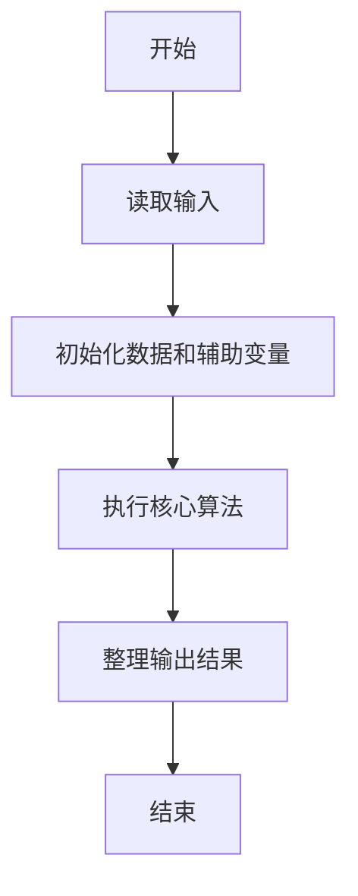
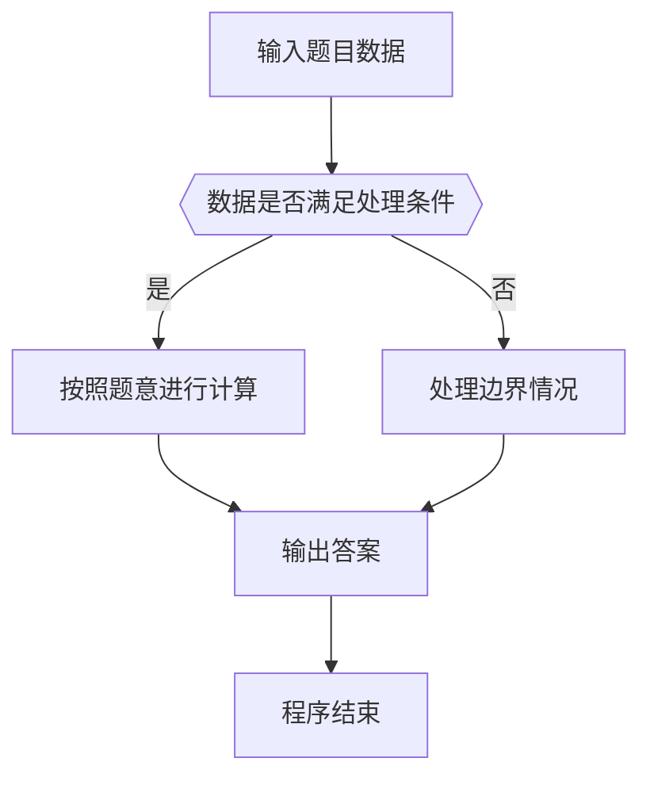

# 1123 舍入

- **分值：** 20分

### 题目描述

不同的编译器对浮点数的精度有不同的处理方法。常见的一种是“四舍五入”，即考察指定有效位的后一位数字，如果不小于 5，就令有效位最后一位进位，然后舍去后面的尾数；如果小于 5 就直接舍去尾数。另一种叫“截断”，即不管有效位后面是什么数字，一概直接舍去。还有一种是“四舍六入五成双”，即当有效位的后一位数字是 5 时，有 3 种情况要考虑：如果 5 后面还有其它非 0 尾数，则进位；如果没有，则当有效位最后一位是单数时进位，双数时舍去，即保持最后一位是双数。

本题就请你写程序按照要求处理给定浮点数的舍入问题。

### 输入格式：

输入第一行给出两个不超过 100 的正整数 $N$ 和 $D$，分别是待处理数字的个数和要求保留的小数点后的有效位数。随后 $N$ 行，每行给出一个待处理数字的信息，格式如下：

```
指令符 数字
```

其中`指令符`是表示舍入方法的一位数字，`1` 表示“四舍五入”，`2` 表示“截断”，`3` 表示“四舍六入五成双”；`数字`是一个总长度不超过 200 位的浮点数，且不以小数点开头或结尾，即 `0.123` 不会写成 `.123`，`123` 也不会写成 `123.`。此外，输入保证没有不必要的正负号（例如 `-0.0` 或 `+1`）。

### 输出格式：

对每个待处理数字，在一行中输出根据指令符处理后的结果数字。

### 输入样例：
```
7 3
1 3.1415926
2 3.1415926
3 3.1415926
3 3.14150
3 3.14250
3 3.14251
1 3.14
```

### 输出样例：
```
3.142
3.141
3.142
3.142
3.142
3.143
3.140
```


### 解题思路

本题的核心是：按字符串模拟小数加法，定位小数点并按保留位数进行四舍五入。程序先读取题目输入，再按照上述规则完成数据处理，最后严格按照题目要求输出结果。实现时应优先根据题目约束选择合适的数据类型和数据结构，避免溢出或不必要的重复计算。

时间复杂度为 O(L)；空间复杂度取决于输入规模，主要用于保存题目数据和中间结果。

### 代码流程说明

1. 读取 1123 舍入 所需的输入数据。
2. 初始化计数器、数组或其他辅助变量。
3. 按字符串模拟小数加法，定位小数点并按保留位数进行四舍五入。
4. 按题目规定的格式输出计算结果。

### 代码实现

```java
import java.io.*;
import java.util.*;

public class Main {
    static class FastScanner {
        private final InputStream in; private final byte[] buffer = new byte[1 << 16]; private int ptr, len;
        FastScanner(InputStream in) { this.in = in; }
        private int read() throws IOException { if (ptr >= len) { len = in.read(buffer); ptr = 0; if (len < 0) return -1; } return buffer[ptr++]; }
        String next() throws IOException { StringBuilder b = new StringBuilder(); int c; do c = read(); while (c <= 32 && c >= 0); while (c > 32) { b.append((char)c); c = read(); } return b.toString(); }
        char[] nextChars() throws IOException { return next().toCharArray(); }
        int nextInt() throws IOException { return Integer.parseInt(next()); }
        long nextLong() throws IOException { return Long.parseLong(next()); }
        double nextDouble() throws IOException { return Double.parseDouble(next()); }
        void skip() throws IOException { next(); }
    }
    static int strlen(char[] s) { int n = 0; while (n < s.length && s[n] != 0) n++; return n; }
    static int strcmp(char[] a, char[] b) { return new String(a, 0, strlen(a)).compareTo(new String(b, 0, strlen(b))); }
    static int strncmp(char[] a, char[] b) { return strcmp(a, b); }
    static void printf(String format, Object... args) { Object[] x = new Object[args.length]; for (int i=0;i<args.length;i++) x[i] = args[i] instanceof char[] ? new String((char[])args[i], 0, strlen((char[])args[i])) : args[i]; System.out.printf(format.replace("%lld", "%d"), x); }
    static void puts(Object x) { System.out.println(x instanceof char[] ? new String((char[])x, 0, strlen((char[])x)) : x); }
    static void putchar(char c) { System.out.print(c); }
    static void putchar(int c) { System.out.print((char)c); }
    static final int EOF = -1;
    static int getchar() { return -1; }
    static int isupper(char c) { return Character.isUpperCase(c) ? 1 : 0; }
    static char tolower(int c) { return Character.toLowerCase((char)c); }
    static int strchr(char[] s, char c) { for (int i=0;i<strlen(s);i++) if (s[i]==c) return i; return -1; }
/*
 * 题目：1123 小数化分
 * 实现原理：按字符串模拟小数加法，定位小数点并按保留位数进行四舍五入。
 * 复杂度：O(L)
 * 实现步骤：
 * 1. 读取 1123 舍入 所需的输入数据。
 * 2. 初始化计数器、数组或其他辅助变量。
 * 3. 按字符串模拟小数加法，定位小数点并按保留位数进行四舍五入。
 * 4. 按题目规定的格式输出计算结果。
 */

static FastScanner fs = new FastScanner(System.in);

    public static void main(String[] args) throws Exception {
    int n; int d;
    n = fs.nextInt(); d = fs.nextInt();
    while (n-- > 0) {
        int mode;
        char[] s = new char[205]; char[] all = new char[405];
        mode = fs.nextInt(); s = fs.nextChars();
        int neg = s[0] == '-';
        char[]  p = s + neg, * dot = strchr(p, '.');
        int ilen = dot ? (int)(dot - p) : (int) strlen(p); int flen = dot ? (int) strlen(dot + 1) : 0; int k = 0;
        for (int i = 0; i < strlen(p); i ++) if (p[i] != '.') all[k ++] = p[i];
        all[k] = 0;
        int keep = ilen + d; int up = 0;
        if (flen > d) {
            char next = p[ilen + 1 + d];
            if (mode == 1) up = next >= '5';
            else if (mode == 3) {
                if (next > '5') up = 1;
                else if (next == '5') {
                    for (int i = ilen + 2 + d; i < strlen(p); i ++) if (p[i] != '.' && p[i] != '0') up = 1;
                    if (up == 0 && keep > 0) up = (all[keep - 1] - '0') % 2;
                }
            }
        }
        if (up) {
            int i = keep - 1;
            while (i >= 0 && all[i] == '9') all[i --] = '0';
            if (i < 0) {
                memmove(all + 1, all, strlen(all) + 1);
                all[0] = '1';
                keep ++;
            } else all[i] ++;
        }
        if (neg) putchar('-');
        if (keep <= d) putchar('0');
        else for (int i = 0; i < keep - d; i ++) putchar(all[i]);
        if (d) {
            putchar('.');
            for (int i = keep - d; i < keep; i ++) putchar(i < k ? all[i] : '0');
        }
        putchar('\n');
    }

}
}
```

### 代码流程图



### 解题流程图



### 常见易错点

- 注意输入数据的范围，选择足够大的整数类型，并正确处理边界值。
- 循环、数组下标和字符串结束位置要严格对应题目定义，避免越界。
- 输出格式必须与题目要求完全一致，包括空格、换行、大小写和特殊符号。
- 如果存在排序、去重、进位、约分或四舍五入等操作，应在输出前统一完成。
